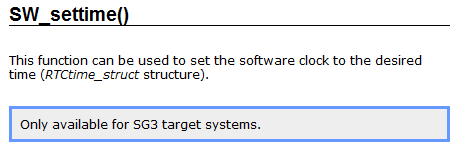

> 029SGC,SG3,SG4是什么有什么区别

- [1 概念](#1%20%E6%A6%82%E5%BF%B5)
- [2 对应硬件](#2%20%E5%AF%B9%E5%BA%94%E7%A1%AC%E4%BB%B6)
	- [2.1 SG4](#2.1%20SG4)
	- [2.2 SG3](#2.2%20SG3)
	- [2.3 SGC](#2.3%20SGC)
- [3 开发注意事项](#3%20%E5%BC%80%E5%8F%91%E6%B3%A8%E6%84%8F%E4%BA%8B%E9%A1%B9)

# 1 概念

- 目标系统（Target System）由处理器架构和系统中使用的处理器类型决定。
- 下面的列表显示了这些平台的不同之处：
    - 处理器类型
    - 数据管理
    - 任务类类型
    - 启动行为
    - Watchdog
    - 算术运算
    - 图形处理能力
    - 网络的可能性
    - 地址管理
- B&R 使用各种平台。不同的目标系统被识别为 SG3（SG = System Generation）、SGC 或 SG4。
- 不过，对于用户而言，由于编程系统（Automation Studio）的统一性，这几种平台之间并无太大区别。
- Target systems - SG3
    - System Generation 3 (SG3) 是指基于摩托罗拉处理器的一代目标系统。与 SGC 和 SG4 目标系统相比，最大的区别在于 I/O 和内存的处理方式。
- Target systems - SGC
    - System Generation Compact（SGC）是指基于摩托罗拉处理器的一代目标机系统。与 SG3 和 SG4 目标机系统相比，最大的区别在于如何处理 I/O 和内存。
- Target systems - SG4
    - System Generation 4（SG4）是指与较早的 SG3 和 SGC 目标机系统相比，具有更多功能的新一代目标机系统。

# 2 对应硬件

## 2.1 SG4

> 2010年之后贝加莱新出的硬件，均是 SG4
> X20系列
> APC 与 PPC 系列
> X90系列
- System Generation 4 (SG4) - 英特尔处理器与 ARM 处理器的 CPU
- 以下 CPU 属于该系列：
    - APC910, APC2100,APC2200,APC3100,APC4100
    - X90CP172,X90CP174
    - X20CP1684,X20CP1684,X20CP1686X,X20CP3684,X20CP3685,X20CP3686X,X20CP3687X
    - X20CP0410,X20CP0411,X20CP0420
    - X20CP0482,X20CP0483,X20CP0484,X20CP0484-1
    - X20CP1381,X20CP1382,X20CP1301,X20CP1381-RT,X20CP1382-RT
    - X20CP1583, X20CP1584, X20CP1585, X20CP1586, X20CP3583, X20CP3584, X20CP3585, X20CP3586
    - X20CP1483, X20CP1483-1,X20CP1484, X20CP1485-1, X20CP1486, X20CP3484, X20CP3485-1, X20CP3486
    - CP340, CP360, CP380, CP382, CP570
    - PP45, PP65
    - PP100/200, PP300/400
    - MP100/200
    - EC20, EC21
    - EC20, EC21
    - AC140, AC141
    - ARsim, ARwin, ARemb
    - APC620, APC700, APC810，

## 2.2 SG3

> 基本属于 B&R 2005 系列产品
- System Generation 3 (SG3) - Motorola 处理器的 CPU
- 以下 CPU 属于该系列：
    - IF161, IP161
    - XP152
    - CP100, CP104, CP152, CP153, CP200, CP210, CP260, CP430, CP470, CP474, CP476, CP770, CP774
    - PP15, PP21, PP35, PP41

## 2.3 SGC

- System Generation Compact CPUs (SGC) - Motorola 处理器 (embedded µP) 的 CPU
- 以下 CPU 属于该系列：
    - X20CP0201, X20CP0291,X20CP0292
    - XC0201, XC0202, XC0292

# 3 开发注意事项

- 在 Automation Studio 4 中，使用库进行开发，默认支持版本均是 SG4 的系统。
- 若提示此功能函数只支持 SG3 的系统，可见如 **Only available for SG3 target systems** 的提示，如下图
- 
