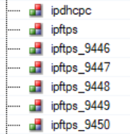

> Tags: #进程 #profile

- [1 B02.030.AR 中各个进程例如 sdar,tAtaSrv0含义](#_1-b02030ar-%E4%B8%AD%E5%90%84%E4%B8%AA%E8%BF%9B%E7%A8%8B%E4%BE%8B%E5%A6%82-sdar,tatasrv0%E5%90%AB%E4%B9%89)
- [2 使用前提](#_2-%E4%BD%BF%E7%94%A8%E5%89%8D%E6%8F%90)
- [3 TcIdleFiller](#_3-tcidlefiller)
- [4 UnknownCyclic](#_4-unknowncyclic)
	- [4.1 解决方式](#_41-%E8%A7%A3%E5%86%B3%E6%96%B9%E5%BC%8F)
	- [4.2 Buffer for created user tasks 设置参数建议](#_42-buffer-for-created-user-tasks-%E8%AE%BE%E7%BD%AE%E5%8F%82%E6%95%B0%E5%BB%BA%E8%AE%AE)
- [5 interrupt 说明](#_5-interrupt-%E8%AF%B4%E6%98%8E)
- [6 `IE#n`](#_6-ien)
- [7 TimeSync](#_7-timesync)
- [8 tAtaSvc0](#_8-tatasvc0)
- [9 sdar](#_9-sdar)
- [10 ipftps](#_10-ipftps)
- [11 tNet0](#_11-tnet0)

# 1 B02.030.AR 中各个进程例如 sdar,tAtaSrv0含义

# 2 使用前提

- CPU 任务执行的进程分析均依赖于 Profiler 功能

# 3 TcIdleFiller

- 空闲任务进程
- 
- 在计算 CPU 占用率时，此进程算作 IDLE 资源
- "TcIdleFiller "正在使用强制空闲时间（Timing / Idle Time）的剩余部分，这些时间未被其他系统任务占用。
- 即意味着在使用此处分配但未使用的资源
- 
- 🔴 目前（2023），SDM(System Diagnostics Manager) 中统计的 CPU 占用率，把 TcIdleFiller 也算作是负载。请以 Profiler 中的数据显示为准。

# 4 UnknownCyclic

- 如果进程任务是在 Profiler 开始计算时创建的，则此任务会以 UnknownCyclic 任务名称的方式出现。

## 4.1 解决方式

- 设置 “Buffer for created user tasks” 给出了可用于存储有关动态创建的进程任务以及在运行期间传输的任务的信息的缓冲区数量。
- 软件树中任务的顺序就是 PLC 上执行任务的顺序，因此，如果查看任务类中的前后任务，通常就能知道 "未知循环 "任务是哪个任务。
- 

## 4.2 Buffer for created user tasks 设置参数建议

- 当使用 DRAM 作为 Profiling 的存储时，内存使用情况通常不会出现问题，Buffer for created user tasks 设置到500也不会出现问题。
- 如果要调试看门狗 Watchdog，并因此将配置文件设置为 SRAM，则此参数会受到 SRAM 可用大小的限制。

# 5 interrupt 说明

- **B&R I/O 总线**（如 X2X Link 或 POWERLINK）使用的中断在 Profiler 中使用接口名称（IF6、IF3、SS1. IF1…）。
- 由 VxWorks 驱动程序处理的中断没有完整的信息提供
- **SystemTick** 的定时器中断很容易识别，因为它在一个系统周期内恰好出现 2 次，时间恰好是系统周期时间的一半。
- Interrupt 27 仅适用于 X90CP174硬件

# 6 `IE#n`

- 执行循环任务中的 INIT 初始化部分代码的进程

# 7 TimeSync

- 若占用太多的 CPU 资源，并伴随着 30993 报警，请升级 AR 至以下版本以上
- D4.73
- C4.83
- D4.90
- B4.91
- A4.92

# 8 tAtaSvc0

- VxWorks 操作 ATA Device 的进程，例如对常见的 CF 卡进行读、写、Ioctl
- 若此进程占用非常高的负载，请注意是否有大量的文件读写操作，是否 FTP 服务被第三方高频请求
- 

# 9 sdar

- SDM（System Diagnostics Manager） 服务消耗的资源

# 10 ipftps

- FTP访问服务进程
- 
- 末尾带数字说明是现在还连着的多个Client。
- 数字含义为
    - FTP Client访问贝加莱FTP Server，建立了链接，则+1
    - FTP Client从贝加莱FTP Server中传递一个文件，则+1
    - 任务结束或断开，则进程消失

# 11 tNet0

- 以太网进程，PLC的TCP的系统任务，负载高说明PLC的网络服务占用资源多，若有类似25314报错，建议怕检查检查源程序，查找是否有指针、数组溢出的情况。
- 情况一
    - 现象
        - tNet0负载偶发占比较高，达到70%，即PLC网口有大量数据涌入。
    - 可能原因：
        - 第三方Client在高频访问PLC
        - 网络上有网络风暴，需要检查交换机接线
- 情况二
    - 现象
        - X20CP0410使用作为ModbusTCP Slave，运行过程PLC进入SERV模式，报错信息有25348、9206
        - 采集Profiler，可以看到在运行系统任务tNet0的过程中，发生了异常PrecessorException: tNet0→PrecessorException
    - 解决方式
        - Automation Runtime版本由D4.34升级至E4.63后解决
- 情况三
    - 现象
        - 使用X20CP1381，固件版本为1.7.0.0，AR版本为D4.52，有用户自己编写的TCP通信，偶发25314、27306、38100报错。
    - 原因
        - TCP通讯程序中有内存溢出的代码（可从Profiler中可见tNet0的前序任务），AR版本D4.52更新了IP协议栈，这导致这些错误会被检测出来进而报警。
    - 解决方式
        - 方式一：修正TCP通信程序
        - 方式二：降低AR版本（例如G4.34），使用老的IP协议栈，规避此问题。（临时措施）
