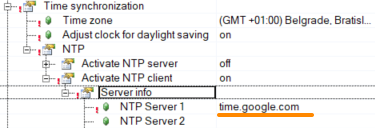

> Tags: #对时

- [1 B02.032.贝加莱NTP对时服务](#_1-b02032%E8%B4%9D%E5%8A%A0%E8%8E%B1ntp%E5%AF%B9%E6%97%B6%E6%9C%8D%E5%8A%A1)
- [2 贝加莱PLC作为NTP Client](#_2-%E8%B4%9D%E5%8A%A0%E8%8E%B1plc%E4%BD%9C%E4%B8%BAntp-client)
	- [2.1 贝加莱NTP Client访问外部NTP Server设置](#_21-%E8%B4%9D%E5%8A%A0%E8%8E%B1ntp-client%E8%AE%BF%E9%97%AE%E5%A4%96%E9%83%A8ntp-server%E8%AE%BE%E7%BD%AE)
- [3 贝加莱PLC作为NTP Server](#_3-%E8%B4%9D%E5%8A%A0%E8%8E%B1plc%E4%BD%9C%E4%B8%BAntp-server)
- [5 贝加莱NTP服务特点](#_5-%E8%B4%9D%E5%8A%A0%E8%8E%B1ntp%E6%9C%8D%E5%8A%A1%E7%89%B9%E7%82%B9)
- [4 Windows作为NTP Server](#_4-windows%E4%BD%9C%E4%B8%BAntp-server)
	- [Windows 设置 NTP Server 方式一](#_windows-%E8%AE%BE%E7%BD%AE-ntp-server-%E6%96%B9%E5%BC%8F%E4%B8%80)
	- [Windows 设置 NTP Server 方式二 （推荐）](#_windows-%E8%AE%BE%E7%BD%AE-ntp-server-%E6%96%B9%E5%BC%8F%E4%BA%8C-%EF%BC%88%E6%8E%A8%E8%8D%90%EF%BC%89)
	- [开放Windows防火墙](#_%E5%BC%80%E6%94%BEwindows%E9%98%B2%E7%81%AB%E5%A2%99)
		- [方式一直接关闭防火墙](#_%E6%96%B9%E5%BC%8F%E4%B8%80%E7%9B%B4%E6%8E%A5%E5%85%B3%E9%97%AD%E9%98%B2%E7%81%AB%E5%A2%99)
		- [方法二开放NTP相关端口](#_%E6%96%B9%E6%B3%95%E4%BA%8C%E5%BC%80%E6%94%BEntp%E7%9B%B8%E5%85%B3%E7%AB%AF%E5%8F%A3)
- [6 NTP对时服务介绍](#_6-ntp%E5%AF%B9%E6%97%B6%E6%9C%8D%E5%8A%A1%E4%BB%8B%E7%BB%8D)
- [7 参考信息](#_7-%E5%8F%82%E8%80%83%E4%BF%A1%E6%81%AF)
- [8 更新日志](#_8-%E6%9B%B4%E6%96%B0%E6%97%A5%E5%BF%97)

# 1 B02.032.贝加莱NTP对时服务

- 若不使用对时服务，PLC通过自己内部始终，每天可能会有几秒的时间偏差，故若有精准时间要求，建议开启NTP对时服务。
- 贝加莱从 V4.24开始支持NTP服务，从B2.90开始支持SNTP对时服务。
- 贝加莱AutomationRuntime均支持通过简单配置的方式作为对时客户端与对时服务器。
- 

# 2 贝加莱PLC作为NTP Client

- 
- 🔴 开启了NTP Client，并不一定立刻会同步时间（除非重启PLC），一般会等待 <span style="background:#F0A7D8">32~1024秒</span> 才会同步时间。
- NTP Server 1 参数说明
    - 最多可配置 4 个不同的时间服务器（“NTP Server 1”至“SNTP Server 4”）。网络时间仅从其中一个服务器同步。其他服务器提供冗余。因此，如果第一优先级服务器（Server 1）发生故障，则下一个最高优先级服务器（Server 2）将自动接管。如果Server 2 发生故障，则将使用Server 3，依此类推。
    - 如果 4 个Server均无法访问，则使用PLC自身实时时钟RTC来作为本地时间。
    - 如果除最高优先级服务器（Server 1）之外的任何服务器处于活动状态，系统将不断检查更高优先级服务器的可用性。如果有比当前正在使用的服务器优先级更高的时间服务器可用，系统将切换回该服务器。每次更改时间服务器时都会创建一个日志条目。
- 可使用互联网公开的NTP 服务，注意，若使用使用外部网络的NTP Server，需要激活DNS客户端服务。

## 2.1 贝加莱NTP Client访问外部NTP Server设置

- 若希望访问外部的NTP Server，例如
    - 
- 首先需要确保PLC所在网络能够访问的到外部的网络
- 如果将 PLC 用作 DHCP 客户端，建议将 “Get DNS from DHCP server” 设置为“On”
    - 通常，DHCP 服务器还提供 DNS 服务器（通常，DHCP 服务器也是互联网路由器，并充当 DNS 服务器）。
- 如果使用具有静态 IP 地址的 PLC，则必须在“DNS server addresses → Server 1”下手动设置至少一个 DNS 服务器。
    - DNS 服务器只能以 IP 地址形式提供（因为 DNS 服务器是解析域名的服务器），例如，您可以使用 8.8.8.8，这是一个 Google DNS 服务器。
    - 但请注意，还必须设置 PLC 的默认网关，因为如果没有配置默认网关，PLC 将无法与本地网络之外进行通信（不仅是 PLC，而且每个 IP 网络系统都使用默认网关将网络数据包路由到本地网络之外）。
- 如果使用静态 IP 地址（PLC 不充当 DHCP 客户端）但需要使用 DNS 的互联网连接，则需要配置所需参数的简短示例。
    - 笔记本电脑所连接的网络：
        - 
    - 因此，PLC必须设置网络中尚未使用的静态 IP 地址（ETH 配置）
        - 
    - 网络的默认网关和 DNS 服务器（CPU 配置）
        - 
    - 在示例中，使用 192. 168. 168.1 作为 DNS 服务器也是可行的，因为此处示例中互联网路由器（= 默认网关）也充当本地网络的 DNS 服务器，这取决于互联网路由器硬件。

# 3 贝加莱PLC作为NTP Server

- 
- **Straum of local clock参数**说明
    - 在 NTP 报文中，分层表示有多少 NTP 服务器根据参考时钟（如原子钟）转发了时间戳。
    - 层级越低（数字越小，贝加莱AR最小建议是3），提供的时间越精确。如果目标系统本身是 NTP 服务器，但未与任何 NTP 服务器同步，则该参数可作为目标系统上可用本地时钟层的后备。
    - 贝加莱作为 NTP 服务器会将配置的层+1 转发给其 NTP 客户端。
        - 例如，如果 "本地时钟层 = 10"，那么此NTP服务器发送给NTP客户端的 NTP 信息中分层信息为 11。
- 在多层NTP服务器中Stratum of local clock设置注意事项
    - 顶层应具有最低值，并且随着层次结构的深入，该值应增加。
    - PLC 不接受分层数过高的服务器的时间。
    - 可以考虑将初始 NTP 服务器的分层设置为 3
- 当使用多层NTP Server层次结构时，需要将服务器设置为在时间同步设置中对“本地时钟层”进行分层设置。
    - 如果第一层的NTP Server(PLC 1)的Stratum of local clock过高，是默认参数14，则下面的PLC均无法对时成功。
    - 
- NTP 服务器不会主动通知客户端时间变化。根据 NTP 客户端运行的时间以及客户端之前的 NTP 同步状态，客户端向服务器请求时间更新可能需要一段时间（最多约 17 分钟）。

# 5 贝加莱NTP服务特点

- 时间同步会有一定延时
    - 🚩NTP Server一旦改变时间，NTP Client 不会立刻跟着修改时间，这取决于NTP Client的机制一般会等待一段时间（例如1min、4min不等），再进行时间同步。
    - NTP Client的对时同步间隔一般在 **32 ~1024**秒之间。
        - 实测观察一般是7~11分钟同步一次。
        - PLC刚启动时会立刻执行时间同步。
    - 在同步开始时（比如重启PLC），会在短时间内发送多个 NTP 数据包，以便更快地同步。
    - AR 中使用的 NTP 守护程序始终使用所有配置的时间服务器，并计算出可以预期最高精度的服务器。然后在此服务器上同步时间。
- 时间同步对时准确性说明
    - NTP 的准确性很大程度上取决于所使用的时间服务器的准确性。如果所使用的服务器非常准确，则可以实现小于一毫秒的时间偏差。
    - NTP 协议是高精度的，使用的精度小于纳秒（2的 -32 次方）
    - NTP 是为“长距离时间同步”而设计的，其工作方式是，客户端必须从服务器获取时间更新，并且获取更新的时间间隔会发生变化（随着客户端运行时间的延长，时间间隔会越来越长，两次向服务器发出请求之间的间隔最长可达 1024 秒。
    - 因此，即使对时服务器非常准确，也很容易遇到所有客户端并没有拥有完全相同时间的情况。
    - 这意味着：如果您在网络中使用自己的 NTP 服务器，并且 NTP 服务器的时间正在更改/“跳跃”，则这种时间跳跃不会立即被所有客户端接管！它可以持续“几分钟甚至更长时间”，具体取决于客户端的同步状态和运行时间，直到客户端的时钟设置为服务器更改的日期和时间。
- 从 AR 版本 x4.90 开始，当 NTP 客户端处于活动状态时，无法更改 PLC 时间，无论是使用 FB 还是使用 AS 中的 Online → 信息对话框。

# 4 Windows作为NTP Server

- 为方便测试验证NTP 对时服务功能，我们常将Windows 系统改为一个NTP Server，PLC作为NTP Client用于测试。
- 以下案例使用 Windows 10 Enterprise 22H2
- 可实现类似下图的测试案例
- 

## Windows 设置 NTP Server 方式一

- 在 Run 中输入 gpedit.msc
    - 
- 在打开的 Local Group Policy Editor 窗口中，找到 Computer Configuration → Administrative Templates → System → Windows Time Service
    - 
- 打开 Global Configuration Settings，按下图设置
    - 
- 在 Time Providers 中打开 Enable Windows NTP Server 配置，设置为 Enable
    - 
    - 
- 设置电脑的 IP 地址
    - 

## Windows 设置 NTP Server 方式二 （推荐）

- 此方式相比方式一，容易验证是否开启成功
- 在 Run 中输入 regedit
    - 
- 找到注册表以下条目 `Computer\HKEY_LOCAL_MACHINE\SYSTEM\CurrentControlSet\Services\W32Time\Config`
    - 
    - 
- 修改注册表以下条目 `Computer\HKEY_LOCAL_MACHINE\SYSTEM\CurrentControlSet\Services\W32Time\TimeProviders\Nt pServer`
    - 
    - 
- 以管理员身份运行CMD命令窗口
    - 
- 输入 net stop w32time 停止服务，再输入 net start w32time 启动服务
    - 
    - 可在 Run 命令中输入 `service.msc` 来确认服务是否正常运行
    - 
- 输入命令 w32tm /stripchart /computer:127.0.0.1 有时间回显说明配置成功了（注意空格）
    - 

```
w32tm /stripchart /computer:127.0.0.1
```

- 注意设置Win 10系统的IP地址

## 开放Windows防火墙

- 为让NTP通信能够与外部设备通信，需要开放对应端口

### 方式一直接关闭防火墙

- 
- 
- 有些公司电脑因为安全需要，不能关闭防火墙，可以参考方法二。

### 方法二开放NTP相关端口

- 设置防火墙开放NTP服务的相关端口：
    - 协议：UDP
    - 端口：123
- 设置入口
    - 
- 以下举例设置了入站规则 Inbound Rules，Outbound Rules也需要设置
    - 
    - 
    - 
- 检查配置成功，可见之前自己命名的防火墙规则可以在Inbound Rules与Outbound Rules可见。
    - 

# 6 NTP对时服务介绍

- 网络时间协议NTP（Network Time Protocol）是TCP/IP协议族里面的一个应用层协议，用来使**客户端和服务器之间进行时钟同步**，提供高精准度的时间校正。NTP服务器从权威时钟源（例如原子钟、GPS）接收精确的协调世界时UTC，客户端再从服务器请求和接收时间。
- NTP基于<span style="background:#A0CCF6">UDP报文</span> 进行传输，使用的UDP端口号为123。
- 应用场景
    - 同步和协调：时间提供了一个共同的参考点，确保系统中的组件和进程按照正确的顺序执行，保持系统的稳定性和一致性。
    - 安全和认证：时间在安全和认证中起着关键作用，用于验证和保护系统，包括数字证书的有效期限、身份验证令牌的时间同步和防止重放攻击等。
        - ⭐在工控场景，OPC UA通信，HTTPS通信，mappView技术等均对时间准确有强要求。
    - 记录和分析：时间戳在记录和日志中起着重要作用，帮助我们了解事件发生的顺序、持续时间和时间间隔，以及在任务调度和性能分析中确定任务优先级、执行时间和延迟等方面的应用。
    - 数据一致性和复制：在多系统协作场景中，时间对于确保数据一致性和复制的正确性非常重要。时间戳可以用于确定事件的顺序，从而确保数据在不同节点之间的正确复制和同步。
- **SNTP（Simple Network Time Protocol）**
    - 是NTP的简化版本，旨在提供基本的时间同步功能，适用于不需要 NTP 提供的精度的服务器和客户端。与NTP相比，SNTP协议主要关注基本的时间同步功能，功能较少，更加易于理解和实现，不过时间同步精度较差。因此SNTP适合一些对时间精度和可靠性要求不是特别高的互联网或局域网。
    - 由于 SNTP 和 NTP 的网络数据包格式相同，这两种协议可彼此协作。这两者之间的主要区别在于 SNTP 不具有 NTP 提供的错误管理和复杂筛选系统。
- 基本通信流程
    - 
    - T1：时间同步请求时间
    - T2：时间服务器接收到请求时间
    - T3：时间服务器响应时间
    - T4: 时间同步请求响应时间
    - 计算延迟时间Delay
        - Delay为客户端和服务端RoundTrip Time
        - Delay = [(T4 - T1) - (T3 – T2)]/2
    - 计算时间偏差Offset
        - 客户端时间T4加Offset为服务端当前时间
            - T4 + Offset = T3 + Delay
        - Offset为计算服务端和客户端的时间偏差，Offset可以为正或者负值
            - Offset = T3 + Delay - T4 = [(T2 - T1) + (T3 – T4)]/2
    - 客户端时间校准基于Offset，粗略而言，客户端当前时间为CurrentTime = T4 + Offset = (T4 + T3 + T2 - T1)
- NTP分层结构
    - NTP服务一般采用分层结构实现，从Stratum 0到Stratum 15不等。，Stratum（层）指的是时间源的层级结构。每个时间源都被分配到一个特定的层级，以下是对Stratum分层结构示意图：
    - 
    - Stratum
        - Stratum 0是最高层级，代表原子钟、GPS接收器或其他高精度的时间源。Stratum 1是直接与Stratum 0时间源相连的服务器，Stratum 2是与Stratum 1服务器相连的服务器，以此类推。
    - 分层的目的
        - 分层结构有助于建立时间同步的可靠性和稳定性。通过分层，NTP协议可以避免时间环路和错误传播，确保时间同步的准确性和可靠性。
    - 分层时间精度
        - 不同层级的时间源具有不同的精确度。Stratum 0时间源通常具有最高的精确度，因为它们直接从原子钟或卫星接收到高精度的时间信号。随着层级的增加，精确度可能会略微降低，但在整个NTP网络中，精确度通常仍然非常高。
    - 时间同步过程
        - 较低层级的服务器会定期向较高层级的服务器发送时间请求。较高层级的服务器使用自己的时钟和与更高级别的时间源的同步信息来响应这些请求。通过这种方式，时间信息从更高级别的时间源传播到较低级别的服务器，实现整个网络中的时间同步。
    - 注： 互联网主机通常会同步到Stratum 2或Stratum 3级别的时间服务器。这是因为Stratum 2和Stratum 3级别的时间服务器已经通过Stratum 1级别的时间服务器与高精度的时间源进行了同步，提供了足够准确的时间信息，满足大多数应用的需求。

# 7 参考信息

- [Windows 时间服务的工作原理 | Microsoft Learn](https://learn.microsoft.com/zh-cn/windows-server/networking/windows-time-service/how-the-windows-time-service-works)

# 8 更新日志

| 日期         | 修改人 | 修改内容      |
| :--------- | :-- | :-------- |
| 2023-07-17 | ZZ  | 初版NTP功能测试 |
| 2024-05-11 | ZJ  | 补充实际测试案例  |
| 2024-07-08 | YZY | 初次创建      |
