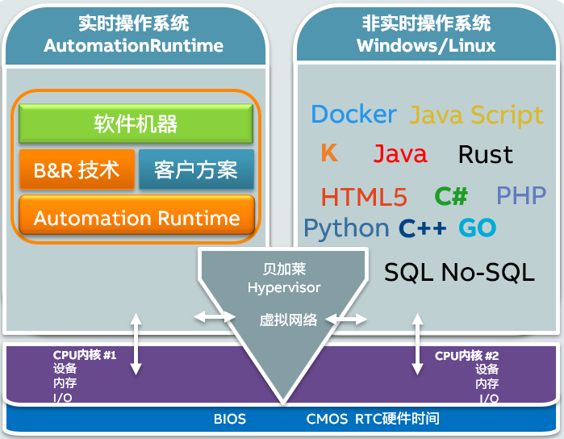
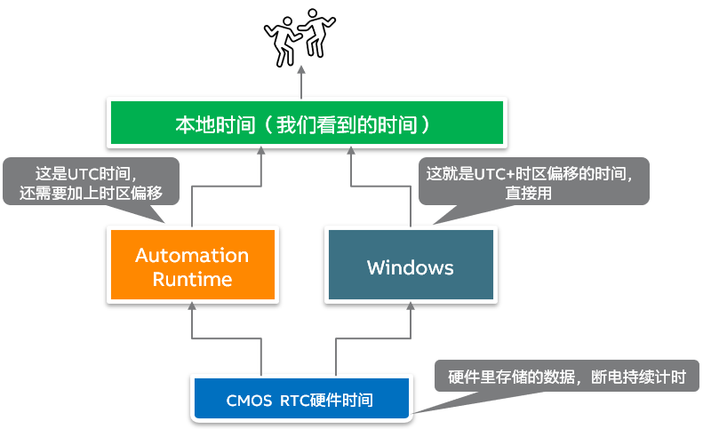
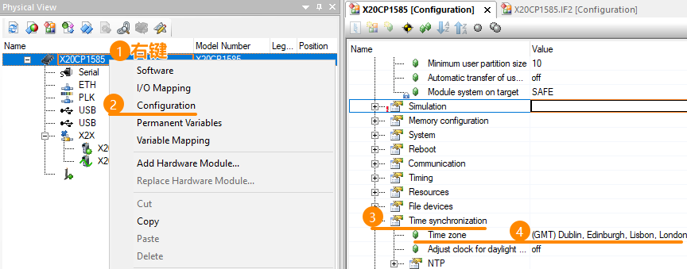
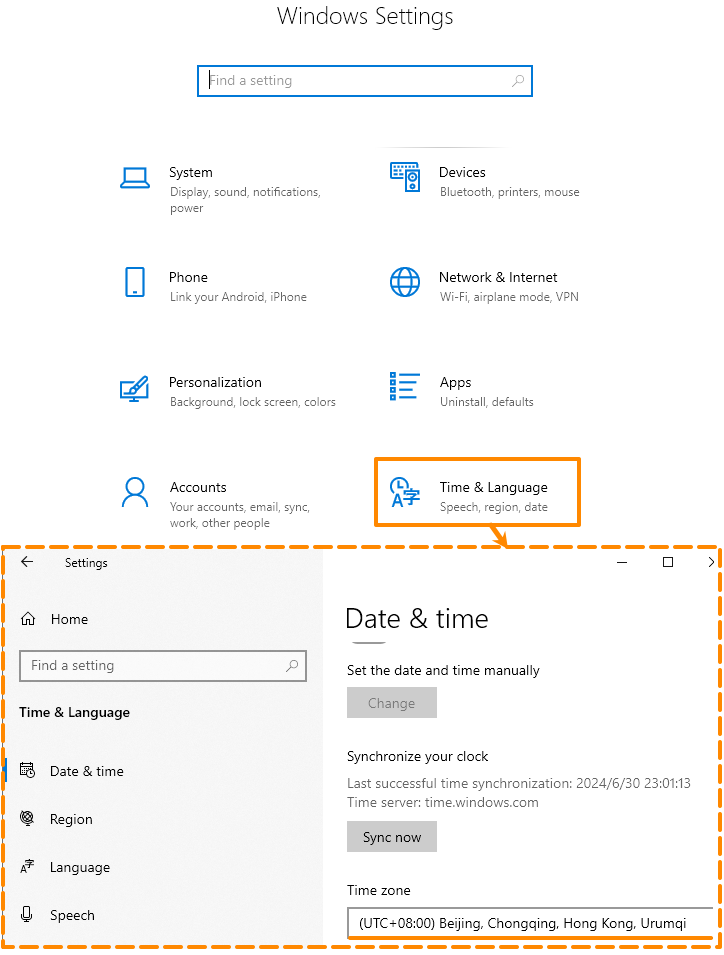
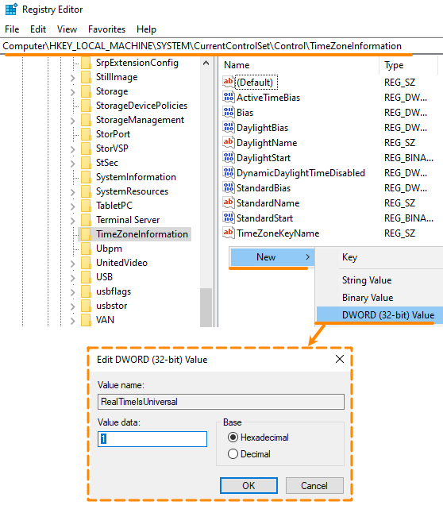

> Tags: #Hypervisor #对时 #NTP

- [1 B02.033.Hypervisor双系统对时功能](#_1-b02033hypervisor%E5%8F%8C%E7%B3%BB%E7%BB%9F%E5%AF%B9%E6%97%B6%E5%8A%9F%E8%83%BD)
- [2 时间概念与原因](#_2-%E6%97%B6%E9%97%B4%E6%A6%82%E5%BF%B5%E4%B8%8E%E5%8E%9F%E5%9B%A0)
- [3 问题根源：时区设置问题](#_3-%E9%97%AE%E9%A2%98%E6%A0%B9%E6%BA%90%EF%BC%9A%E6%97%B6%E5%8C%BA%E8%AE%BE%E7%BD%AE%E9%97%AE%E9%A2%98)
- [4 时区设置说明](#_4-%E6%97%B6%E5%8C%BA%E8%AE%BE%E7%BD%AE%E8%AF%B4%E6%98%8E)
	- [4.1 贝加莱AutomationRuntime时区设置](#_41-%E8%B4%9D%E5%8A%A0%E8%8E%B1automationruntime%E6%97%B6%E5%8C%BA%E8%AE%BE%E7%BD%AE)
	- [4.2 Windows时区设置](#_42-windows%E6%97%B6%E5%8C%BA%E8%AE%BE%E7%BD%AE)
- [5 解决方式一：将Windows设置注册表，调整时区处理](#_5-%E8%A7%A3%E5%86%B3%E6%96%B9%E5%BC%8F%E4%B8%80%EF%BC%9A%E5%B0%86windows%E8%AE%BE%E7%BD%AE%E6%B3%A8%E5%86%8C%E8%A1%A8%EF%BC%8C%E8%B0%83%E6%95%B4%E6%97%B6%E5%8C%BA%E5%A4%84%E7%90%86)
- [6 解决方式二：将Windows侧与AR侧的时区，全部设置为UTC+0](#_6-%E8%A7%A3%E5%86%B3%E6%96%B9%E5%BC%8F%E4%BA%8C%EF%BC%9A%E5%B0%86windows%E4%BE%A7%E4%B8%8Ear%E4%BE%A7%E7%9A%84%E6%97%B6%E5%8C%BA%EF%BC%8C%E5%85%A8%E9%83%A8%E8%AE%BE%E7%BD%AE%E4%B8%BAutc0)
- [7 时间错乱，AR侧Logger频繁记录30993](#_7-%E6%97%B6%E9%97%B4%E9%94%99%E4%B9%B1%EF%BC%8Car%E4%BE%A7logger%E9%A2%91%E7%B9%81%E8%AE%B0%E5%BD%9530993)
- [8 时间错乱，BIOS上时间就不对](#_8-%E6%97%B6%E9%97%B4%E9%94%99%E4%B9%B1%EF%BC%8Cbios%E4%B8%8A%E6%97%B6%E9%97%B4%E5%B0%B1%E4%B8%8D%E5%AF%B9)
- [9 贝加莱AS Help中关于对时相关说明](#_9-%E8%B4%9D%E5%8A%A0%E8%8E%B1as-help%E4%B8%AD%E5%85%B3%E4%BA%8E%E5%AF%B9%E6%97%B6%E7%9B%B8%E5%85%B3%E8%AF%B4%E6%98%8E)
	- [9.1 在同步 Automation Runtime 和 GPOS 之间的时间时应注意什么？](#_91-%E5%9C%A8%E5%90%8C%E6%AD%A5-automation-runtime-%E5%92%8C-gpos-%E4%B9%8B%E9%97%B4%E7%9A%84%E6%97%B6%E9%97%B4%E6%97%B6%E5%BA%94%E6%B3%A8%E6%84%8F%E4%BB%80%E4%B9%88%EF%BC%9F)
	- [9.2 为什么 MS Windows 断电后更改的系统时间会丢失？](#_92-%E4%B8%BA%E4%BB%80%E4%B9%88-ms-windows-%E6%96%AD%E7%94%B5%E5%90%8E%E6%9B%B4%E6%94%B9%E7%9A%84%E7%B3%BB%E7%BB%9F%E6%97%B6%E9%97%B4%E4%BC%9A%E4%B8%A2%E5%A4%B1%EF%BC%9F)
- [10 更新日志](#_10-%E6%9B%B4%E6%96%B0%E6%97%A5%E5%BF%97)

# 1 B02.033.Hypervisor双系统对时功能

- Hypervisor双系统若使用Windows + Automation Runtime，则会发现断电上电后，两个系统显示的时间不同步，有8小时时差。
- Hypervisor的系统架构如下图所示，两个系统同时会去读取存储在主板CMOS的RTC硬件时间。
    - 
- 两个系统的时间是通过RTC硬件时间同步的，但两个操作系统的时区是独立设置的并不同步。

# 2 时间概念与原因

- 硬件时间（RTC time）
    - 硬件时间，也被称为实时时钟（RTC），是指计算机主板上的一个独立于操作系统的设备，它在电源关闭甚至断电情况下也能保持运行。其功能是记录当前的日期和时间。
    - 大部分操作系统在启动时会从RTC读取时间，然后设置系统时间。同样，操作系统也可以将系统时间写回到RTC中。
- UTC时间
    - 系统时间通常使用协调世界时（UTC）表示。UTC是一种基于原子时钟的时间标准，全球各地的科学家通过精密测量来维护它。
    - 每一个地方在同一时刻的UTC时间是相同的。
    - UTC+或UTC- 来表示各个时区的时间，中国的时区时间就是UTC+8。
- 本地时间
    - 即我们看到的正确的时间，就是UTC+时区偏移。
    - 本地时间与硬件时间RTC有关
        - Linux/贝加莱AutomationRuntime 认为硬件中存储的时间是 UTC 时间，会在硬件中存储的时间的基础上加上时区的偏移。
        - Windows 认为硬件中存储的硬件时间是 UTC+时区偏移，它会直接进行显示。
- 大部分操作系统的时间管理包括如下方面：
    - 启动时根据硬件时间(RTC)设置本地时间
    - 运行时通过 NTP 对时服务联网校正时间
    - 关机时根据本地时间设置硬件时间(RTC)。
- 

# 3 问题根源：时区设置问题

- 当使用Hypervisor发现两个系统断电上电后会固定差几个小时时间，则此问题即是时区问题

# 4 时区设置说明

## 4.1 贝加莱AutomationRuntime时区设置

- 

## 4.2 Windows时区设置

- 

# 5 解决方式一：将Windows设置注册表，调整时区处理

- 让 Windows 也和 AR/Linux 一样，将电脑硬件时间看作UTC时间，上电时增加时区处理。
- 增加方式A: 手动增加注册表
    - Win+R输入regedit打开注册表。
    - 找到HKEY_LOCAL_MACHINE/SYSTEM/CurrentControlSet/Control/TimeZoneInformation，右键新建DWORD(32位)值，名称为“RealTimeIsUniversal”，值为1
        - 
- 增加方式B：双击执行以下压缩包内的reg文件
    - [点击下载 → RealTimeIsUniversal注册表添加reg文件](/B02_技术_AutomationRuntime/FILES/033Hypervisor双系统对时功能/WindowsTimeZoneSet.zip ':ignore')
- 参考说明
    - [如果在 Windows 中启用了 RealTimeIsUniversal 注册表项，则不能更改系统时间 - Microsoft 支持](https://support.microsoft.com/zh-cn/topic/%E5%A6%82%E6%9E%9C%E5%9C%A8-windows-%E4%B8%AD%E5%90%AF%E7%94%A8%E4%BA%86-realtimeisuniversal-%E6%B3%A8%E5%86%8C%E8%A1%A8%E9%A1%B9-%E5%88%99%E4%B8%8D%E8%83%BD%E6%9B%B4%E6%94%B9%E7%B3%BB%E7%BB%9F%E6%97%B6%E9%97%B4-78cf9fbe-eeca-4b06-a67a-2dacdf5189f9)

# 6 解决方式二：将Windows侧与AR侧的时区，全部设置为UTC+0

- 这样就规避了时区调整问题，若在Windows侧设置注册表无效，建议使用此方式。

# 7 时间错乱，AR侧Logger频繁记录30993

- 若发现本地时间错乱跳变，且发现Logger中频繁记录30993，则此问题为AR的BUG
- 影响范围 4.7 ~ 4.11 的AR。
- 升级AR至 2021-04-15（D4.90） 及之后发布的AR版本
    - 开始出现此BUG的版本：B4.73
    - 建议使用此AR版本及之后版本：
        - D4.73
        - C4.83
        - D4.90
        - B4.91
        - A4.92
- 30993报错说明
    - Time jump - software time
    - 错误描述
        - 软件时间向前或向后跳变。
        - 在时间同步过程中，当软件时间与参考时间相差大于2秒时，就会发生这种情况。这种情况下，时间校正是通过向前或向后跳变秒数来调整的，软件时间调整时不会发生跳变。
    - 建议解决方式
        - 如果使用 RTC 而不是对时服务器作为参考时钟，则不应发生此错误。如果错误继续发生，原因可能是 CPU 利用率过高。然后时间同步任务没有获得 CPU，软件时间与时间源（RTC 的 SNTP）相差超过 2 秒。
        - 如果使用对时服务器进行时间同步，则应缩短 SNTP 同步间隔（请参阅 CPuporties/time synchronization）。如果时间服务器提供的时间不正确，或者发生故障并且目标系统切换到其他时间服务器或 RTC，也会出现此错误。

# 8 时间错乱，BIOS上时间就不对

- 现象
    - 工控机设备运行时间较长，长时间断电再上电发现时间跳变，原因为CMOS电池没电了。
    - 主板上的CMOS电池是可充电电池，但如果工控机使用很多年，电池老化，无法存储过多电能，因此，关机后存储电量很容易耗尽，导致时间不对。
- 解决方式
    - 更换CMOS电池，或者使用NTP对时服务

# 9 贝加莱AS Help中关于对时相关说明

## 9.1 在同步 Automation Runtime 和 GPOS 之间的时间时应注意什么？

> 此信息来源于AS Help，GUID: 695831f7-4802-4d8a-94a9-0a8b7b3adf52
- Windows侧应通过注册表将UTC时间保存在硬件实时时钟中
    - 两个操作系统通过实时时钟同步时间（UTC）。
    - 时区在两个操作系统中独立设置，不同步。
    - 在 GPOS 中，必须确保 UTC 保存在硬件实时时钟中，而不是本地时间。
    - 在 Windows 中，必须将以下注册表项设置为 "1"：（DWORD（32 位））
        - `HKEY_LOCAL_MACHINE\SYSTEM\CurrentControlSet\Control\TimeZoneInformation\RealTimeIsUniversal`
- 不应通过 NTP 对时服务器同时自动同步两个操作系统的时间。
    - 这可能会导致虚拟以太网接口上的连接短暂中断，导致 mapp View 客户端必须重新连接。
    - 如果在 Automation Runtime 中配置了对时服务，建议在 GPOS 中禁用自动对时服务，反之亦然。

## 9.2 为什么 MS Windows 断电后更改的系统时间会丢失？

- 当将时间更改为过去某一时间时，必须正确关闭 Windows，以便在重新启动后仍能设置该时间。
- 如果发生断电，Windows 会重新设置以前的有效时间。
- Windows 不接受从外部将时间更改为过去的时间。这是 MS Windows 的预期行为。

# 10 更新日志

| 日期         | 修改人 | 修改内容 |
| :--------- | :-- | :--- |
| 2024-07-02 | YZY | 初次创建 |
