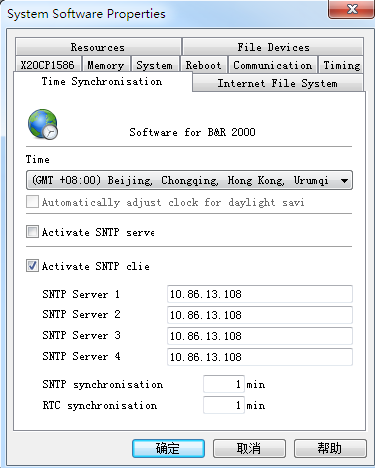
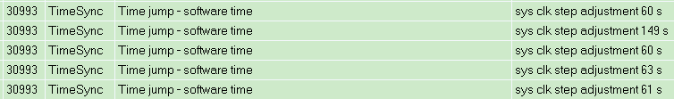
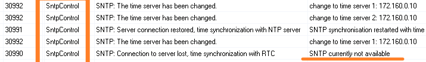
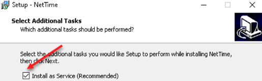
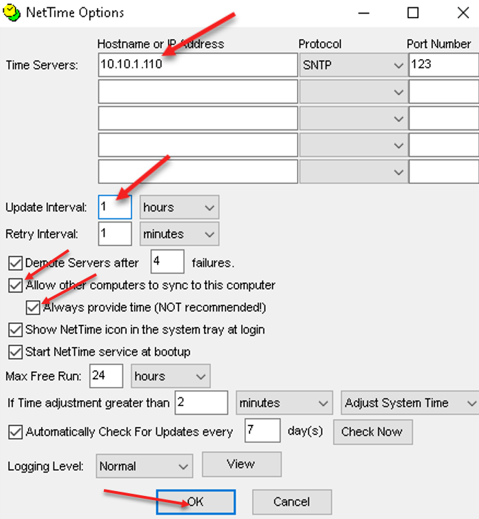
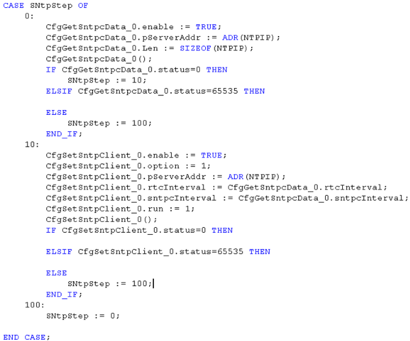

> Tags: #对时

- [1 B02.034.贝加莱SNTP对时说明](#_1-b02034%E8%B4%9D%E5%8A%A0%E8%8E%B1sntp%E5%AF%B9%E6%97%B6%E8%AF%B4%E6%98%8E)
- [2 贝加莱PLC中SNTP的设置](#_2-%E8%B4%9D%E5%8A%A0%E8%8E%B1plc%E4%B8%ADsntp%E7%9A%84%E8%AE%BE%E7%BD%AE)
- [3 贝加莱SNTP的特点](#_3-%E8%B4%9D%E5%8A%A0%E8%8E%B1sntp%E7%9A%84%E7%89%B9%E7%82%B9)
- [4 SNTP无法正常访问报错 30990](#_4-sntp%E6%97%A0%E6%B3%95%E6%AD%A3%E5%B8%B8%E8%AE%BF%E9%97%AE%E6%8A%A5%E9%94%99-30990)
- [5 Windows 使用NetTime软件作为SNTP Server](#_5-windows-%E4%BD%BF%E7%94%A8nettime%E8%BD%AF%E4%BB%B6%E4%BD%9C%E4%B8%BAsntp-server)
- [6 通过代码实现SNTP Client](#_6-%E9%80%9A%E8%BF%87%E4%BB%A3%E7%A0%81%E5%AE%9E%E7%8E%B0sntp-client)
- [7 补充注意事项](#_7-%E8%A1%A5%E5%85%85%E6%B3%A8%E6%84%8F%E4%BA%8B%E9%A1%B9)
- [8 更新日志](#_8-%E6%9B%B4%E6%96%B0%E6%97%A5%E5%BF%97)

# 1 B02.034.贝加莱SNTP对时说明

- 自AR4.24以后，更建议使用NTP。
- SNTP为NTP对时服务的简化版本，详情可参考
    - [032贝加莱NTP对时服务](032贝加莱NTP对时服务.md)
- SNTP是简单网络时间协议（Simple Network Time protocol）的简称，它是目前Internet网上实现时间同步的一种重要工程化方法NTP协议为了保证高度的精确性，需要很复杂算法，但是在实际很多应用中，秒级的精确度就足够了，在这种情况下，SNTP协议出现了，它通过简化原来的访问协议，在保证时间精确度的前提下，使得对网络时间的开发和应用变得容易。
- SNTP主要对NTP协议涉及有关访问安全、服务器自动迁移部分进行了缩减。SNTP协议采用客户/服务器工作方式，服务器通过接收GPS信号或自带的原子钟作为系统的时间基准，客户机通过定期访问服务器提供的时间服务获得准确的时间信息，并调整自己的系统时钟，达到网络时间同步的目的。客户和服务器通讯采用UDP协议，端口为123，最高精度只能达到ms级。
- [点击访问 → B&R Online Help 中相关章节](https://help.br-automation.com/#/en/4/projectmanagement%2Fsystemconfiguration%2Fsg4%2Fcpu%2Fprojectorganisation_systemconfiguration_sg4_cpu_ntp.html)

# 2 贝加莱PLC中SNTP的设置

- 
- SNTP synchronization interval
    - 时间间隔指定NTP服务器和NTP客户端之间网络时间同步的频率。此时间以分钟为单位指定。
    - 如果用户更改客户端上的时间（使用 AS 或库），则网络时间会立即同步，而不会等待间隔结束。
    - 此参数最多可配置到 Automation Runtime A4. 24
- RTC synchronization interval
    - 时间间隔，指定客户端本地RTC实时时钟与服务器网络时间同步的频率。时间间隔以分钟为单位。
    - 此参数最多可配置到 Automation Runtime A4. 24

# 3 贝加莱SNTP的特点

- SNTP 时间同步的准确性影响参数
    - 系统负载：PLC的CPU占用率过高会影响精确度。
    - 配置的同步间隔：为获得最高精确度，SNTP 同步间隔应设置为一分钟。
    - 网络负载：网络负载过重也会影响精确度。
    - 一般来说，可以达到 10-50 毫秒左右的精确度。
- 正常SNTP 起作用Logger会记录时间修改的变化
    - 

# 4 SNTP无法正常访问报错 30990

- 使用一个SNTP Server，在一个设备较多的网络中，受影响较大
    - 实际测试发现大约30个设备（均使用SNTP Client）在一个网络中，SNTP Client可能会出现连不上的情况，会报错 30990
    - 

# 5 Windows 使用NetTime软件作为SNTP Server

- 软件为NetTime
    - 可以实现同SNTP服务器的通讯，设置本地的时钟，并同时作为一个SNTP服务器使用端口123，向客户端发送时钟信息，同时体积小巧，免费可长期使用。
- 下载链接
    - www.timesyntool.com
- 安装注意事项
    - 软件安装前请先关闭防火墙，并以管理员权限运行安装程序。
    - 安装过程中此处请打勾，将该程序设置为开机自动运行。
        - 
- 点击Settings按钮完成设置
    - 
    - 这里分别设置SNTP服务器的IP地址，使用协议，端口号和刷新系统时钟的时间间隔，此处SNTP服务器IP：10.10.1.110，更新时间间隔是1小时
    - 请一定勾选Allow other computers to sync to this computer. Always provide time (NOT recommended!)这两项，这样才可以向SNTP客户端发送时间信息
    - 其他设置可以不必修改，确定参数后点击OK即可。
    - 关闭此程序界面，程序进入后台运行。
        - 
- 设置Windows的防火墙设置与端口
    - 请查看 [032贝加莱NTP对时服务](032贝加莱NTP对时服务.md) 中 **5.3 开放Windows防火墙** 章节

# 6 通过代码实现SNTP Client

- 使用AsARCfg库中的CfgGetSntpcData和CfgSetSntpClient功能块实现SNTP客户端功能。
    - CfgGetSntpcData获取必要的客户端数据。
    - CfgSetSntpClient运行客户端。
- 具体代码如下：
    - 

# 7 补充注意事项

- Windows CE 限制
    - Windows CE SNTP 客户端的最小客户端刷新率为 5 分钟。
    - 任何小于此值的刷新率都将停止 SNTP 服务，并且根本无法工作

# 8 更新日志

| 日期         | 修改人 | 修改内容                                           |
| :--------- | :-- | :--------------------------------------------- |
| 2024-03-29 | WH  | 编写SNTP Server NetTime软件用法 编写程序实现SNTP Client |
| 2024-07-09 | YZY | 补充文档信息                                         |
