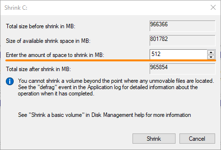

> Tags: #文件

# B02.035.如何在ARSim模式下的使用USER分区

- AS4.10之后的版本，Module system on target只能选择SAFE，这导致了如果需要读写外部文件，文件只能存放在USER空间，即PLC的CF卡中的F盘中
    - 
- 我们习惯在File devices中将Path指定为 `F:\` ，但当开启仿真模式，需要电脑本地也需要一个F盘。
- 此文档介绍如何手动划分笔记本的电脑的硬盘区域，指定一个专门的F盘用于测试。

# 电脑创建F盘

- 1___打开文件管理器，右键PC，选择Manage(管理)，找到 Disk Management（磁盘管理）
    - 
    - 磁盘管理也可以从运行窗口启动。按 Windows+R，在框中键入“diskmgmt.msc”，然后单击“确定”。
- 2___点击C盘，右键 → 选择 Shrink Volume (压缩卷 )，在弹出框中输入需要F盘容量（单位为MB）并选择收缩，以下图为例，分配了512MB的硬盘空间。
    - 
    - 
- 3___选中刚刚分配好的分区卷，右键 → New Simple Volume，→ 选择需要分配给的盘符为 F → 命名此卷并格式化（需注意要选择FAT32）
    - 
    - 
    - 
- 4___格式化完成，将文件放置在指定路径即可
    - 

# 更新日志

| 日期                             | 修改人 | 修改内容 |
| :----------------------------- | :-- | :--- |
| 2024-08-19 | YZY | 初次创建 |
