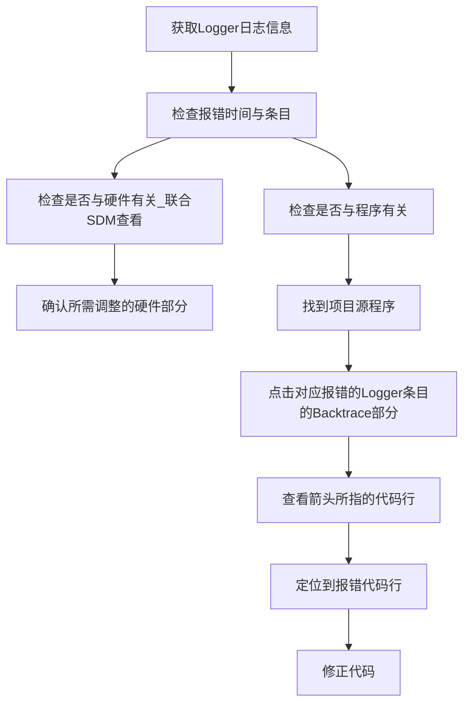

> Tags: #AR

- [1 B03.006.PLC进入Service Mode，该如何解决？](#_1-b03006plc%E8%BF%9B%E5%85%A5service-mode%EF%BC%8C%E8%AF%A5%E5%A6%82%E4%BD%95%E8%A7%A3%E5%86%B3%EF%BC%9F)
- [2 通过 SDM 收集系统日志 Logger](#_2-%E9%80%9A%E8%BF%87-sdm-%E6%94%B6%E9%9B%86%E7%B3%BB%E7%BB%9F%E6%97%A5%E5%BF%97-logger)
- [3 常见排查方式与思路](#_3-%E5%B8%B8%E8%A7%81%E6%8E%92%E6%9F%A5%E6%96%B9%E5%BC%8F%E4%B8%8E%E6%80%9D%E8%B7%AF)

# 1 B03.006.PLC进入Service Mode，该如何解决？

- PLC进入Service Mode的可能性较多。较为常见的原因有如下问题
    - 程序中的硬件组态与实际硬件不符合 → 检查是否模块插错，模块拨码拨错（最常见）
    - 硬件损坏 → 收集Logger日志 → 联系相关人员分析
    - 任务超时报错 → 收集Logger日志 → 联系程序开发人员
    - 程序严重故障例如内存溢出 → 收集Logger日志 → 联系程序开发人员
- AutomationRuntime的不同状态，[点击查看 → 020什么是贝加莱PLC的SERV模式](../B02_技术_AutomationRuntime/020什么是贝加莱PLC的SERV模式.md)
- 常见PLC例如X20CP3687X的 **R灯** 会呈现 红灯常亮 的状态。
    - 
- 为准确定位导致SERV的原因，需要获取到Logger日志，日志中包含了完整的报错信息。
    - 可以自行导出Logger
    - 或者直接把CF/CFast卡寄给相关人员（或）（所有信息均存储在卡中）

# 2 通过 SDM 收集系统日志 Logger

- 详情可见 [⭐003如何收集现场PLC的故障信息](../C04_现场维运/003如何收集现场PLC的故障信息.md)

# 3 常见排查方式与思路

- 常见的排查流程如下

