> Tags: #SDM #系统诊断

- [1 B03.009 SDM是什么？](#1%20B03.009%20SDM%E6%98%AF%E4%BB%80%E4%B9%88%EF%BC%9F)
	- [1.1 对应帮助说明](#1.1%20%E5%AF%B9%E5%BA%94%E5%B8%AE%E5%8A%A9%E8%AF%B4%E6%98%8E)
	- [1.2 相关内容](#1.2%20%E7%9B%B8%E5%85%B3%E5%86%85%E5%AE%B9)
- [2 SDM功能开启与关闭](#2%20SDM%E5%8A%9F%E8%83%BD%E5%BC%80%E5%90%AF%E4%B8%8E%E5%85%B3%E9%97%AD)
- [3 概览页](#3%20%E6%A6%82%E8%A7%88%E9%A1%B5)
- [4 内存页](#4%20%E5%86%85%E5%AD%98%E9%A1%B5)
- [5 任务周期页](#5%20%E4%BB%BB%E5%8A%A1%E5%91%A8%E6%9C%9F%E9%A1%B5)
- [6 CPU使用率页](#6%20CPU%E4%BD%BF%E7%94%A8%E7%8E%87%E9%A1%B5)
- [7 软件页](#7%20%E8%BD%AF%E4%BB%B6%E9%A1%B5)
- [8 硬件页](#8%20%E7%A1%AC%E4%BB%B6%E9%A1%B5)
- [9 轴控信息页](#9%20%E8%BD%B4%E6%8E%A7%E4%BF%A1%E6%81%AF%E9%A1%B5)
- [10 日志页](#10%20%E6%97%A5%E5%BF%97%E9%A1%B5)
- [11 Profiler页](#11%20Profiler%E9%A1%B5)
- [12 更新日志](#12%20%E6%9B%B4%E6%96%B0%E6%97%A5%E5%BF%97)

# 1 B03.009 SDM是什么？

- SDM的全称为System Diagnostics Manager，也称为系统诊断管理器。可以使用浏览器通过IP地址对控制器进行访问。
- SDM具有如下功能
    - 运动轴信息、跟踪数据和操作、上传网络命令跟踪
    - 可通过网络服务进行数据查询
    - 硬件分析，用于检测目标系统上的配置或硬件问题，额外显示型号/设备 ID
        - 硬件树中的 I/O 查看器，用于显示 I/O 状态
    - 分析系统配置和Automation Runtime 参数（如配置的 IP 地址）
    - 软件分析（目标系统上的软件模块和版本）
    - 访问 Profiler 并上传 Profiler 日志，以便在 Automation Studio 中进行进一步分析
    - 显示和上传目标系统的错误日志
- 在控制器已经和电脑进行连接的情况下，在浏览器中输入
    - `http://控制器IP地址/sdm` ，即可访问SDM界面。
    - 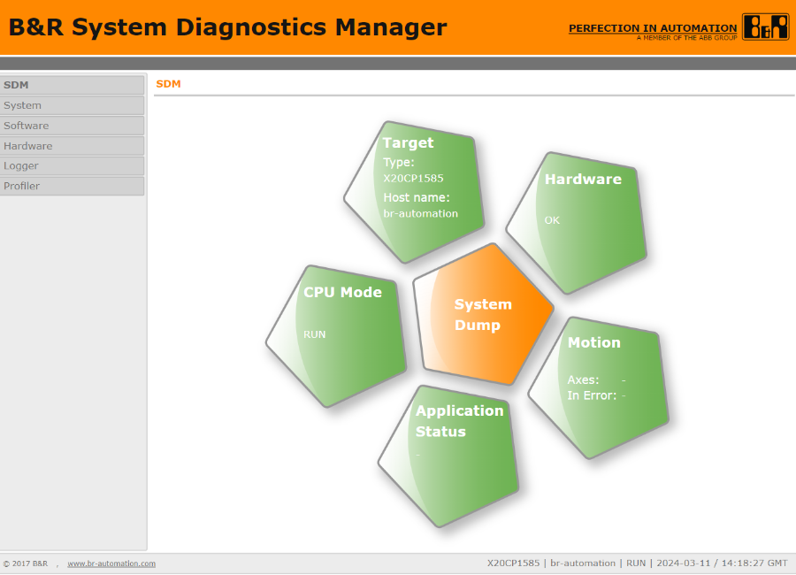
- Automation Runtime V3.0 及更高版本中包含的系统诊断管理器可用于从任何位置（内联网或互联网）使用标准 Web 浏览器诊断控制器。
- 不再需要用户专用诊断工具和 Automation Studio 来分析控制器的配置或 Automation Runtime 的问题。唯一需要的是网络浏览器和与控制器的 TCP/IP 连接
- 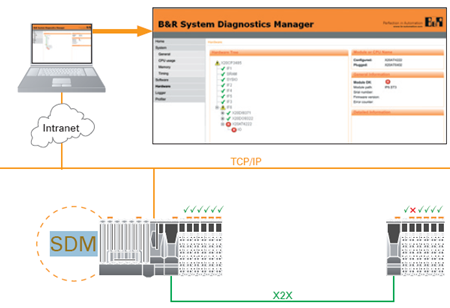

## 1.1 对应帮助说明

- 贝加莱英文帮助说明
    - [B&R Online Help (br-automation.com)](https://help.br-automation.com/#/en/4/automationruntime%2Ftargets%2Fsdm%2Fsdm.htm)
- Automation Help
    - GUID : 492f2f2c-6a4b-4f1f-8b64-c39163eb50cb
    - Diagnostics and service → Diagnostics tools → System Diagnostics Manager (SDM)

## 1.2 相关内容

- [⭐008SDM数据本地诊断工具](/C07_工具/008SDM数据本地诊断工具.md)
- [033通过SDM查看存储设备的健康情况-Storage wear](033通过SDM查看存储设备的健康情况-Storage%20wear.md)

# 2 SDM功能开启与关闭

- SDM功能默认开启
- 配置方式：
    - Physical View下 → PLC 右键选择 Configuration → System diagnostics → Activate System Diagnostics Manager 设置为 on
        - 需注意，此功能使用的前提为 Activate Web Server 为 on
- 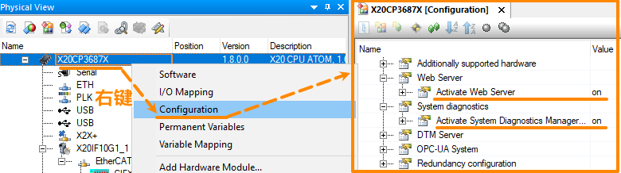

# 3 概览页

- 本页显示目标系统的系统设置和运行模式。
- 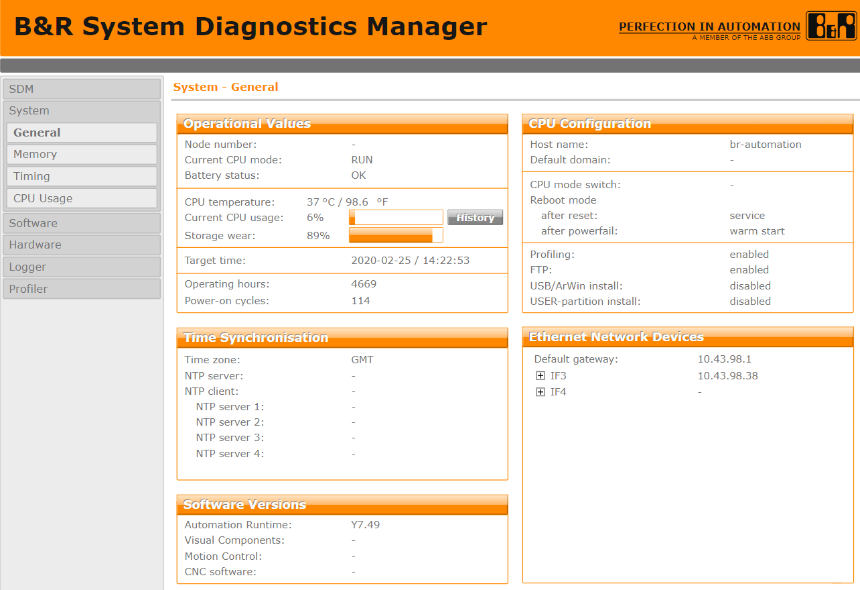
- Storage wear 参数说明
    - [033通过SDM查看存储设备的健康情况-Storage wear](033通过SDM查看存储设备的健康情况-Storage%20wear.md)

# 4 内存页

- 本页显示目标系统上已配置和可用的内存量。
- 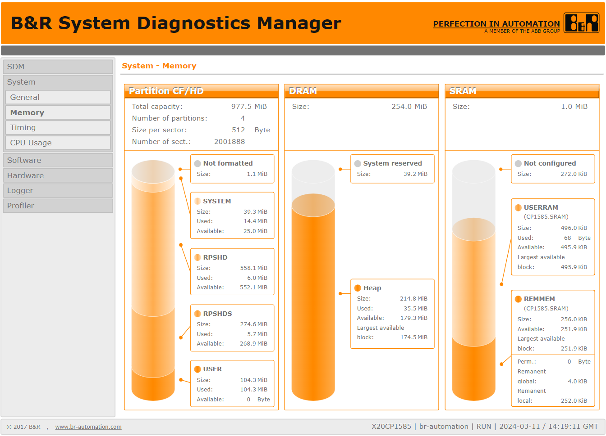

| 属性                                                                         | 描述                          |
| -------------------------------------------------------------------------- | --------------------------- |
| **Partition CF / HD （CF卡，硬盘分区）**                                           |                             |
| 此区域显示目标系统的 CompactFlash /硬盘的已配置存储空间和可用存储空间。 底部的柱形图显示了每个分区中已使用和可用的存储空间。  |                             |
| Total capacity [MB]                                                        | 目标系统 CompactFlash 卡/硬盘的总容量。 |
| Number of partitions                                                       | 目标系统上配置的分区数。                |
| Size per sector [bytes]                                                    | 以字节/扇区为单位的存储空间量。            |
| Number of sectors                                                          | 扇区数                         |
| **DRAM**                                                                   |                             |
| 该区域显示 DRAM 中的可用内存总量。 底部的条形图显示 DRAM 中已使用和可用的内存量。                         |                             |
| Size [MB]                                                                  | 目标系统上可用的 DRAM 内存总量。         |
| **SRAM**                                                                   |                             |
| 该区域显示 SRAM 中配置的内存量。  底部的条形图显示了为剩余变量和永久变量配置的 SRAM 区域，以及它们的已用内存和可用内存量。 |                             |
| Size [KB]                                                                  | 目标系统上配置的 SRAM 总量。           |

# 5 任务周期页

- 目标系统上配置的定时器设置和任务类别周期时间将显示在此页面上。
- 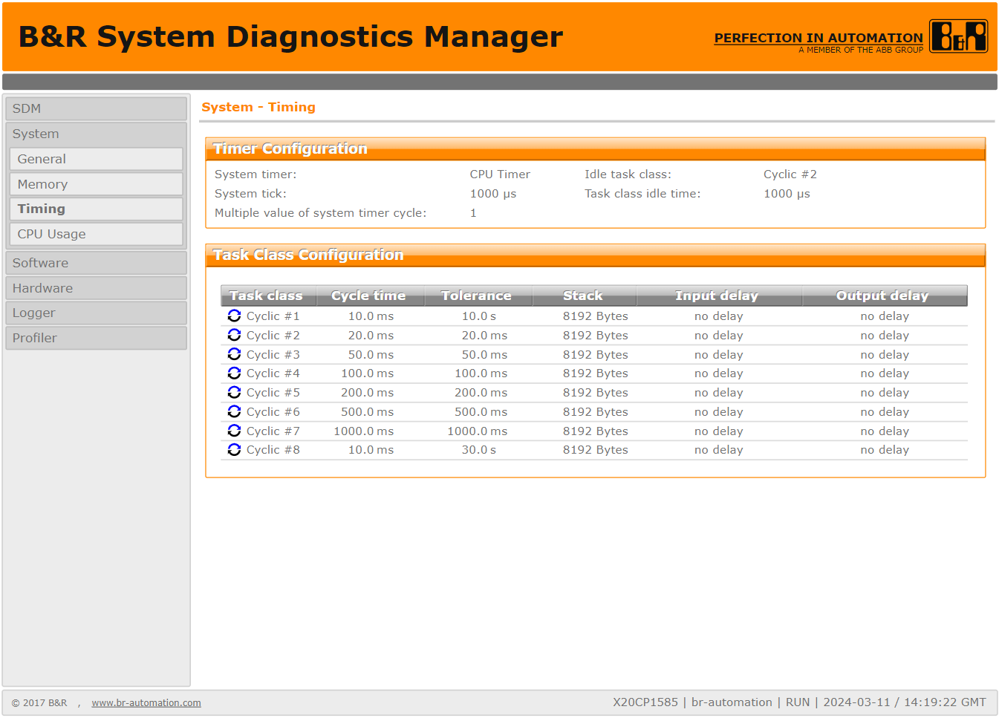

# 6 CPU使用率页

- 本页显示自上次开机以来目标系统 CPU 负载的图表。可以使用 "时间间隔 Time interval "下的组合框设置显示的时间范围。
- 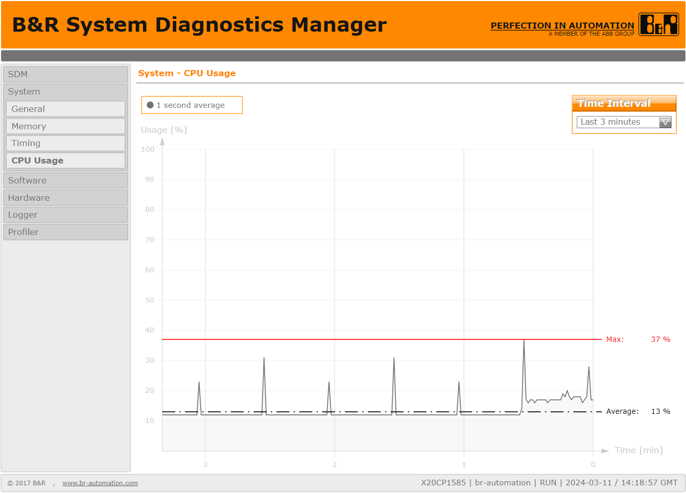
- Time Interval 时间间隔参数设置
    - 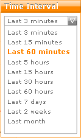

# 7 软件页

- 本页显示目标系统中的软件模块。模块列表可以 .txt 或 .csv 格式保存在电脑上。
- 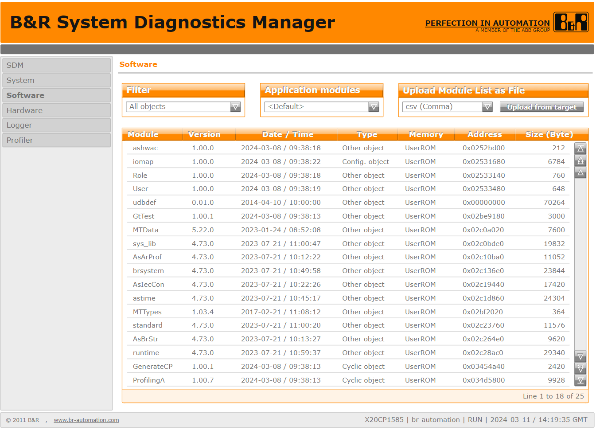

# 8 硬件页

- 本页显示目标系统的硬件树。它包含用于配置各种模块的信息和错误状态。
- 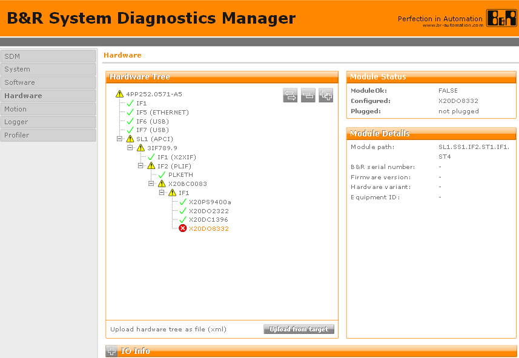
- 硬件树 Hardware tree
    -  对于相应的硬件模块，“模块已配置”和“模块已插入”具有相同的含义，且诊断数据点 ModuleOK=TRUE。
    -  该图标表示实际硬件模块与 Automation Studio 项目的目标系统配置不匹配（未连接或未配置）。
    -  该图标表示与目标系统 Automation Studio 项目配置不匹配（未连接或未配置）但已禁用模块监控的模块。
    -  该图标表示 Automation Studio 项目中未对目标系统配置对应的模块。
    - 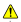 此图标指示硬件树的某个分支与Automation Studio项目的配置不匹配。
- 模块状态 Module status
    - 已连接/配置模块的名称
    - ModuleOk：当 "模块状态 Module status "字段显示 "ModuleOk "时，这反映了相应硬件模块的诊断数据点 "ModuleOk "的状态。
    - Configured / Plugged：如果出现错误 ，此处将显示在 Automation Studio 中配置的模块名称。如果配置的模块与插入的模块相同，则硬件树和此属性中将显示相同的模块名称。
- Hardware - I/O information
    - I/O 监控页面显示的 I/O 数据点与 Automation Studio 中显示的所选模块或设备的数据点相同。
    - 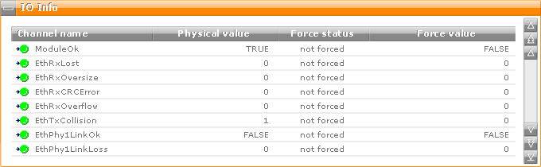

# 9 轴控信息页

- 该页面显示目标系统中所有已配置轴的信息。它包含配置各种轴的信息和错误状态。
    - 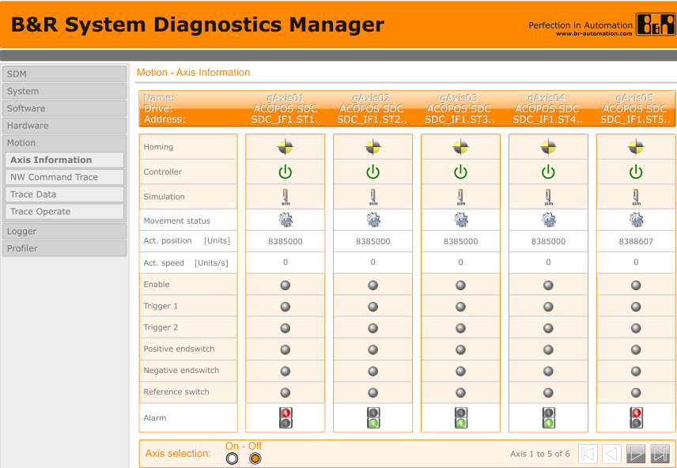
- 在 NW Command Trace 页，您可以创建网络命令跟踪快照并从目标系统上传。数据将使用 Automation Studio 进行评估。
    - 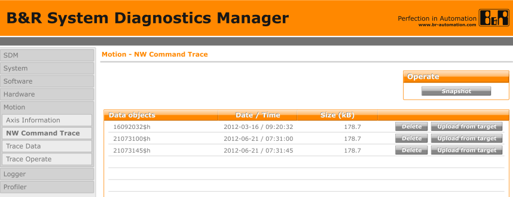

# 10 日志页

- 此页面列出目标系统上Logger模块（用户日志/错误日志）的当前100个日志条目。记录器记录也可以从目标系统上传，并在Automation Studio记录器中进行评估。
- 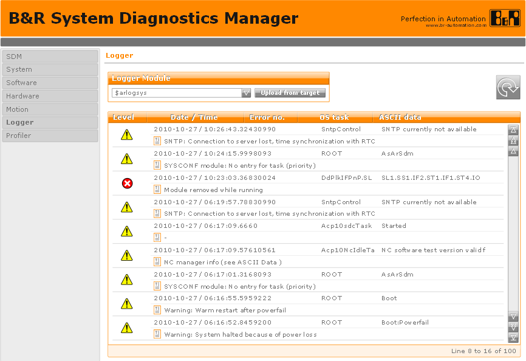

# 11 Profiler页

- 在 Automation Studio 中创建的 Profiler 配置可传输到目标系统，并在此页面上启动和停止。Profiler 记录也可从目标系统上传，并在 Automation Studio Profiler 中进行评估。
- 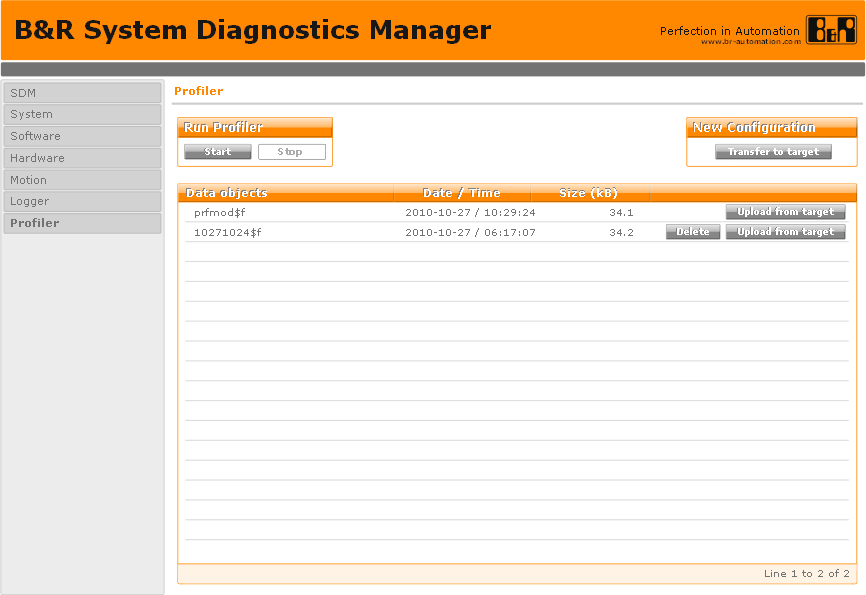

# 12 更新日志

| 日期         | 修改人       | 修改内容 |
| :--------- | :-------- | :--- |
| 2024-03-17 | YuanZhiyi | 初次创建 |
