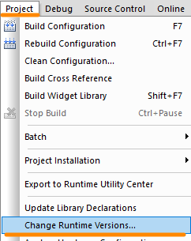
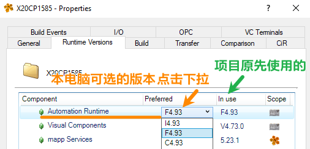

> Tags: #AS

- [1 B03.013.AS软件编译报错6801](#_1-b03013as%E8%BD%AF%E4%BB%B6%E7%BC%96%E8%AF%91%E6%8A%A5%E9%94%996801)
- [2 问题原因](#_2-%E9%97%AE%E9%A2%98%E5%8E%9F%E5%9B%A0)
- [3 解决方式一安装指定的AR版本](#_3-%E8%A7%A3%E5%86%B3%E6%96%B9%E5%BC%8F%E4%B8%80%E5%AE%89%E8%A3%85%E6%8C%87%E5%AE%9A%E7%9A%84ar%E7%89%88%E6%9C%AC)
- [4 解决方式二修改使用当前已有的AR版本](#_4-%E8%A7%A3%E5%86%B3%E6%96%B9%E5%BC%8F%E4%BA%8C%E4%BF%AE%E6%94%B9%E4%BD%BF%E7%94%A8%E5%BD%93%E5%89%8D%E5%B7%B2%E6%9C%89%E7%9A%84ar%E7%89%88%E6%9C%AC)

# 1 B03.013.AS软件编译报错6801

- `Error 6801:File not found "C:BrAutomation AS\System\C0472\SG4\Ia32\@cfX20CP1586.br".`

# 2 问题原因

- 项目已经指定了对应的AR版本，但编译项目的电脑中没有安装此版本，可从报错信息中查看了解到，缺少的是C072版本。
- 在AS软件中，点击菜单栏 Project → Change Runtime Versions → Runtime Versions
- Automation Runtime条目中，In use的版本为此项目原先使用且指定的版本，Preferred的版本为当前此电脑上可选择的
    - 
    - 
- 若本地电脑没有安装In Use所对应的Automation Runtime版本，则在编译的时候报出 6801 报错。

# 3 解决方式一安装指定的AR版本

- 可参考 [078高版本AS软件使用已停产硬件_手动下载固件](/B01_技术_AutomationStudio/078高版本AS软件使用已停产硬件.md) 进行安装所需的AR版本
- 例如报错问题 `Error 6801:File not found "C:BrAutomation AS\System\C0472\SG4\Ia32\@cfX20CP1586.br".`
    - 把下面这个链接打开，下载并安装可以解决。
    - [V4.7 AR Upgrade (C0472_X20CP1586) | B&R Industrial Automation (br-automation.com)](https://www.br-automation.com/en/downloads/software/automation-runtime/automation-studio-47/v47-ar-upgrade-c0472-x20cp1586/?noredirect=1)

# 4 解决方式二修改使用当前已有的AR版本

- 🔴 为保持项目的一致性，建议使用原本已经过测试的AR版本
- 若原本使用的AR版本过低，可以考虑安装新版本的AR，并在Preferred选项中选择最新的版本，点击Apply按钮。
