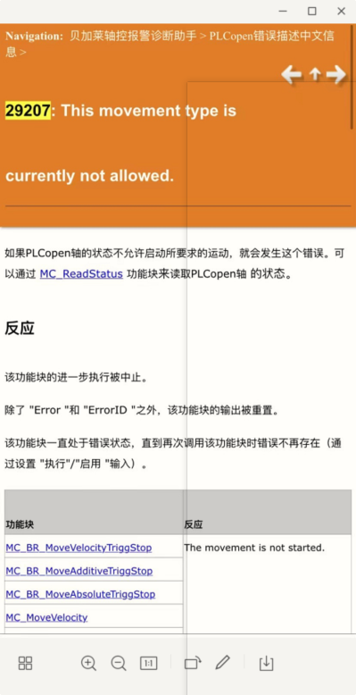

# 014轴控相关报警问题怎么解决
- 可在AS HELP中搜索对应的报警号查看问题原因
- 亦可以在以下链接 下载中文版本的轴控报警的信息进行查看
    - https://gitee.com/yzydeer/BuR_Assistant/blob/master/CHM_files/%E8%B4%9D%E5%8A%A0%E8%8E%B1%E8%BD%B4%E6%8E%A7%E6%8A%A5%E8%AD%A6%E8%AF%8A%E6%96%AD%E5%8A%A9%E6%89%8B%20V1.00.6.chm
- 此CHM文件可下载在手机中，用CHM Sharp或者掌阅搜索浏览
    - 
