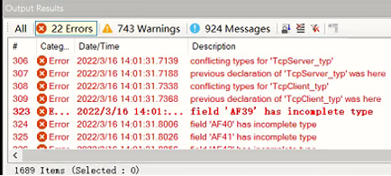
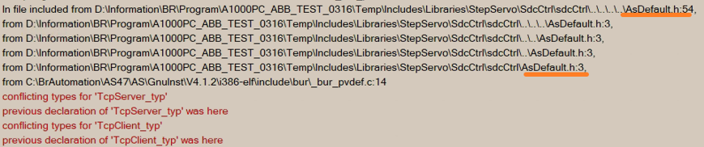
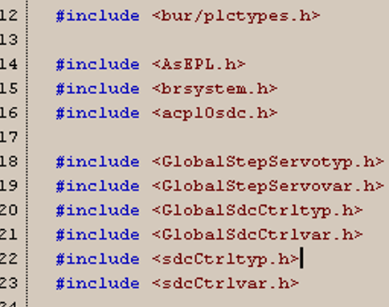
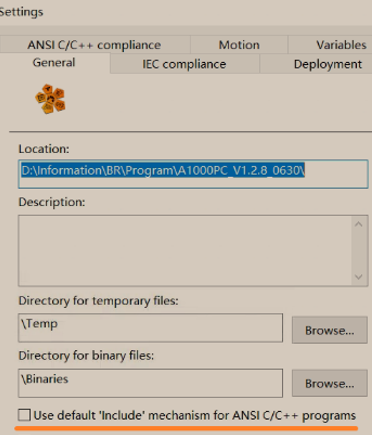

# 017在原ST项目中导入C任务程序导致编译报错
## 现象
出现类似以下的错误

查看完整的编译输出结果

## 原因
出现此类问题的主要原因为原项目为ST任务组成的项目，且自己创建了很多结构体，长时间维护后，库的顺序与依赖关系错乱，当引入C任务后，会触发更加严格的依赖检查，因此导致此问题。
## 处理方式
1. 将C任务程序的#inluce <AsDefault.h>删除，换成此C任务实际依赖的。

2. AS软件取消勾选 Use default'Include' mechanism for ANSI C/C++ programs,

