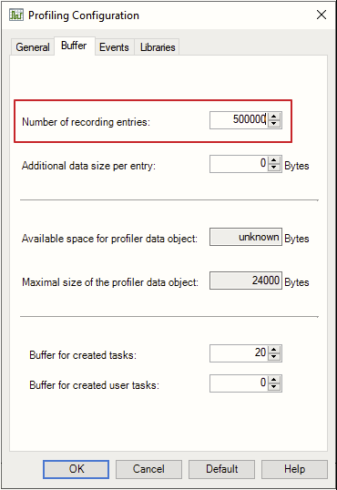
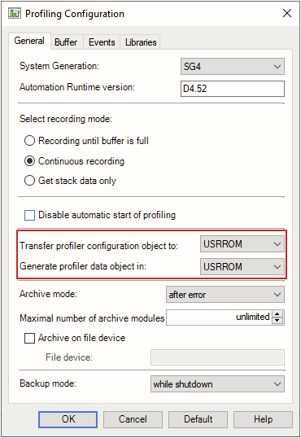

# 020如何增加Profiler采集的样本数量
## 问题描述
- 控制器在出现故障进入service模式后，AR会自动记录故障代码，及故障前的profiler数据并保存在USERROM以便技术人员读取并分析故障原因。在使用profiler分析控制系统故障时，常发现默认配置下的profiler记录数据过少，无法为故障分析提供足够的样本。如何增加profiler采集的数据？

## 解决方案
- 在Profile Configuration中Buffer可增加到500000（默认1500）
- 
- Gerneral中Transfer profile configuration object to 及 Generate profile data object in均需改为USRROM
- 
- 设定完毕后，在线的情况下Install Profile Configuration即可将当前控制器的profile采集数据量从1500增加到500000，一旦系统发生故障进入service后，自动生成的profile数据量也会变成500000。

## 注意
- 只能在online的情况下下载以上修改后的profile配置到控制后才能生效，目前无法通过项目中configuration的方式让该方式生效。
- Profile采样数据量增大到500000后，发生service时报错的profiler文件也会增大到5M左右，这意味着如果系统较容易进入service时会累计报错较大容量的profiler文件，在用尽USEROM后会导致系统无法正常启动！
- 可以通过SDM定期清除profiler文件，保证系统能够正常运行。
- 加强代码质量，保证系统稳定性，减少故障发生也就减少了profiler的自动保存。