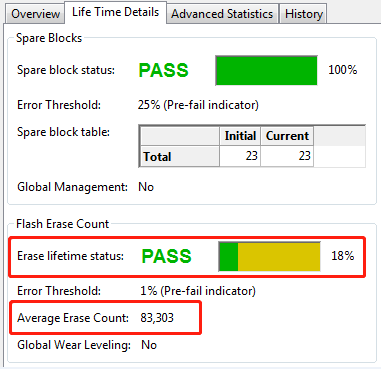

# CF,Cfast,SSD故障分析
## 问题描述
CF/CFast/SSD出现异常时，可用什么软件对存储介质进行分析？

## 解决方案
对于带有S.M.A.R.T功能的存储介质，使用S.B.L.T.M软件进行分析。（S.B.L.T.M软件介绍见附件PDF）可通过Erase lifetime status和Average Erase Count数值来判断CF寿命状态。
例如下图，Erase lifetime status=18%，Average Erase Count=83,303。从该CF卡的使用时间可推断出剩余寿命。

   

