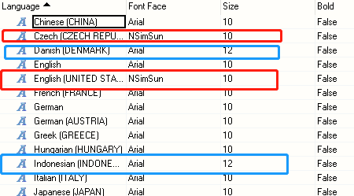

# 025Visu显示不出来并且profile显示mappidle占用极高
## 现象
- 把一套之前正常使用的程序烧到相同的硬件去使用，发现一直报警，Visu显示不出来，查了一下profile显示mappidle一直占用90%多，导致Visu启动不起来。

## 原因
- 1.在打开visu情况下，安装ABB那两个字库，会导致整个项目的visu所有font都错位。
- 2.这样导致的font错位会引起CPU起不来，profile会提示成mappidle资源使用过多，不会指向font问题。

## 解决方式
- 是Visu上字体全部错位了导致的，修正即可
- 错误的情况：
    - 
