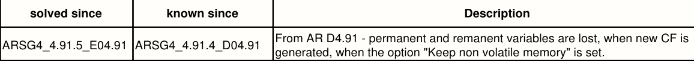
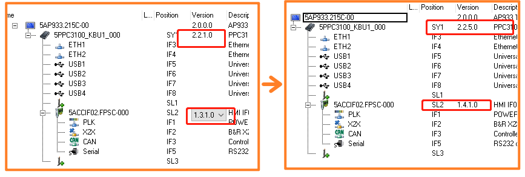

# 026PPC3100断电上电后掉电保持变量丢失
# 现象
- 设置掉电保持后，直接用AS热重启是可以保持的，但是如果是通过空开直接断电再上电，掉电保持的参数全部都不保持
- 使用的硬件与相关版本如下
    - 硬件：PPC3100
    - AR:D4.91

# 原因
- 查看AR版本的BUG修复日志，可见如下信息
- 

# 解决方式
- 升级AR至E4.91，与此同时，硬件的固件版本也需要升级到最新版本
- 
