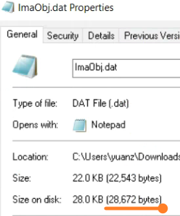

# 028基于AsIMA实现PLC通信，第一次上电PLC进SERV，重启后正常问题
# 现象
- 基于AsIMA库实现PLC之间通信，第一次上电进入SERV,报错25348
- 
- PLC设备热重启后，则正常运行
- 其中IMA通信用的DatObj文件偏大，有28KB。
- 

# 解决方式
- 通过优化通信的数据结构，在通信数据量没有变化的情况下，将DatObj文件内的信息压缩，例如BOOL多个点通信，改为基于数组结构通信，减小DatObj文件的大小。
- Stack和Tolerence改大没有效果