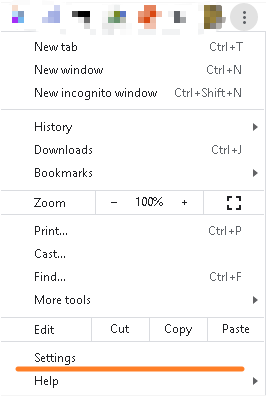

## 1.现象 ERR_EMPTY_RESPONSE
- 

### 原因
- 关闭WiFi就可以解决

## 2.端口冲突
- 在同一个设备上，存在端口号冲突，即有其他的服务也占用80端口，导致SDM的默认端口81被占用
### 解决方式
- 修改mappView的默认端口，从81端口改为其他的未被占用的端口，例如8080
- 

### 如何在Windows下如何查看端口占用情况
-   输入Win + R，输入cmd，调用cmd窗口。
- 
- 输入 `netstat -ano` 查看端口占用信息
- 
- `netstat -ano|findstr "81"`  查看对应端口被使用情况
- 
-   `tasklist | findstr “17552”`查看端口对应的任务名
- 
-   可以在任务管理器中找到此进程并关闭，或者通过有管理权限的cmd中的命令`taskkill /f /pid 17552` 强行关闭
- 
## 3.浏览器代理影响
- 

### 解决方式
- 代理问题：关闭浏览器的局域网设置的代理，取消自动检测设置的打勾。
- 如代理必须使用，则建议进行白名单添加设置，web服务器访问代理服务器时必须绕过IP地址。例如为了访问ARsim，必须为代理服务器保留IP地址“127.0.0.1”和“Localhost”。
-   代理设置方式（谷歌浏览器）
-   找到Settings处：
    - 
- 拉到最下方，点击Advanced，会提示出更多信息
    - 
- 打开代理设置
    - 
- 关闭自动代理检测
    - 
- 若一定要开代理，则开启Manual proxy setup，并如下填写
    - 