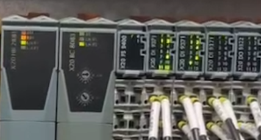
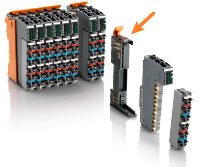

> Tags: #X20PS9400
- [1 B03.031.X20PS9400模块之后所有模块R灯单闪](#_1-b03031x20ps9400%E6%A8%A1%E5%9D%97%E4%B9%8B%E5%90%8E%E6%89%80%E6%9C%89%E6%A8%A1%E5%9D%97r%E7%81%AF%E5%8D%95%E9%97%AA)
- [2 确认项](#_2-%E7%A1%AE%E8%AE%A4%E9%A1%B9)
- [3 问题原因](#_3-%E9%97%AE%E9%A2%98%E5%8E%9F%E5%9B%A0)
- [4 解决方式](#_4-%E8%A7%A3%E5%86%B3%E6%96%B9%E5%BC%8F)

# 1 B03.031.X20PS9400模块之后所有模块R灯单闪

- PLC已正常运行，R灯常亮
- POWERLINK从站X20BC8083的R/E灯绿灯常亮，有数据交互
- 挂在X20PS9400后所有模块的R灯单闪
- 

# 2 确认项

- X20BC8083模块的PLK拨码正确
- X20PS9400以及后续硬件的实际安装顺序与配置顺序完全一致

# 3 问题原因

- X20模块的底板损坏
- 

# 4 解决方式

- 更换受损的底座模块后解决
