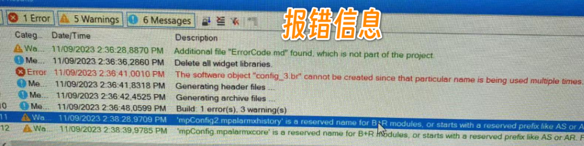
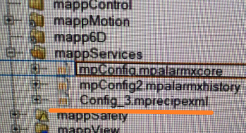

# 现象
- 进行了项目整合，编译的时候发现一个任务也没有编译，直接提示有 Config_3. Br 名字冲突, 编译过程立刻终端，但看 Software Configuration 中，并没有看到有 Config_3 这个任务
- 报错信息如下，其中提示 particular name is being used multiple times.
- 
- 贝加莱项目在哪些地方会有 Config_3 这样名字的隐藏. Br 文件？

# 原因与解决方式
- 1. 经过检查，发现 Configuration - mappServices 中，有手动添加 mapp 配置文件时自动命名的 Config_3. Mprecipexml 配置文件。 
- 2. 将 Config_3 文件名改为其他的，例如 mpConfig 3 后，即编译后不再出现此问题。
- 

