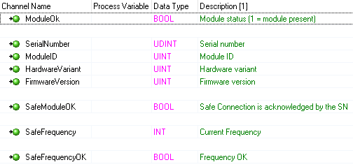
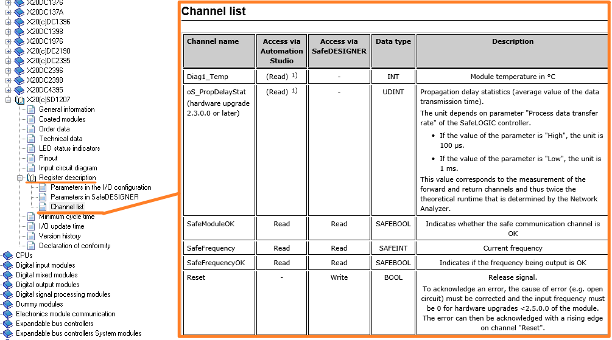
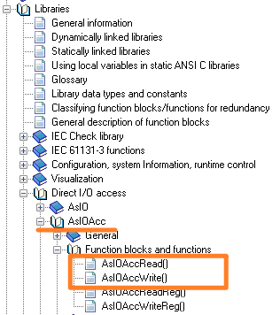
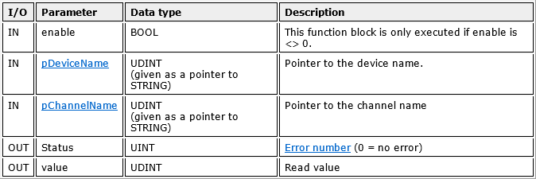
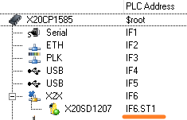

> Tags: #功能块

- [1 B04.005.AsIOAcc如何获取硬件模块寄存器中的信息](#_1-b04005asioacc%E5%A6%82%E4%BD%95%E8%8E%B7%E5%8F%96%E7%A1%AC%E4%BB%B6%E6%A8%A1%E5%9D%97%E5%AF%84%E5%AD%98%E5%99%A8%E4%B8%AD%E7%9A%84%E4%BF%A1%E6%81%AF)
- [2 需求](#_2-%E9%9C%80%E6%B1%82)
- [3 信息获取](#_3-%E4%BF%A1%E6%81%AF%E8%8E%B7%E5%8F%96)
- [4 如何操作](#_4-%E5%A6%82%E4%BD%95%E6%93%8D%E4%BD%9C)
	- [4.1 以 AsIOAccRead 为例读 `X20SD1207` 模块温度](#_41-%E4%BB%A5-asioaccread-%E4%B8%BA%E4%BE%8B%E8%AF%BB-x20sd1207-%E6%A8%A1%E5%9D%97%E6%B8%A9%E5%BA%A6)
	- [4.2 代码案例：StructureText](#_42-%E4%BB%A3%E7%A0%81%E6%A1%88%E4%BE%8B%EF%BC%9Astructuretext)
	- [4.3 代码案例：C](#_43-%E4%BB%A3%E7%A0%81%E6%A1%88%E4%BE%8B%EF%BC%9Ac)

# 1 B04.005.AsIOAcc如何获取硬件模块寄存器中的信息

# 2 需求

- 当我们想了解贝加莱模块的状态信息，我们通常通过在线监测此模块 I/O mapping 的信息，例如
- 
- 但当我们想更深入获取此模块内部的一些详细信息，我们可以从哪里获取？

# 3 信息获取

- 我们可以通过查找此模块相关的帮助信息，找到 Register description 的 Channel list
- 
- 此章节的信息即是此模块还可以访问获取与设置的模块信息

# 4 如何操作

- 我们可以使用 AsIOAcc 功能块，来实现此效果
- 

## 4.1 以 AsIOAccRead 为例读 `X20SD1207` 模块温度

- 功能块接口信息
- 
- `pDeviceName` 的信息对应着模块当前的地址
    - 例如 `X20SD1207` 模块在硬件树中的位置如下，其地址就是 `IF6.ST1`
    - 
- `pChannelName` 的信息对应着此模块 Register description 的 Channel list 表中的 Channel name
    - 比如我们想要读温度，那此名称即为 `Diag1_Temp`

## 4.2 代码案例：StructureText

```
AsIOAccRead_0.enable := TRUE;
AsIOAccRead_0.pDeviceName := ADR('IF6.ST1');  //’IF6.ST1’为模块当前的地址
AsIOAccRead_0.pChannelName := ADR('Diag1_Temp');
AsIOAccRead_0();

AsIOAccRead_0.value; //此数值即为温度数值

```

## 4.3 代码案例：C

```c

#include <bur/plctypes.h>
#include <AsBrStr.h>
#include <AsIOAcc.h>

_LOCAL STRING sChannelName[81];
_LOCAL STRING sDeviceName[81];
_LOCAL struct AsIOAccRead AsIOAccRead_0;

void _INIT ProgramInit(void)
{
    brsmemset((UDINT)&sDeviceName,sizeof(sDeviceName));
    brsmemset((UDINT)&sChannelName,sizeof(sChannelName));
}

void _CYCLIC ProgramCyclic(void)
{

    brsstrcpy((UDINT)&sDeviceName,(UDINT)"IF6.ST1");
    brsstrcpy((UDINT)&sChannelName,(UDINT)"Diag1_Temp");
    
    AsIOAccRead_0.enable = 1;
    AsIOAccRead_0.pDeviceName = (UDINT)&sDeviceName;
    AsIOAccRead_0.pChannelName = (UDINT)&sChannelName;
    AsIOAccRead(&AsIOAccRead_0);

}

void _EXIT ProgramExit(void)
{

}
```
