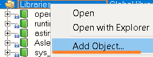
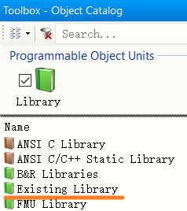
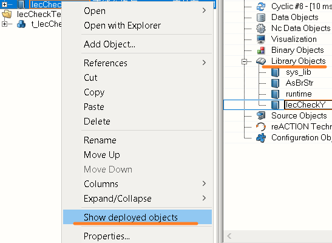

> 006贝加莱库导入方式

> Tags: #库 #AS

- [Automation Studio中导入库方式](#Automation%20Studio%E4%B8%AD%E5%AF%BC%E5%85%A5%E5%BA%93%E6%96%B9%E5%BC%8F)
- [更新日志](#%E6%9B%B4%E6%96%B0%E6%97%A5%E5%BF%97)

# Automation Studio中导入库方式

- ① 获得需要导入的库压缩包
- ② 解压文件
- ③ 添加库点击Add Object
    - 
- ④ 选择Existing Library
    - 
- ⑤ 找到刚刚解压的路径，选择需要导入的库
    - 
- ⑥ 导入完成后，右键此库，点击Show deployed objects，确认此库已被添加至当前配置的Library Objects中
    - 

# 更新日志

| 日期     | 修改人     | 修改内容     |
|:-----|:-----|:-----|
| 2023-12-28     | YuanZhiyi     | 初次创建     |
