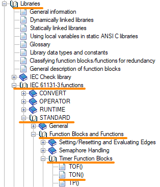
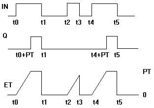
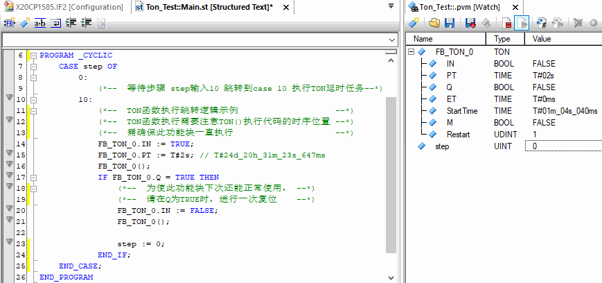

> Tags: #TON

- [1 008计时器TON使用方式](#1%20008%E8%AE%A1%E6%97%B6%E5%99%A8TON%E4%BD%BF%E7%94%A8%E6%96%B9%E5%BC%8F)
- [2 接口](#2%20%E6%8E%A5%E5%8F%A3)
- [3 时序图](#3%20%E6%97%B6%E5%BA%8F%E5%9B%BE)
- [4 编写案例](#4%20%E7%BC%96%E5%86%99%E6%A1%88%E4%BE%8B)
- [5 更新日志](#5%20%E6%9B%B4%E6%96%B0%E6%97%A5%E5%BF%97)

# 1 008计时器TON使用方式

- TON函数是STANDARD库中的提供的计时器功能，常用于程序等待一段时间后去做什么。在项目开发中非常常用。
- TON 功能块实现了开关接通延时。
- 该功能块在10 ms的倍数基础上工作，即，它不能精确到1 ms。
- 

# 2 接口

| **I/O** | **参数** | **数据类型** | **描述** |
| ---- | ---- | ---- | ---- |
| IN | IN | BOOL | 输入信号，为TRUE则使能 |
| IN | PT | TIME | 延迟时间，格式为 `T#24d_20h_31m_23s_647ms` |
| OUT | Q | BOOL | 输出信号，输入信号的上升沿延迟PT所设的时间后置TRUE |
| OUT | ET | TIME | 已用时间 |

# 3 时序图

- 
- 如果 IN 为 FALSE，则 Q 输出为 FALSE，ET 输出为 0。
- 一旦 IN 为 "TRUE"，ET 中的时间就开始以毫秒为单位计数，直到其值等于 PT 中的值。然后保持该值。
- 如果 IN 为 "TRUE "且 ET 等于 PT，则 Q 为 "TRUE"。否则为 FALSE。因此，如果 PT 中的时间（以毫秒为单位）已过，Q 就会有一个上升沿。

# 4 编写案例

```
PROGRAM _CYCLIC
	CASE step OF
		0: 
			(*--  等待步骤 step输入10 跳转到case 10 执行TON延时任务--*)	
		10:
			(*--  TON函数执行跳转逻辑示例                    --*)
			(*--  TON函数执行需要注意TON()执行代码的时序位置 --*)
			(*--  需确保此功能块一直执行                     --*)
			FB_TON_0.IN := TRUE;
			FB_TON_0.PT := T#2s; // T#24d_20h_31m_23s_647ms 
			FB_TON_0();
			IF FB_TON_0.Q = TRUE THEN
				(*--  为使此功能块下次还能正常使用， --*)
				(*--  请在Q为TRUE时，进行一次复位    --*)
				FB_TON_0.IN := FALSE;
				FB_TON_0();
				
				step := 0;
			END_IF;
	END_CASE;
END_PROGRAM
```

- 

# 5 更新日志

| 日期     | 修改人     | 修改内容     |
|:-----|:-----|:-----|
| 2024-01-21     | YuanZhiyi     | 初次创建     |
