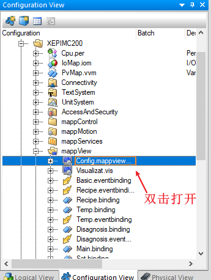
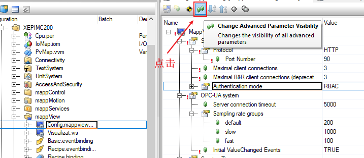
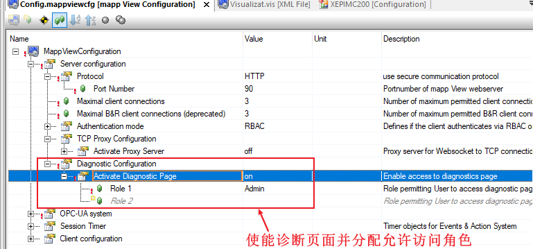
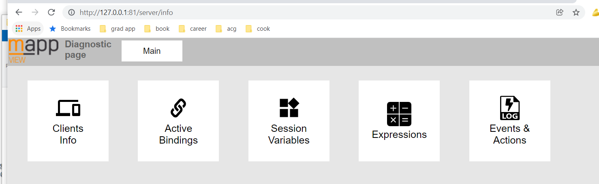

# 如何打开mappView的网页诊断页？
Tags：mappView、诊断

A：
首先需要在AS项目ConfigurationView中打开mappView文件夹中的Config.mappView配置文件

在配置界面中打开高级属性（Change Advanced Parameter Visibility）

找到Diagnostic Configuration条目并进行适当配置即可

配置完成后编译下载程序
在浏览器地址栏中输入 http://IP地址:81/server/info 后，正确输入项目中设定的管理员用户名和密码即可登录mappView的网页诊断页。
注意，在使用ARSim进行仿真时，默认的IP地址为127.0.0.1，此时诊断页的地址为 http://127.0.0.1:81/server/info ，如下图所示：

