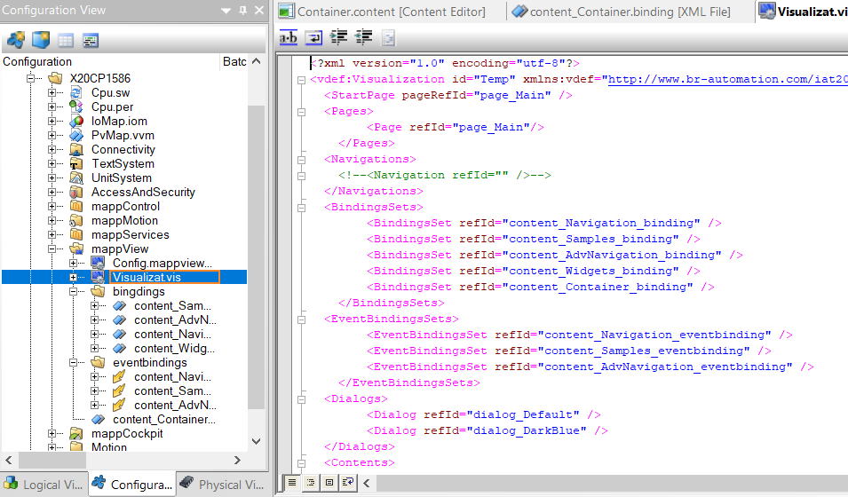
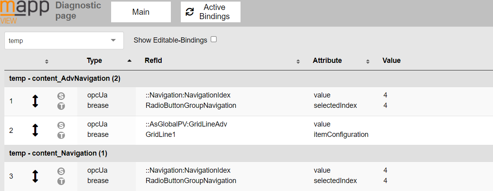

# 006打开mappView网页诊断页后，其中各个选项均为空该怎么办？
Tags：mappView、诊断
A：
保持诊断页面打开的同时，在浏览器地址栏中输入http：//127.0.0.1：81/index.html?visuID=需要诊断的项目的Visualization ID。
一个项目的Visualization ID可以在configuration view的.vis文件中找到。

只有在Visualization页面与诊断页面的同时开启时，诊断页面才会显示相应的诊断信息。

