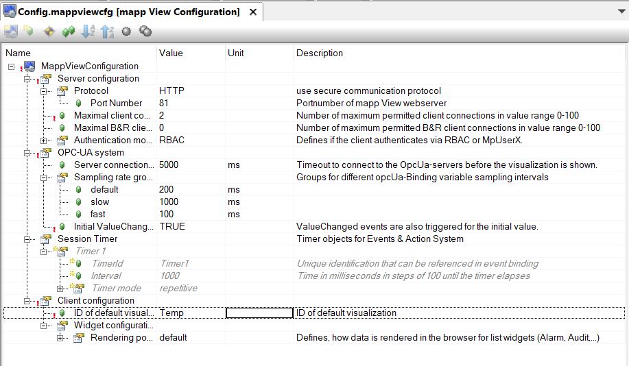

# 007如何只输入控制器IP地址：81的情况下打开Visualization页面查看mappView项目？
Tags：mappView、Visualization

A：
- 在configuration view中的mappView文件夹中找到mapp View Configuration并展开。找到Client configuration下的ID of default visualization。
- 在ID of default visualization的value一栏中输入.vis文件中的visual ID,即可将该visual ID设为默认的visual ID。
之后在浏览器地址栏中输入 http://127.0.0.1:81 ，将打开该visual ID相对应的mappView项目。

