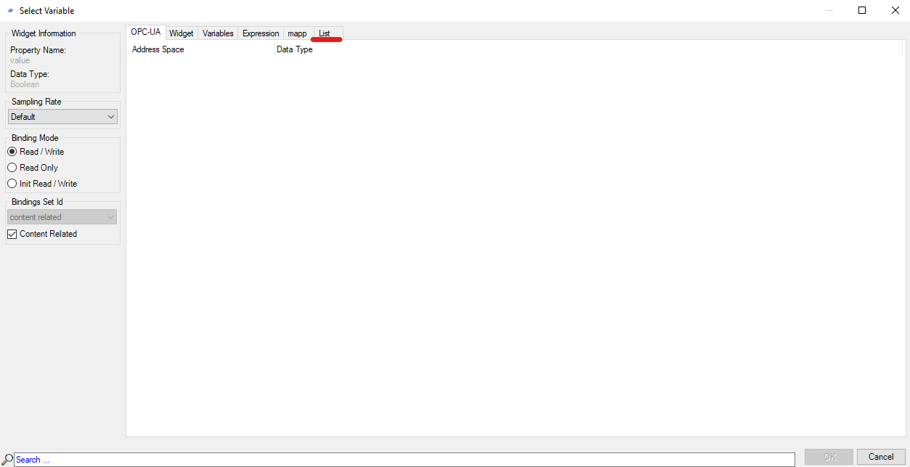

# 008在mappView如何给控件绑定数组？
Tags：mappView、控件、数组

A：
首先，确保mappView的版本在5.12.0以上，点击Automation Studio上方的Project→Change Runtime Versions来查看当前使用的mappView版本。
对于支持绑定数组的控件，将其添加至页面后，点击该控件。选择该控件的properties，在Data栏中
找到Binding，点击…按钮，跳出绑定界面后选择List浮标，即可选择想进行绑定的数组。

