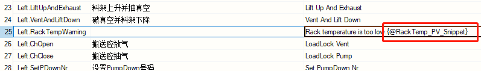
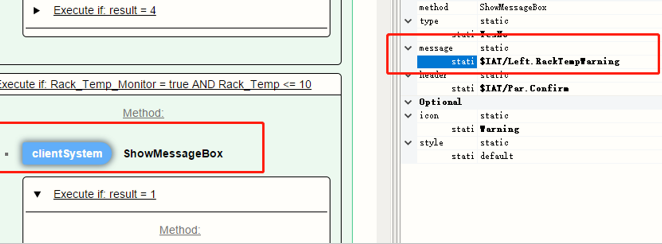
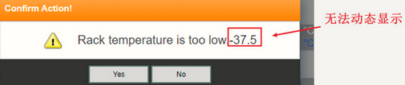
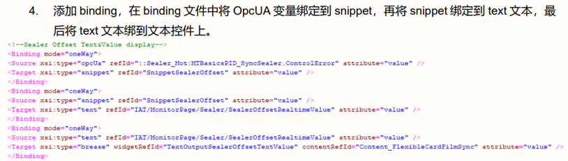
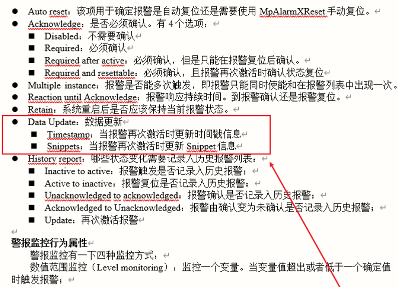

# 015mappView界面使用Snippet动态显示数据信息怎么实现
## 需求
1.客户使用mappView自带的MessageBox无法通过调用TMX中snippet的方式实现数据的动态显示，只能显示触发时刻的数据（TextOutput可动态显示）

2.mappAlarmX报警信息也需要通过调用TMX Snippet文本的形式实现动态刷新
## 解决方式
#### 1.1 使用Snippet的正确使用方式

Message Box及Label确实无法实现数据的动态刷新，只能在刷新浏览器或再次触发时刷新，而Textoutput控件可做到实时刷新。
#### 1.2 将MessageBox改为Dialog+Textoutput的形式实现相关功能；
#### 2 开启报警高级属性中的Data Update-Snippets开关

