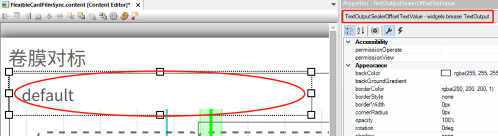
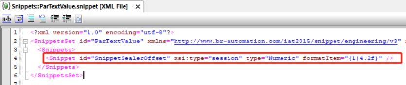
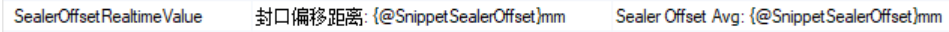
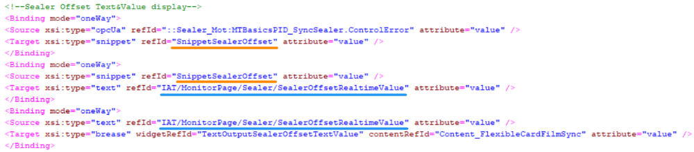
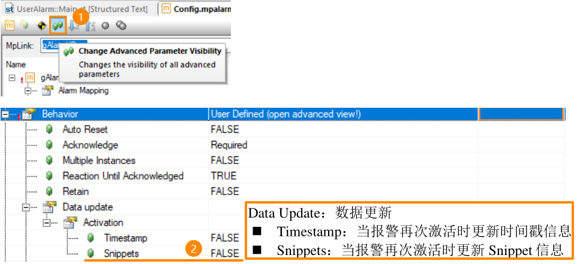

> 015mappView界面使用Snippet动态显示数据信息怎么实现

> #mappView #snippet

- [1 问题](#1%20%E9%97%AE%E9%A2%98)
	- [1.1 MessageBox使用Snippet不支持动态显示](#1.1%20MessageBox%E4%BD%BF%E7%94%A8Snippet%E4%B8%8D%E6%94%AF%E6%8C%81%E5%8A%A8%E6%80%81%E6%98%BE%E7%A4%BA)
	- [1.2 mappAlarmX报警信息需要调用TMX Snippet文本的形式实现动态刷新](#1.2%20mappAlarmX%E6%8A%A5%E8%AD%A6%E4%BF%A1%E6%81%AF%E9%9C%80%E8%A6%81%E8%B0%83%E7%94%A8TMX%20Snippet%E6%96%87%E6%9C%AC%E7%9A%84%E5%BD%A2%E5%BC%8F%E5%AE%9E%E7%8E%B0%E5%8A%A8%E6%80%81%E5%88%B7%E6%96%B0)
- [2 解决方式](#2%20%E8%A7%A3%E5%86%B3%E6%96%B9%E5%BC%8F)
	- [2.1 使用Snippet的正确使用方式](#2.1%20%E4%BD%BF%E7%94%A8Snippet%E7%9A%84%E6%AD%A3%E7%A1%AE%E4%BD%BF%E7%94%A8%E6%96%B9%E5%BC%8F)
	- [2.2 mappAlarmX开启报警高级属性中的Data Update-Snippets开关](#2.2%20mappAlarmX%E5%BC%80%E5%90%AF%E6%8A%A5%E8%AD%A6%E9%AB%98%E7%BA%A7%E5%B1%9E%E6%80%A7%E4%B8%AD%E7%9A%84Data%20Update-Snippets%E5%BC%80%E5%85%B3)

# 1 问题

## 1.1 MessageBox使用Snippet不支持动态显示

- 使用mappView自带的 **MessageBox** 无法通过调用TMX中 **snippet** 的方式实现数据的**动态显示**，只能显示触发时刻的数据（TextOutput可动态显示）
- 
- 
- 

## 1.2 mappAlarmX报警信息需要调用TMX Snippet文本的形式实现动态刷新

# 2 解决方式

## 2.1 使用Snippet的正确使用方式

- 1. 在需要显示文本的 Content 中添加 TextOutput 控件
    - 
- 2. 定义 Snippet 名称，type=“IndexTest”，定义文本路径，其中“.{1}”为 IndexText 类型的固定格式
    - 
- 3. 在.tmx 文件中添加显示的 text 文本，其中插入 snippet 数值的格式如下：
- 
- 4. 添加 binding，在 binding 文件中将 OpcUA 变量绑定到 snippet，再将 snippet 绑定到 text 文本，最后将 text 文本绑到文本控件上
    - 
- 🛑**MessageBox** 及**Label** 确实无法实现数据的动态刷新，只能在刷新浏览器或再次触发时刷新，而Textoutput控件可做到实时刷新。
    - 将MessageBox改为Dialog+Textoutput的形式实现相关功能；

## 2.2 mappAlarmX开启报警高级属性中的Data Update-Snippets开关

- 
