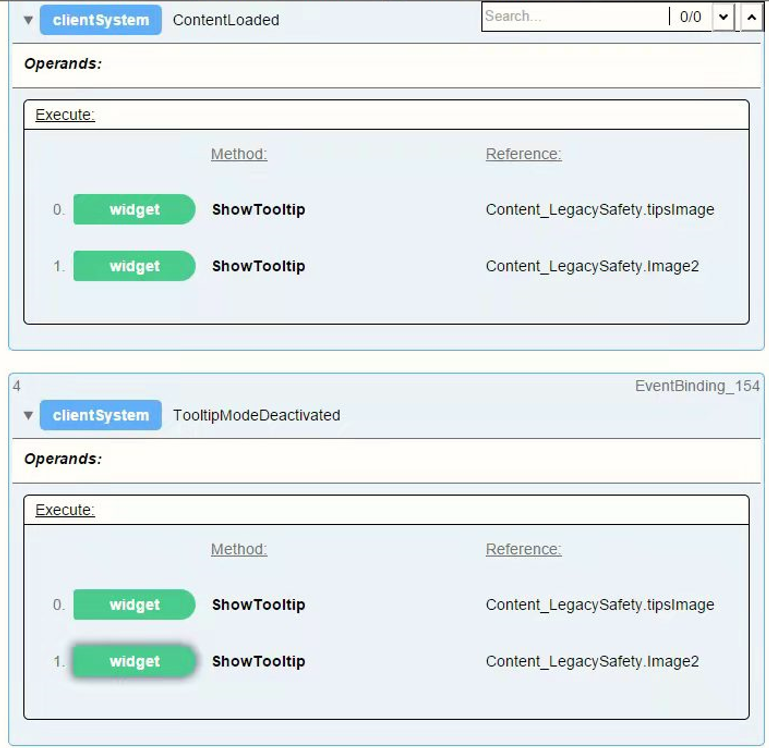

# 016mappView界面显示控件提示内容
## 需求
在mappView界面中制作各个控件的提示信息。并且避免点一下出现提示标志，再点一下提示标志出现提示信息的情况，希望点一下就显示提示信息
## 解决方式
使用ContentLoaded及TooltipModeDeactivated事件制作触发控件ShowTooltip的Action，使得提示标志在mappView界面中一直显示，点击一下即可显示对应控件的提示信息。

