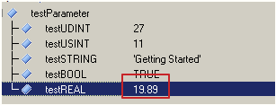
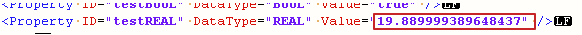
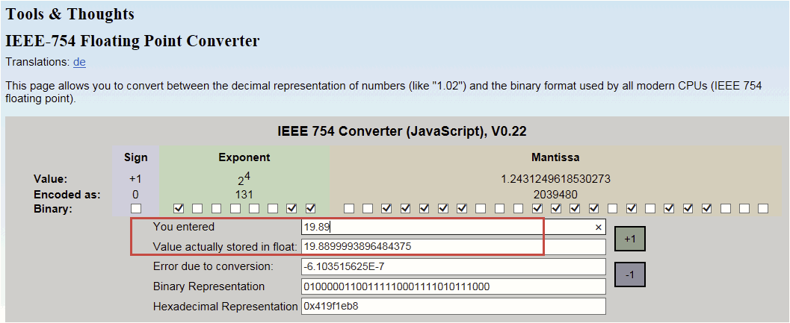

# 018使用MpRecipeXml时，REAL类型变量的数值与XML文件里保存的数值不一致，是否正常？

## 现象
- 例如，用watch功能监控到变量的值是19.89，如下图：
- 
- 但是保存到XML中后，打开XML文件发现数值变为19.889999...如下图：
- 

## 原因
- 这种现象是正常的，这是由于REAL的特殊编码方式（IEEE754协议）造成的。

- 下面网址是IEEE754协议的转换浮点数的工具。
    - https://www.h-schmidt.net/FloatConverter/IEEE754.html

- 举个例子，如下图，输入了19.89，但是对应的浮点数其实是19.889999...
- 

- 按照浮点数的转换规则，应该不存在19.89这种数值，之所以AS的watch窗口看到的是19.89，只是因为AR支持的浮点数精确位数有限。实际上这个数作为浮点类型，应该就是19.889999...XML文件的精确度较高。