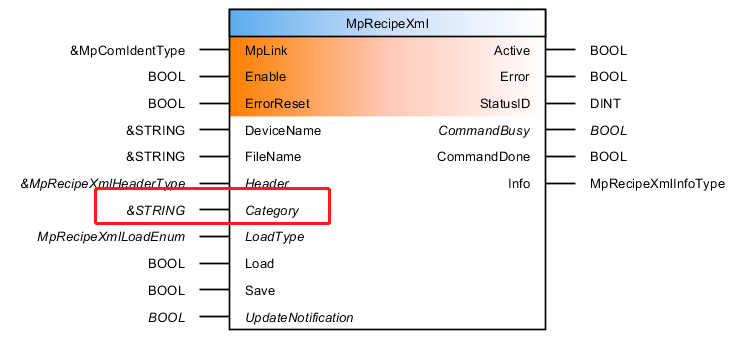
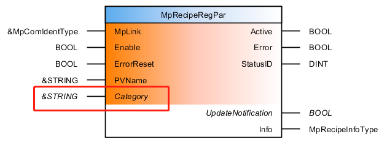
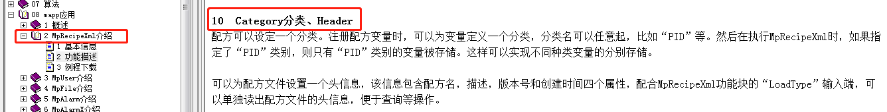
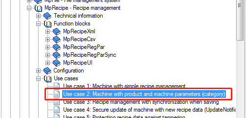

# 使用MpRecipeXML时，如何将两个变量分别存到两个不同的XML文件中
## 问题描述
使用MpRecipeXML时，如何将两个变量分别存到两个不同的XML文件中？

## 解决方案
要配合使用功能块MpRecipeXml和MpRecipeRegPar的引脚Category完成需求。将需要保存到同一个XML文件中的变量分为同一类即可。具体设置和代码可参考附件。

注：
标准化功能块中相关描述：

AS帮助中相关应用案例描述：

