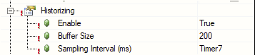
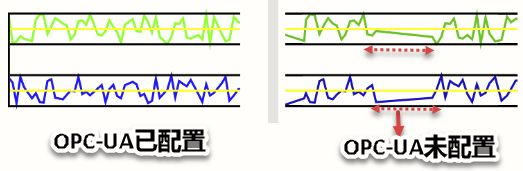

# 025OnlineChartHDA无法记录历史数据
- Q: 在使用OnlineChartHDA控件过程中，发现只有当HMI Contetn页面被load时，当前/历史数据才能被记录。但是切换到别的页面后，新的数据没有被记录，再次切回后才能更新并记录当前/历史数据。
- A:发现Configuration下OPCUA中的属性Historizing中没有enable，Buffer Size等未设置...
- 
- 修改前后OnlineChart对比如下：
    - 红色箭头代表切出到切回OnlineChartHDA这段时间，数据没有被更新记录，当切回时，数据直接的波动通过直线来过渡。而通过设置了Historizing属性的OnlienChartHDA能完整记录过程中的数据。
- 
