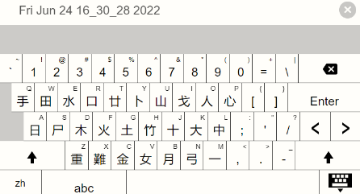
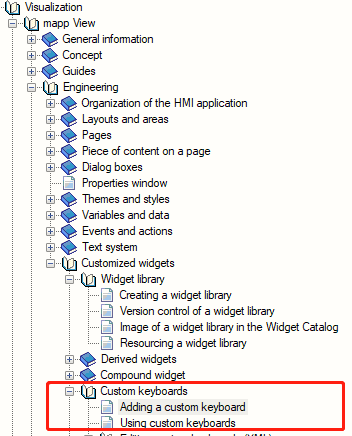
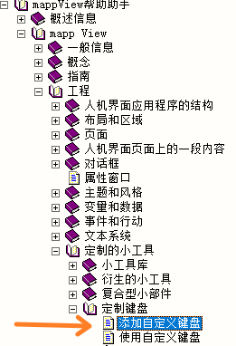
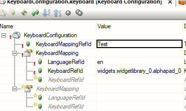

# 026mappView中能否限制键盘只输入英文？
## 问题
- 为方便使用，能否定制mappView的键盘
- 

## 回答
- 可以。
- 可以创建一个新的键盘，在配置里面只留英文的。
- AS Help中的位置：
    - 
- 你可以在[mappView开发助手](https://gitee.com/yzydeer/BuR_Assistant/blob/master/CHM_files/mappView%E5%BC%80%E5%8F%91%E5%8A%A9%E6%89%8B%200.02.0.chm)查看
- 

- 实现效果：
    - 
