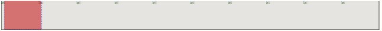
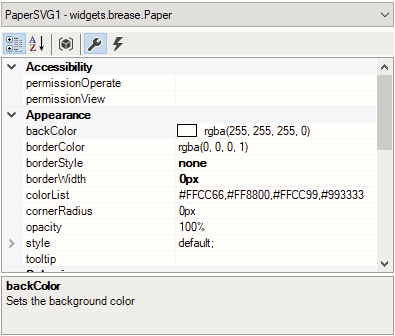
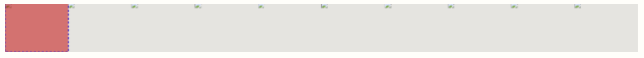

# 027mappView使用Paper控件展现SVG出现SVG起始位置与设定位置不一致的现象
## 问题
- 在运用Paper控件过程中遇到问题，如图所示，左边边界是paper控件设置的起始点位置，但是显示的SVG（图中红色方框），与边界存在一个偏差距离。而这个偏差距离不能通过调整Paper控件属性中的translation来回到paper控件的起始点位置。
- 

## 解决方式
- Paper控件中默认的borderStyle选择none,同时将borderWidth设置为0px，即可解决SVG的起点与控件边界不重合的现象。
- 
- 最终呈现的SVG起点位置
- 

