> Tags: #mappView

- [1 B05.030-mappView无法访问原因](#_1-b05030-mappview%E6%97%A0%E6%B3%95%E8%AE%BF%E9%97%AE%E5%8E%9F%E5%9B%A0)
- [2 现象 ERR_CONNECTION_TIME_OUT](#_2-%E7%8E%B0%E8%B1%A1-err_connection_time_out)
	- [2.1 解决方式](#_21-%E8%A7%A3%E5%86%B3%E6%96%B9%E5%BC%8F)
- [3 工控机(装 Hypervisor)的 Chrome 开 mappview 时显示找不到服务器](#_3-%E5%B7%A5%E6%8E%A7%E6%9C%BA%E8%A3%85-hypervisor%E7%9A%84-chrome-%E5%BC%80-mappview-%E6%97%B6%E6%98%BE%E7%A4%BA%E6%89%BE%E4%B8%8D%E5%88%B0%E6%9C%8D%E5%8A%A1%E5%99%A8)
	- [3.1 解决方式](#_31-%E8%A7%A3%E5%86%B3%E6%96%B9%E5%BC%8F)
- [4 AR进入了SERV模式](#_4-ar%E8%BF%9B%E5%85%A5%E4%BA%86serv%E6%A8%A1%E5%BC%8F)
	- [4.1 解决方式](#_41-%E8%A7%A3%E5%86%B3%E6%96%B9%E5%BC%8F)
- [5 PLC 内存不够](#_5-plc-%E5%86%85%E5%AD%98%E4%B8%8D%E5%A4%9F)
	- [5.1 解决方式](#_51-%E8%A7%A3%E5%86%B3%E6%96%B9%E5%BC%8F)
- [6 系统时间不一致](#_6-%E7%B3%BB%E7%BB%9F%E6%97%B6%E9%97%B4%E4%B8%8D%E4%B8%80%E8%87%B4)
	- [6.1 解决方式](#_61-%E8%A7%A3%E5%86%B3%E6%96%B9%E5%BC%8F)
- [7 ARSim 在 Win 10 运行，mappView 无法访问，logger 中有-1061083372](#_7-arsim-%E5%9C%A8-win-10-%E8%BF%90%E8%A1%8C%EF%BC%8Cmappview-%E6%97%A0%E6%B3%95%E8%AE%BF%E9%97%AE%EF%BC%8Clogger-%E4%B8%AD%E6%9C%89-1061083372)
	- [7.1 原因](#_71-%E5%8E%9F%E5%9B%A0)
	- [7.2 解决方式](#_72-%E8%A7%A3%E5%86%B3%E6%96%B9%E5%BC%8F)
	- [7.3 下载链接](#_73-%E4%B8%8B%E8%BD%BD%E9%93%BE%E6%8E%A5)
- [8 浏览器代理影响](#_8-%E6%B5%8F%E8%A7%88%E5%99%A8%E4%BB%A3%E7%90%86%E5%BD%B1%E5%93%8D)
	- [8.1 解决方式](#_81-%E8%A7%A3%E5%86%B3%E6%96%B9%E5%BC%8F)
- [9 ARSim 在本地电脑使用，存在端口占用冲突](#_9-arsim-%E5%9C%A8%E6%9C%AC%E5%9C%B0%E7%94%B5%E8%84%91%E4%BD%BF%E7%94%A8%EF%BC%8C%E5%AD%98%E5%9C%A8%E7%AB%AF%E5%8F%A3%E5%8D%A0%E7%94%A8%E5%86%B2%E7%AA%81)
	- [9.1 解决方式](#_91-%E8%A7%A3%E5%86%B3%E6%96%B9%E5%BC%8F)
	- [9.2 如何在Windows下如何查看端口占用情况](#_92-%E5%A6%82%E4%BD%95%E5%9C%A8windows%E4%B8%8B%E5%A6%82%E4%BD%95%E6%9F%A5%E7%9C%8B%E7%AB%AF%E5%8F%A3%E5%8D%A0%E7%94%A8%E6%83%85%E5%86%B5)
- [10 浏览器异常](#_10-%E6%B5%8F%E8%A7%88%E5%99%A8%E5%BC%82%E5%B8%B8)
	- [10.1 解决方式](#_101-%E8%A7%A3%E5%86%B3%E6%96%B9%E5%BC%8F)
- [11 修改了 OPC UA 端口，mappView 对应服务配置没跟着修改](#_11-%E4%BF%AE%E6%94%B9%E4%BA%86-opc-ua-%E7%AB%AF%E5%8F%A3%EF%BC%8Cmappview-%E5%AF%B9%E5%BA%94%E6%9C%8D%E5%8A%A1%E9%85%8D%E7%BD%AE%E6%B2%A1%E8%B7%9F%E7%9D%80%E4%BF%AE%E6%94%B9)
	- [11.1 修改方式](#_111-%E4%BF%AE%E6%94%B9%E6%96%B9%E5%BC%8F)
	- [11.2 现象](#_112-%E7%8E%B0%E8%B1%A1)

# 1 B05.030-mappView无法访问原因

# 2 现象 ERR_CONNECTION_TIME_OUT

- 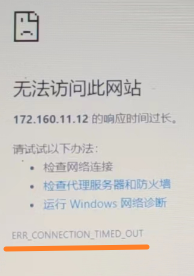

## 2.1 解决方式

- 等待片刻
- CPU还处于启动状态，还未运行

# 3 工控机(装 Hypervisor)的 Chrome 开 mappview 时显示找不到服务器

- Windows系统上的Chrome浏览器

## 3.1 解决方式

- 使用另外台电脑可以显示mappView，因此查看设备管理器，确实有未知设备
- 安装Hypervisor中的usb驱动盘中的GPOS driver后解决

# 4 AR进入了SERV模式

## 4.1 解决方式

- 查看Logger，检查程序或者硬件问题。

# 5 PLC 内存不够

- 访问SDM页面，了解当前设备的DRAM是否被消耗尽
- 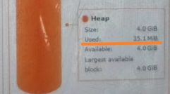

## 5.1 解决方式

- 若内存不够，更换内存大一点的PLC或者进行程序优化

# 6 系统时间不一致

- 由于浏览器的安全限制，若时间严重异常将不允许访问

## 6.1 解决方式

- 把CPU和Windows的时间都统一到当前时间

# 7 ARSim 在 Win 10 运行，mappView 无法访问，logger 中有-1061083372

- 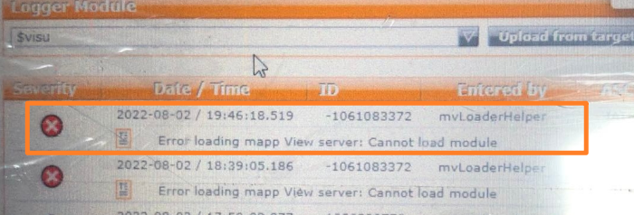

## 7.1 原因

- 在Win10下，AR000调用Windows WSA库里一些函数失败，需要安装相应的依赖。

## 7.2 解决方式

- 安装Microsoft Visual C++ 2010 x86 Redistributable Setup
- 重启一次

## 7.3 下载链接

- 微软官方
    - [最新受支持的 Visual C++ 可再发行程序包下载 | Microsoft Learn](https://learn.microsoft.com/zh-cn/cpp/windows/latest-supported-vc-redist?view=msvc-170)
- 百度网盘
    - https://pan.baidu.com/s/1O7QTdkABSDAEmoJpHub_JA?pwd=5tln

# 8 浏览器代理影响

- 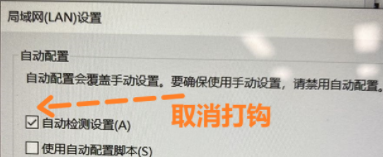

## 8.1 解决方式

- 代理问题：关闭浏览器的局域网设置的代理，取消自动检测设置的打勾。
- 如代理必须使用，则建议进行白名单添加设置，web服务器访问代理服务器时必须绕过IP地址。例如为了访问ARsim，必须为代理服务器保留IP地址“127.0.0.1”和“Localhost”。
- 代理设置方式（谷歌浏览器）
- 找到Settings处：
    - 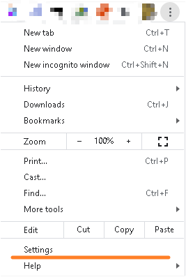
- 拉到最下方，点击Advanced，会提示出更多信息
    - 
- 打开代理设置
    - 
- 关闭自动代理检测
    - 
- 若一定要开代理，则开启Manual proxy setup，并如下填写
    - 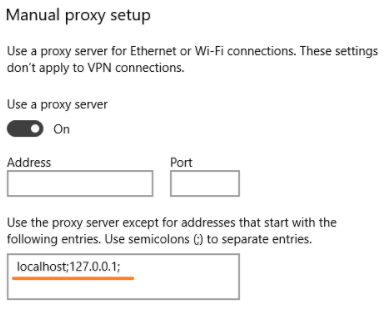

# 9 ARSim 在本地电脑使用，存在端口占用冲突

- 在同一个设备上，存在端口号冲突，即有其他的服务也占用81端口，导致mappView的默认端口81被占用

## 9.1 解决方式

- 修改mappView的默认端口，从81端口改为其他的未被占用的端口，例如8081
- 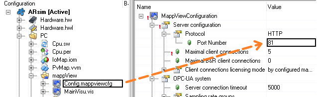

## 9.2 如何在Windows下如何查看端口占用情况

- 输入Win + R，输入cmd，调用cmd窗口。
- 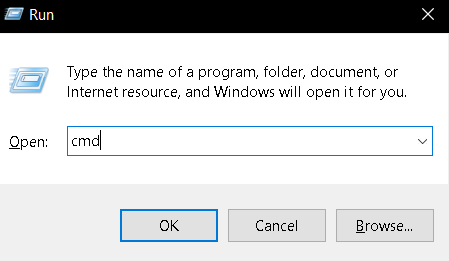
- 输入 `netstat -ano` 查看端口占用信息
- 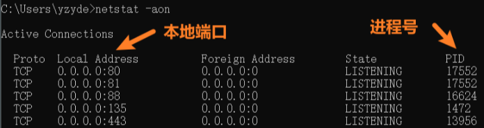
- `netstat -ano|findstr "81"`  查看对应端口被使用情况
- 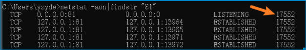
- `tasklist | findstr “17552”`查看端口对应的任务名
- 
- 可以在任务管理器中找到此进程并关闭，或者通过有管理权限的cmd中的命令`taskkill /f /pid 17552` 强行关闭
- 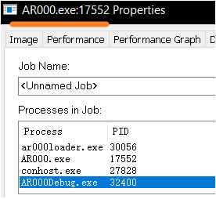

# 10 浏览器异常

## 10.1 解决方式

- 使用谷歌浏览器

# 11 修改了 OPC UA 端口，mappView 对应服务配置没跟着修改

## 11.1 修改方式

- 将默认的 Port number 从 4840 修改为 4849
- 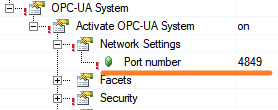

## 11.2 现象

- MappView 画面中所有 OPC UA 通信点均显示为 XX
- 
- ## 原因
- `OpcUaServer.uaserver` 的默认服务器的 Port number 没有对应跟着修改，应该修改如下
- 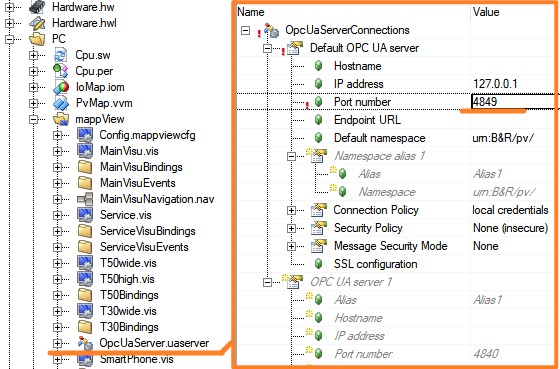
