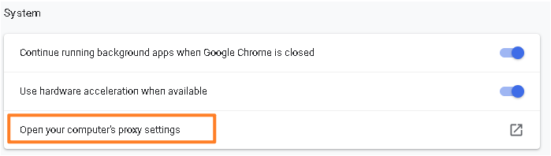

[TOC]

# 1. 现象 ERR_CONNECTION_TIME_OUT

- 

## 解决方式

- 等待片刻
- CPU还处于启动状态，还未运行

# 2.工控机(装 Hypervisor)的 Chrome 开 mappview 时显示找不到服务器

- Windows系统上的Chrome浏览器

## 解决方式

- 使用另外台电脑可以显示mappView，因此查看设备管理器，确实有未知设备
- 安装Hypervisor中的usb驱动盘中的GPOS driver后解决

# 3.AR进入了SERV模式

## 解决方式

- 查看Logger，检查程序或者硬件问题。

# 4.PLC 内存不够

- 访问SDM页面，了解当前设备的DRAM是否被消耗尽
- 

## 解决方式

- 若内存不够，更换内存大一点的PLC或者进行程序优化

# 5.系统时间不一致

- 由于浏览器的安全限制，若时间严重异常将不允许访问

## 解决方式

- 把CPU和Windows的时间都统一到当前时间

# 6.ARSim 在 Win 10 运行，mappView 无法访问，logger 中有-1061083372

- 

## 原因

- 在Win10下，AR000调用Windows WSA库里一些函数失败，需要安装相应的依赖。

## 解决方式

- 安装Microsoft Visual C++ 2010 x86 Redistributable Setup
- 重启一次

## 下载链接

- 微软官方
    - [最新受支持的 Visual C++ 可再发行程序包下载 | Microsoft Learn](https://learn.microsoft.com/zh-cn/cpp/windows/latest-supported-vc-redist?view=msvc-170)
- 百度网盘
    - https://pan.baidu.com/s/1O7QTdkABSDAEmoJpHub_JA?pwd=5tln

# 7.浏览器代理影响

- 

## 解决方式

- 代理问题：关闭浏览器的局域网设置的代理，取消自动检测设置的打勾。
- 如代理必须使用，则建议进行白名单添加设置，web服务器访问代理服务器时必须绕过IP地址。例如为了访问ARsim，必须为代理服务器保留IP地址“127.0.0.1”和“Localhost”。
- 代理设置方式（谷歌浏览器）
- 找到Settings处：
    - 
- 拉到最下方，点击Advanced，会提示出更多信息
    - 
- 打开代理设置
    - 
- 关闭自动代理检测
    - 
- 若一定要开代理，则开启Manual proxy setup，并如下填写
    - 

# 8.ARSim 在本地电脑使用，存在端口占用冲突

- 在同一个设备上，存在端口号冲突，即有其他的服务也占用81端口，导致mappView的默认端口81被占用

## 解决方式

- 修改mappView的默认端口，从81端口改为其他的未被占用的端口，例如8081
- 

## 如何在Windows下如何查看端口占用情况

- 输入Win + R，输入cmd，调用cmd窗口。
- 
- 输入 `netstat -ano` 查看端口占用信息
- 
- `netstat -ano|findstr "81"`  查看对应端口被使用情况
- 
- `tasklist | findstr “17552”`查看端口对应的任务名
- 
- 可以在任务管理器中找到此进程并关闭，或者通过有管理权限的cmd中的命令`taskkill /f /pid 17552` 强行关闭
- 

# 9.浏览器异常

## 解决方式

- 使用谷歌浏览器

# 10.修改了 OPC UA 端口，mappView 对应服务配置没跟着修改

## 修改方式

- 将默认的 Port number 从 4840 修改为 4849
- 

## 现象

- MappView 画面中所有 OPC UA 通信点均显示为 XX
- 
- ## 原因
- `OpcUaServer.uaserver` 的默认服务器的 Port number 没有对应跟着修改，应该修改如下
- 
