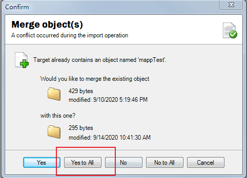
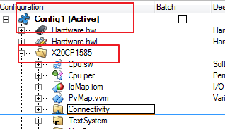

```toc
```

# 一、背景知识
若需要对mappView项目进行移植，请先对mappView软件基本使用有一定的概念，请先参加相关培训
- TM611
    - [TM_files/TM611 Mapp View 基础_ZH_V4.7.pdf](https://gitee.com/yzydeer/BuR_Assistant/blob/master/TM_files/TM611%20Mapp%20View%20%E5%9F%BA%E7%A1%80_ZH_V4.7.pdf)
- 视频信息
    - [AS 软件开发实操篇：人机界面mappView](https://app9qg8os8w3630.pc.xiaoe-tech.com/p/t_pc/course_pc_detail/column/p_5f867370e4b06aff1a03f36a)
- 入门教程
    - [mappViewWiki](https://gitee.com/yzydeer/BuR_Assistant/blob/master/mappViewWiki/Home.md)

> 此移植说明重点在于提示移植步骤，若实际操作中有变化，请及时反馈

# 二、整体mappView项目移植
从一个mappView项目移植到一个没有配置过mappView的项目中

## 源项目
- 项目位置
- 
### 确认mappView版本
- 
- 
### 导出MappView组件
- 

### 获取导出的文件
- 

## 目标项目
- 空项目


### 导入MappView组件
- 
- 

- 导入后缺失绑定，错误内容会报出
- （导入程序为空项目，界面控制程序没有导致各种绑定缺失）


### 拷贝Project.Language文件
- 
## 注意事项
### OPC UA设定
- 需要确认，重新绑定变量
- 
- 
### Config ID与 CPU型号是否一致
- 不一致会在Configuration View下创建新的config与CPU文件夹
- 

### Event Binding确认
- MappView界面动作，变量控制都在 Event，Binding中实现，需要确认导入功能 Event，Binding是否缺失
- 
### VIS文件确认
- 显示页面，Visual ID设定都在这个文件中
- 
- 若使用了mappServices相关组件，需要添加MpServer库
- 

# 三、单页移植
- 以移植界面下载安全链为例
## 复制相关的Content


## 增加页面切换功能
- 
- 
## 界面需要相应图片
- 

## 添加TMX文本文件
- 
- 

## 导入并配置snippet内容
- 
## 导入Dialog相关信息
- 
## 导入Binding，EventBinding文件
- 

## .VIS文件中添加所有内容
- 
## OPC UA 变量参数调整
- 将OPC UA变量表以文本打开，直接将变量信息内容复制进目标项目中
- 