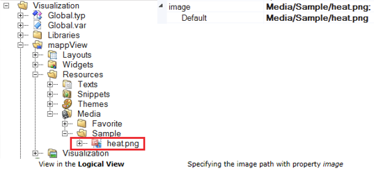
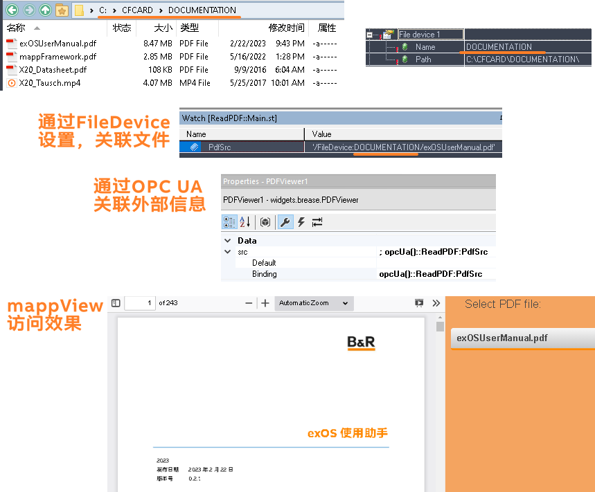

# 需求说明
- 客户在开发程序中常会使用PDFViewer、VedioPlayer、Image等控件来查看一些资源，从help中可以找到一些AS中固定资源的路径设定格式，而一些外部资源的路径格式则没有提及。
- mappView的所有资源文件都存放在Logical View - mappView - Resources 路径下
- 选择PDFViewer、Image、VideoPlayer控件，均可在此处选择对应的文件。
- 

- 但有时要求加载程序的外部资源

# 设置方式

`/FileDevice:DOCUMENTATION/`

# 设置效果

