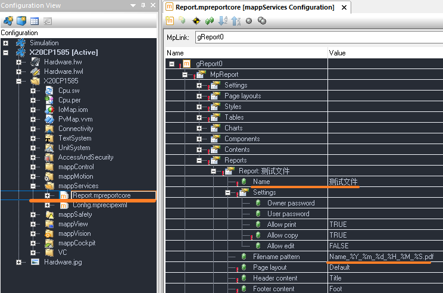
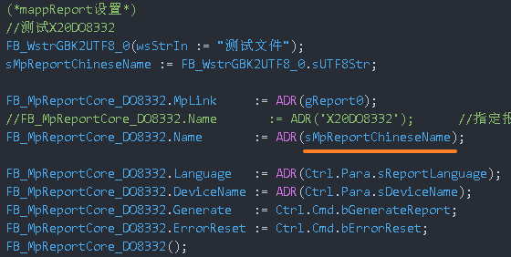
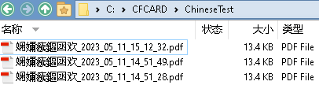
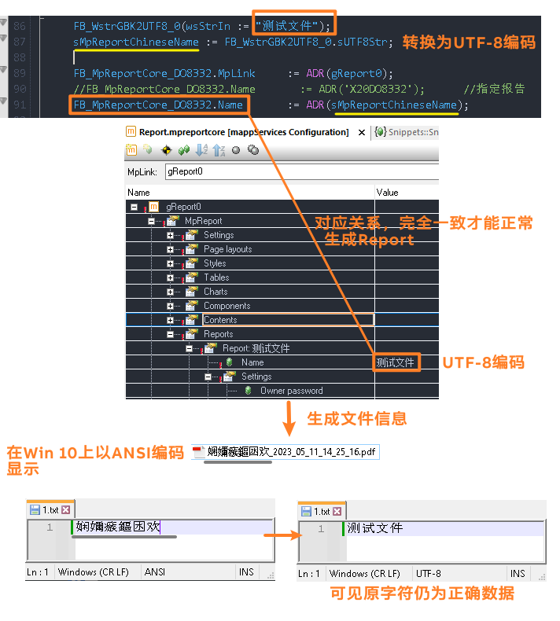
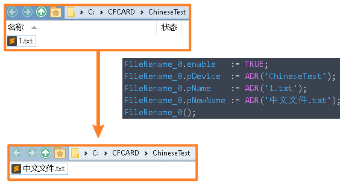

# 期望目标
- 能够使用 MappReport 功能，生成带有中文名称的 pdf 文件，例如 `测试文件_2023_05_11_15_12_32.pdf`

# 结论
- 由于编码问题，无法直接生成能够在 Win 10 系统正常显示的中文文件名
- MappReport 生成的文件名的编码默认为 UTF-8，而 Win 10 系统以 ANSI（在中文环境下为 GB 2312）编码显示中文文件名

# 原因
## MpReport 的文件名生成配置方式
- MappReport 在 Configuration View - MappServices - Report. Mpreportcote 的 Reports - Name 设置定制的文件名
- 

> 需注意：mpreportcore - Reports - Name 仅支持直接文本输入，不支持 TMX 信息动态调用例如 `$$Report/Title`

- 并在程序 MpReportCore 的 Name 引脚处，指向上图中配置的 Name
- 
- 给 MpReportCore 的引脚 Generate 一个上升沿信号，MpReport 即生成相关 Report 文件
- 

## MpReport 生成文件名的编码关系
- 
- 若在 Linux 系统中存储并查看 MpReport 输出的文件，则由于 Linux 系统默认的编码系统为 UTF-8，则中文能正常显示。
# 解决方式
- 使用 FileRename 重命名文件为 ANSI 编码的中文名称
- 

