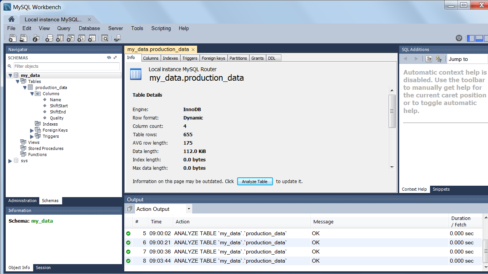
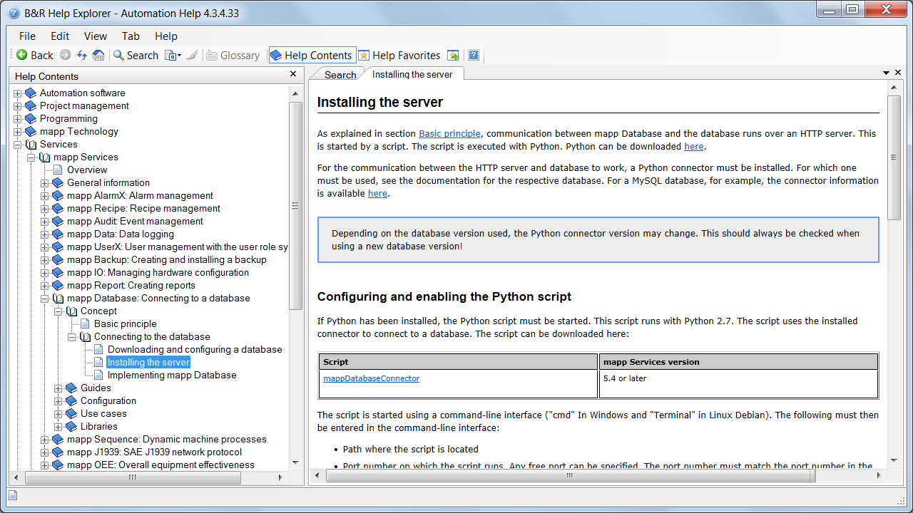
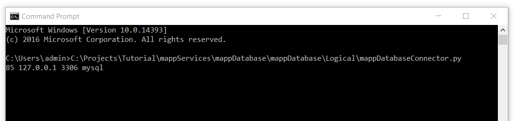
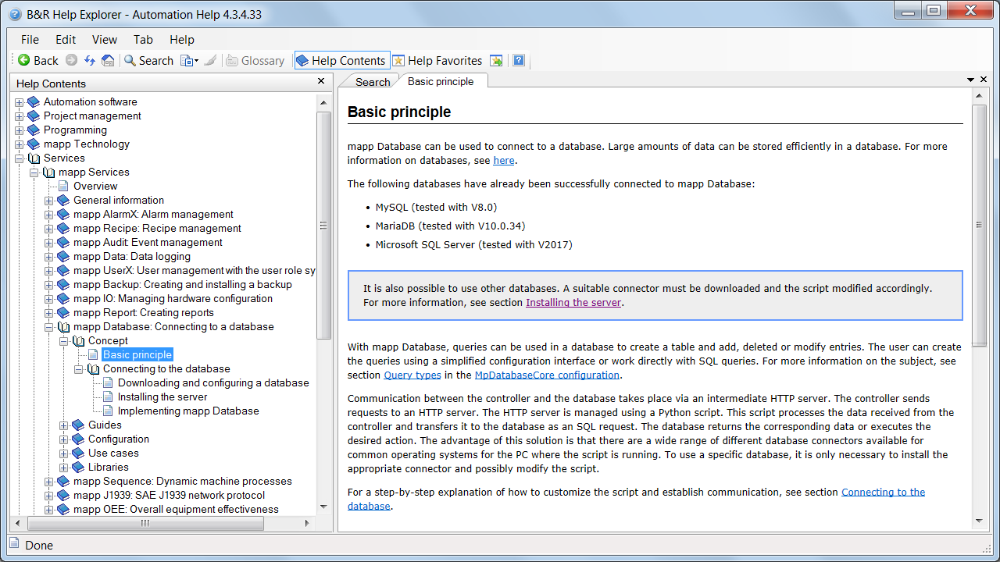
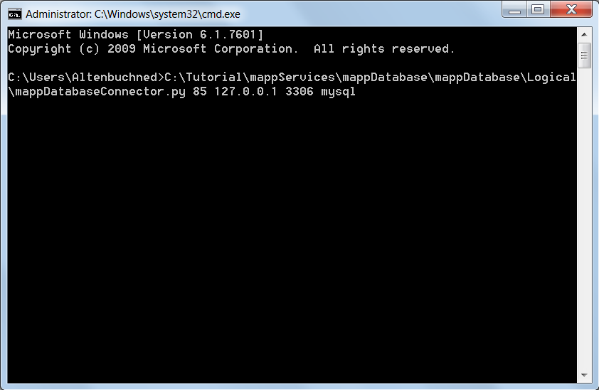
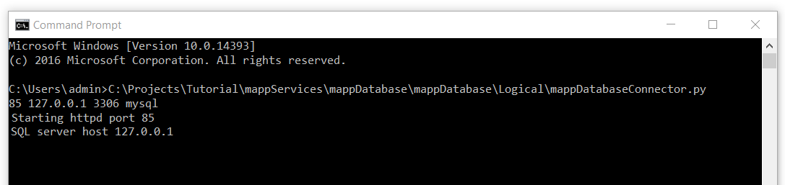

# 1 概述

学习目标
-   创建一个数据库
    
-   启用一个HTTP服务器
    
-   建立沟通
    

学习时间
3分钟。

1️⃣按回车键

1️⃣按回车键

# 2MySQL ::下载 Connector/Python - Google Chrome

1️⃣按回车键

1️⃣按回车键

1️⃣按回车键

1️⃣按回车键

1️⃣按回车键

1️⃣按回车键

1️⃣按回车键

1️⃣按回车键

# 3结束
