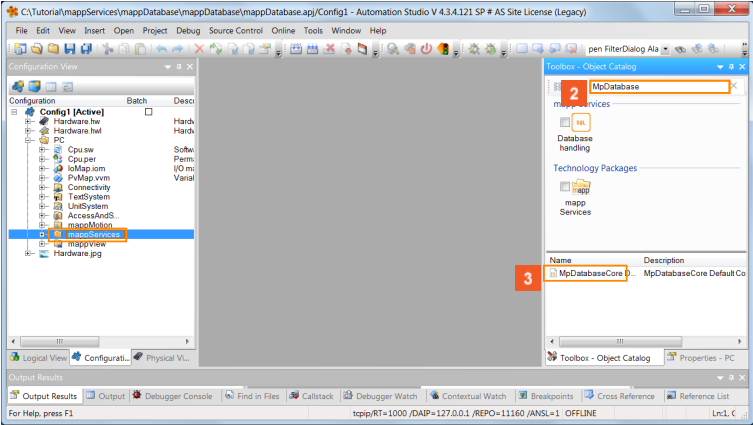
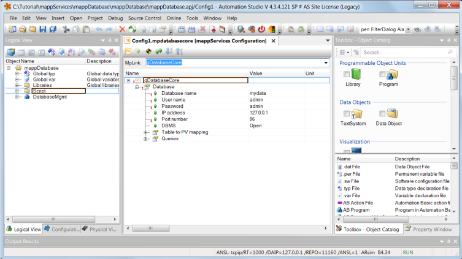
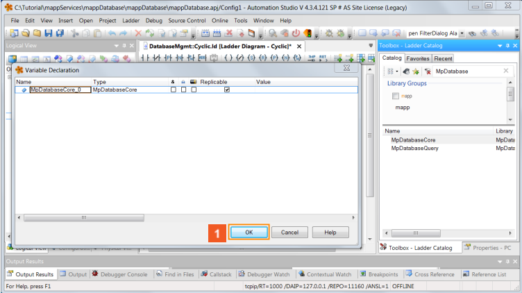
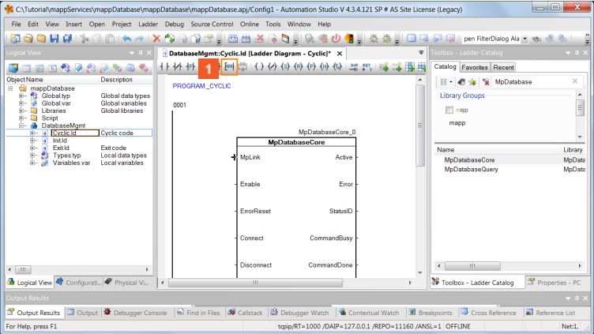
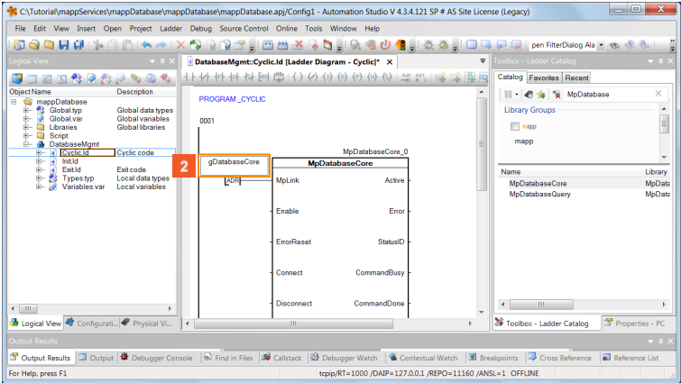
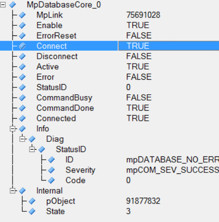
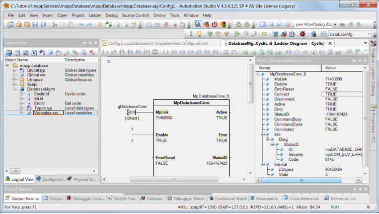

## 学习目标
- 添加配置
- 配置 MpDatabaseCore
- 测试功能
## Step 1 添加配置
1. 点击搜索
2. 在输入栏输入 MpDatabase
3. 拖动 MpdatabaseCore 配置文件到 mappServices 文件夹

## Step 2 配置 MpDatabaseCore
1. 如下图所示配置 Database

2. 在程序中插入 MpDatabase 功能块

3. 将 MpLink 引脚与配置文件中的 MpLink 对应

## Step 3 测试功能
- Transfer 后打开 Monitor，置位功能块的 Connect 引脚

