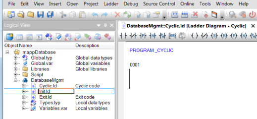

## 学习目标
- 添加配置
- 配置 MpDatabaseCore
- 测试功能
## Step 1 添加 MpLink配置
1. 点击 Configure View，选择 mappServices，右键选择 Add Object
2. 在弹出框中点击搜索
3. 在输入栏输入 MpDatabase
4. 拖动 MpdatabaseCore 配置文件到 mappServices 文件夹

## Step 2 配置 MpDatabaseCore
1. 如下图所示配置 Database
2. 记住 MpLink 的名称，例如此处创建的 MpLink 名为 **gDatabaseCore**

3. 相关帮助信息可在 Automation Help 中查找获得

## Step 3 添加任务并配置 MpDatabaseCore
1. 新建 DatabaseMgmt 任务，选择 Ladder Program。

2. 声明一个类型为 MpDatabaseCore 的变量 

3. 在程序中插入 MpDatabase 功能块

4. 将 MpLink 引脚与配置文件中的 MpLink 对应

 5. 编译后在线 Transfer 下载
## Step 4 测试功能
- Transfer 后打开 Monitor，置位功能块的 Connect 引脚

- 

