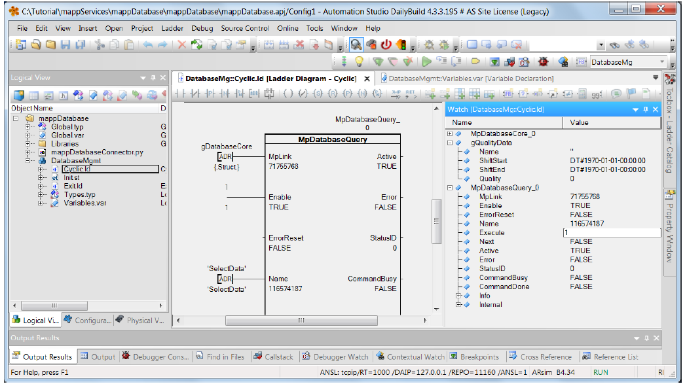
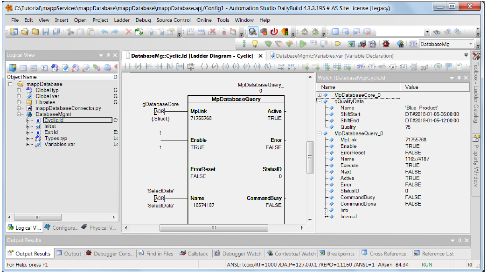
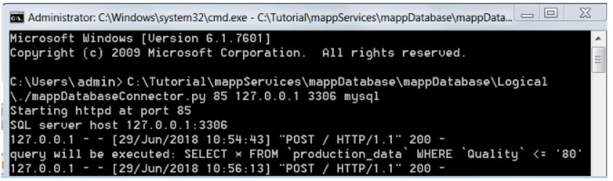

# 036Altenbuchner mapp database3-创建和执行一个查询

 

## 学习目标

 	配置编辑

​	添加与配置MpDatabaseQuery功能块

​	测试此功能

 

学习时间

​	5分钟

 

## 学习目标

​	配置编辑

​	添加与配置MpDatabaseCore功能块

​	测试此功能

学习时间

​	5分钟

 

按下键

## 2 配置编辑

按下键

按下键

按下键

按下键

## 3 贝加莱帮助探索-自动化帮助4.3.6.8

按下键

## 4 添加与配置MpDatabaseQuery

双击：DatabaseMgmt（)

单击添加网络（）按钮

双击：MpDatabaseQuery

点击OK（)按钮

按下键

点击 AddressContact（)按钮。

进入gDatabaseCore区域

按下键

按下键

输入1

按下键

点击 AddressContact（)按钮。

输入‘SelectData’区域。

注意：

名称必须用撇号“”！

点击键

## 5 测试功能

点击Transfer

单击transfer（)按钮

按下监控图标

按下键

单击Execute（)区域

写入1

按下键

按下键

6 END
