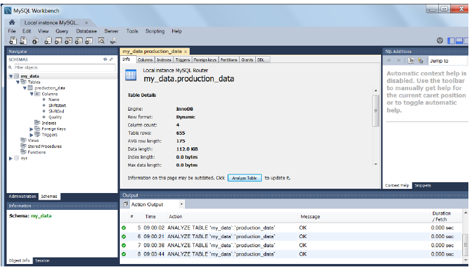

## 学习目标
- 配置编辑
- ​添加与配置MpDatabaseQuery功能块
- ​测试此功能

## 预计学习时间
- ​5分钟 

## STEP 1 确认数据库 Table参数
-  

## STEP 2 在 AS 软件中配置编辑
-  

1. 确认 AS 软件配置中的 mpdatabasecore 文件中配置的参数与实际数据库的信息对应一致
    A. mpdatabasecore 的 FROM 参数，与数据库中 Table 名同名
    B. mpdatabasecore 的 Process variable 参数对应的成员变量名，与数据库中表列名完全一致
-  

## STEP 3 贝加莱帮助探索
- 详细描述可在 Automation Help 对应位置了解
-  
## STEP 4 添加与配置 MpDatabaseQuery
1. 双击：DatabaseMgmt 任务 
- 

1. 单击添加网络)按钮
-  

1. 双击：MpDatabaseQuery
-  

1. 点击OK按钮
-  

1. 按下回车键
-  

1. 点击 AddressContact 按钮
2. 将 gDatabaseCore 参数填入 MpLink 区域
3. 按下回车
-  

1. 按下空格键 （用于跳转到 Enable 的引脚） 
2. 输入参数 1
3. 按下回车键
-  

1. 选择 Name 引脚，点击 AddressContact 按钮
2. 输入‘SelectData’区域。
>注意：名称必须用单引号 `'`
3. 按下回车键
-  

1. 程序中的 MpDatabaseQuery 的 Name 引脚参数与 mpdatabasecore 配置表中的 Name 完全一致。
-  

## STEP 5 测试功能
1. 点击 Transfer 按钮，进行程序下载
-  

1. 点击 Transfer 按钮
-  

1. 点击 Monitor 监控图标
-  

1. 单击 Execute
2. 写入 1
3. 按下回车键
-  

1. 可见 gQualityData 结构体中数据被来自数据库中的数据更新
-  

1. 运行的 Python 程序中可见具体的执行命令 
-  
