[TOC]
## 概述 
### 学习目标
- 在 mappView 画面上添加和配置一个 "Database" 部件
- 测试HMI应用程序
### 学习时间
- 5  分钟
## STEP 1 在 mappView 画面中添加和配置 "Database" 部件
- 期望实现效果 
- 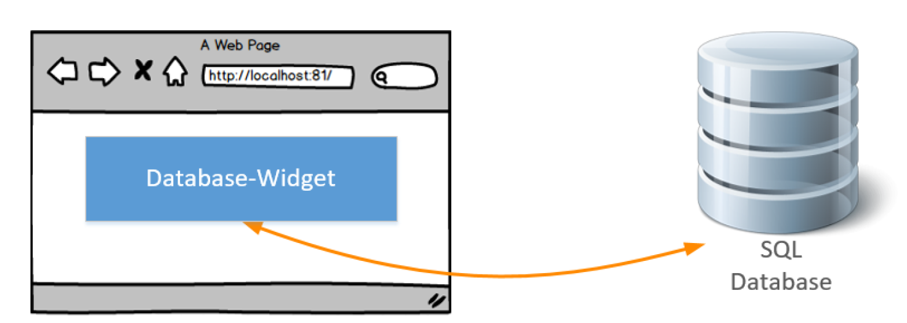
- Automation Studio 项目中 mapp 配置文件 mpdatabasecore 文件参数
- 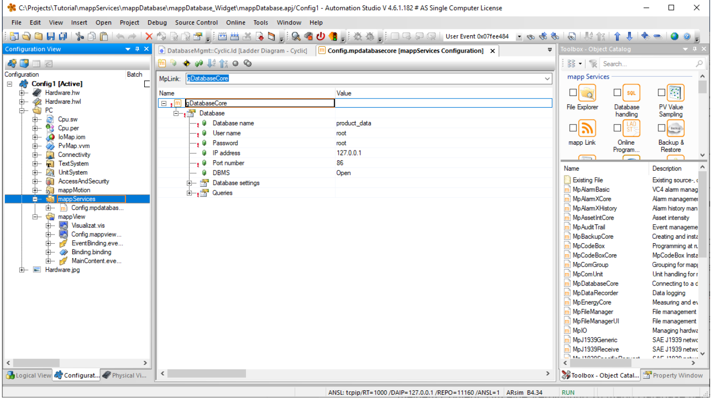

1. 在 Automation Studio 项目中，在 Logical View 下，找到想添加画面的 mappView - Visualization - Pages
2. 双击 Content.content 表格单元

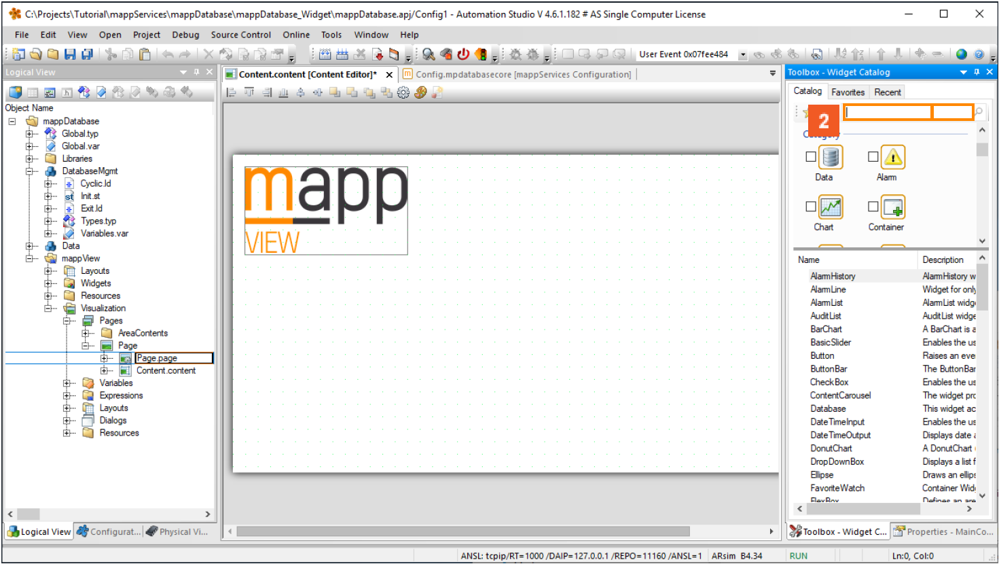

1. 点击 **Search** 输入字段
2. 在字段中输入 **Database**
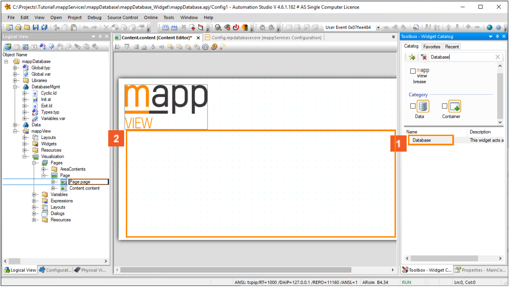

1. 通过拖拽 **Database** 控件到 Content 中
2. 在 Properties 栏，找到 mpLink 的 Binding 条目，点击 **Browse** 按钮
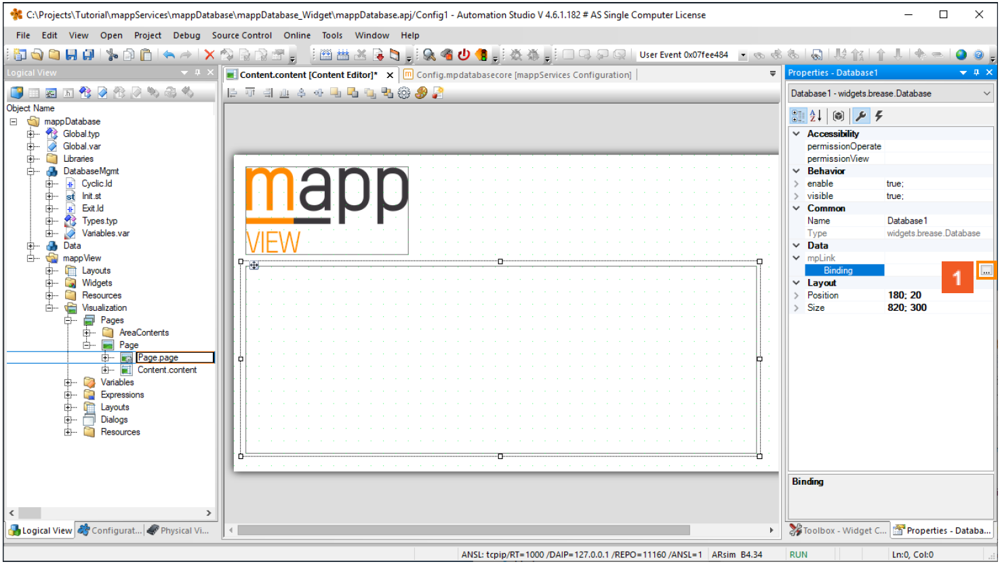

1. 选择 mapp 的 Tab 页，选择对应的 mpLink
2. 点击 **OK** 按钮
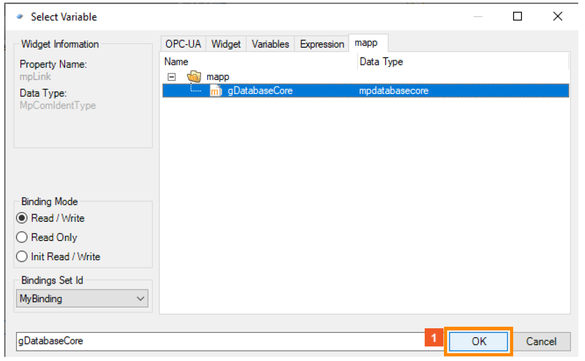
 
1. 拖拽 **“Table”** 项到 **“Database”** 控件上面
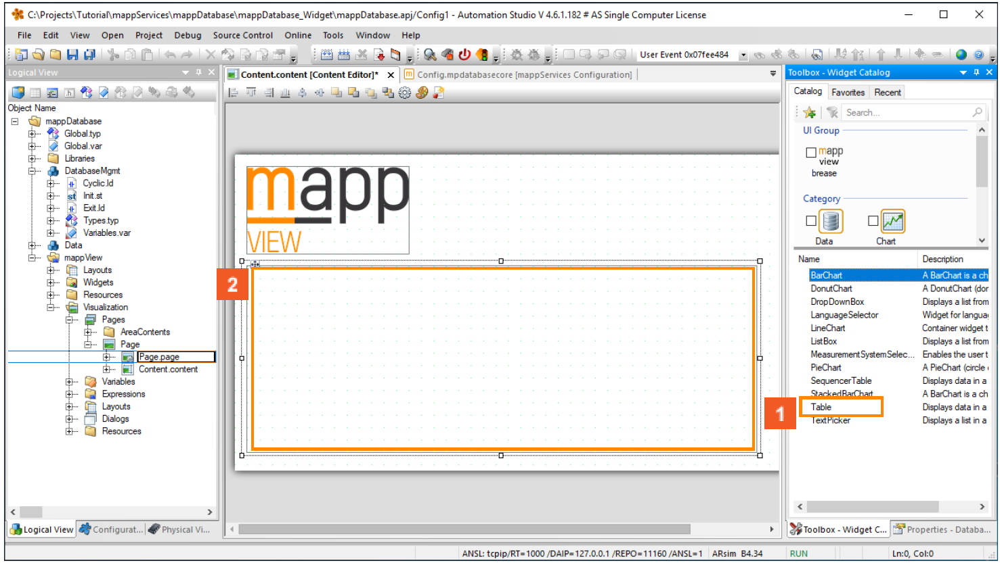

1. 拖拽 **TableItem** 项到 **"Table"** 控件上
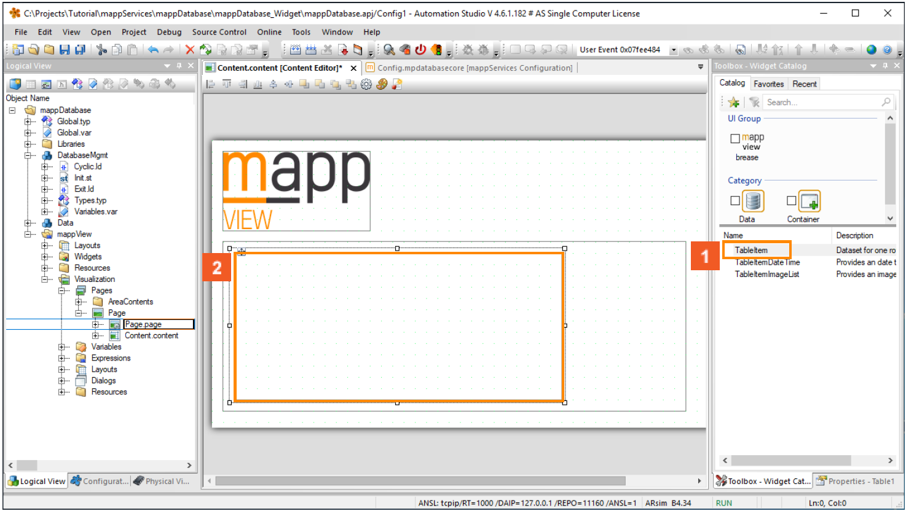

1. 拖拽 **TableItem** 项到 **"Table"** 控件上
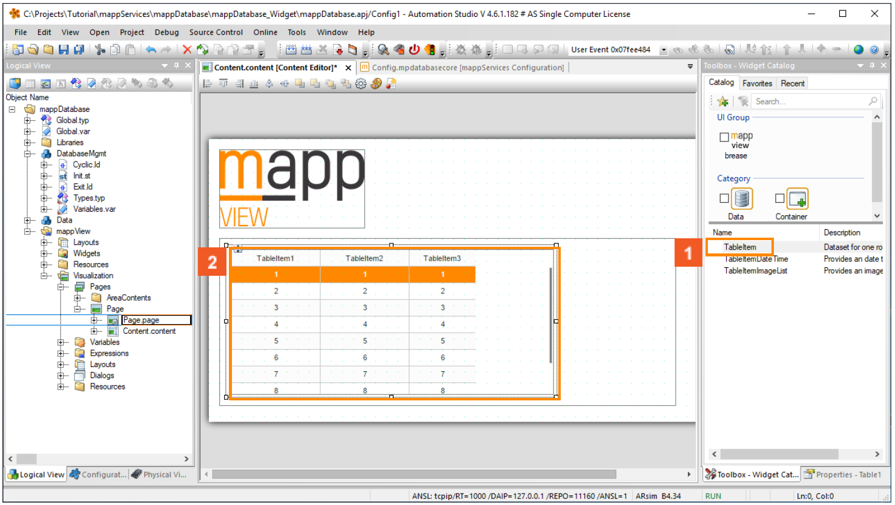

1. 拖拽 **TextPicker** 项到 **"Database"** 控件上
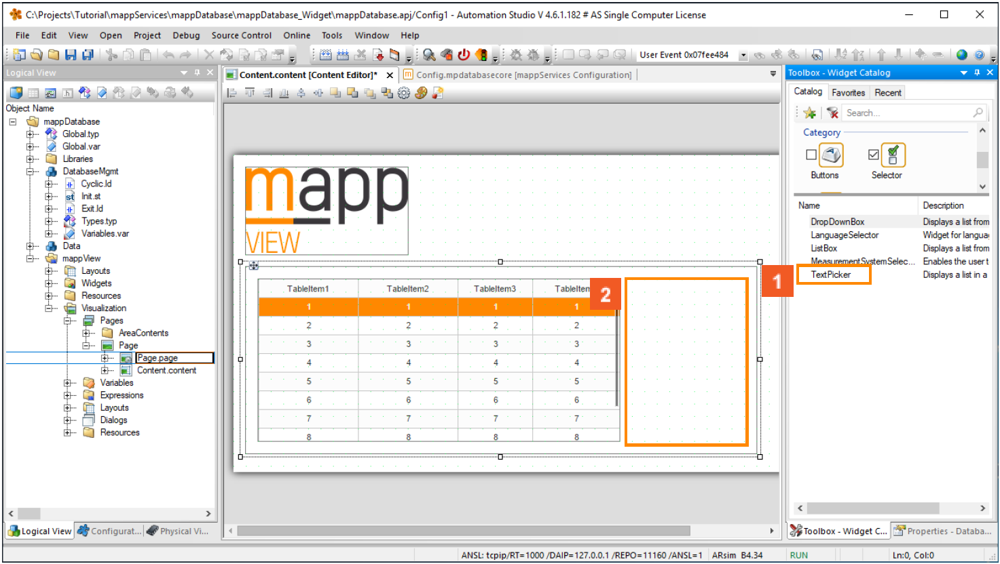

1. 点击 **Transfer**按钮
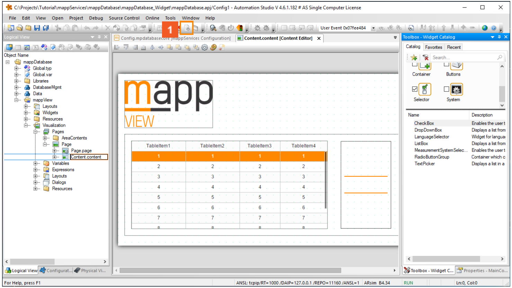

- 此部分内容操作在 Automation Help 相关位置
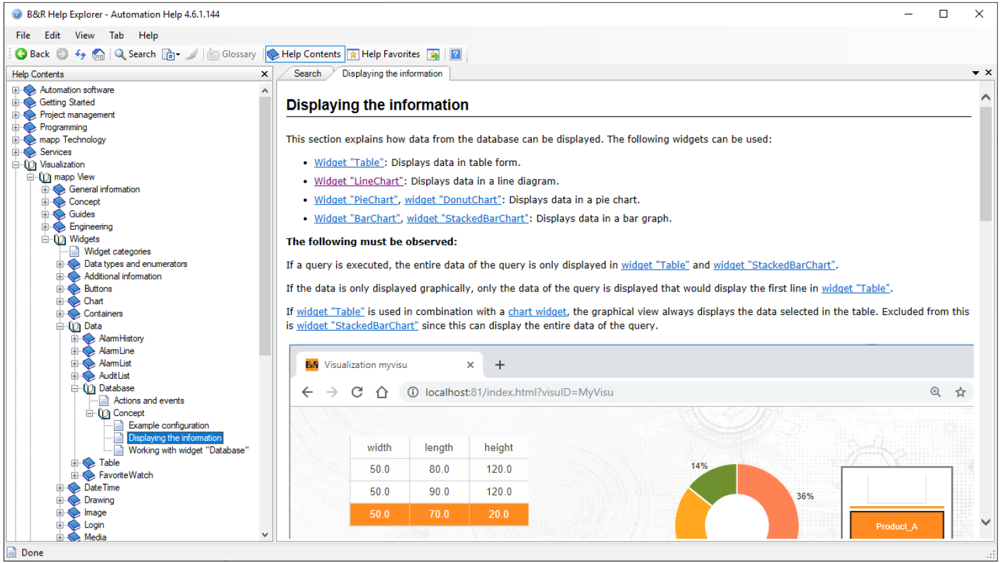
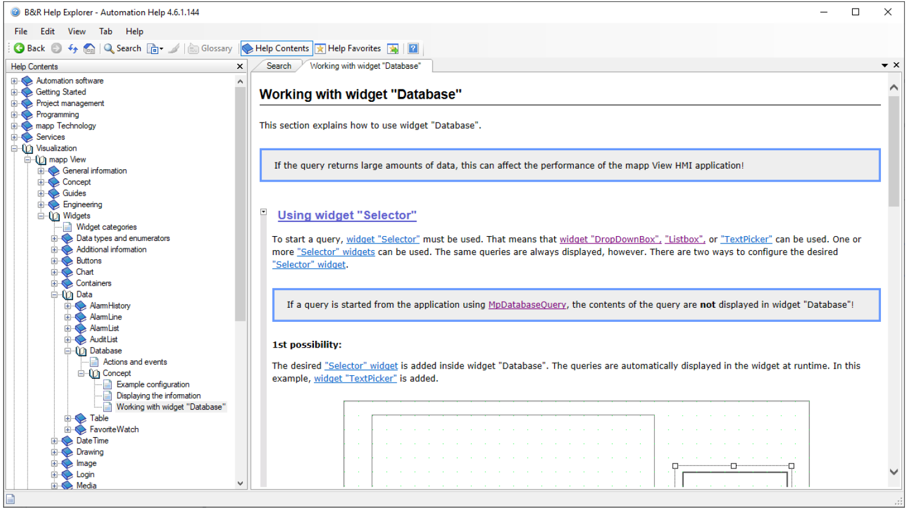
## STEP 2 测试 HMI 应用
1. 点击 **Transfer** 按钮
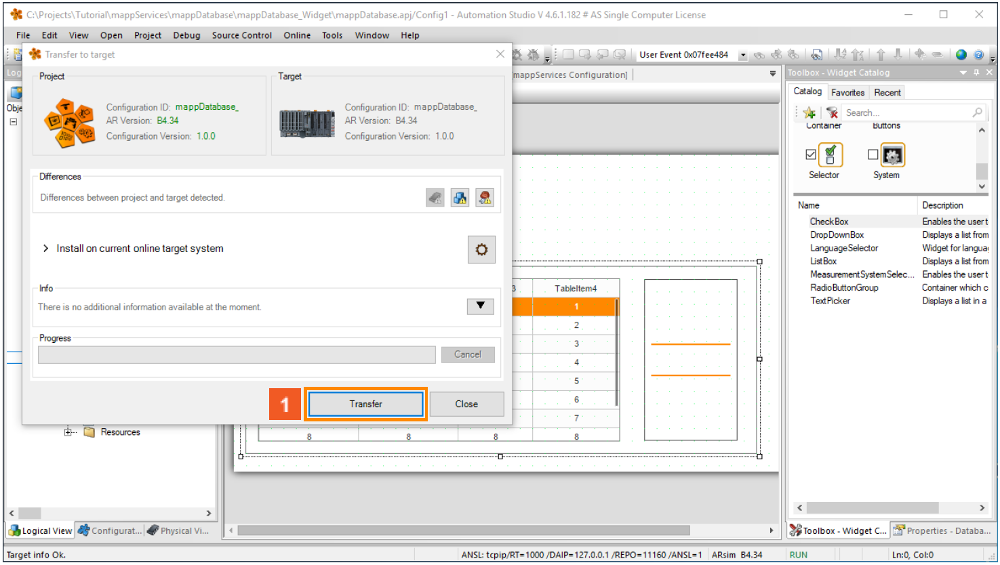

1. 点击 **Close**按钮
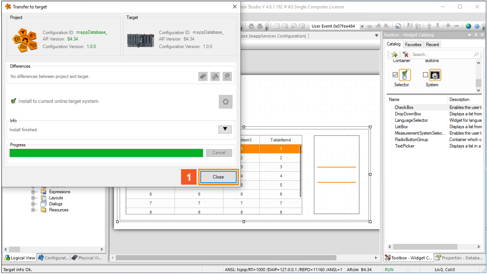

1. 打开浏览器，输入 `127.0.0.1/index. html？visuID`
2. 点击 **CheckQuality**按钮
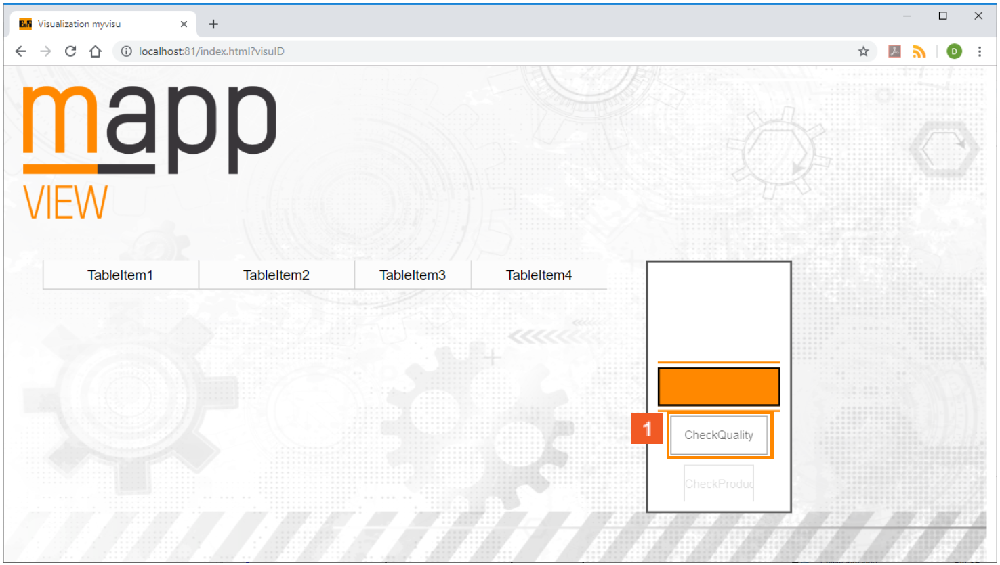

1. 即可 mappView 画面上查询到来自数据库中的相关数据
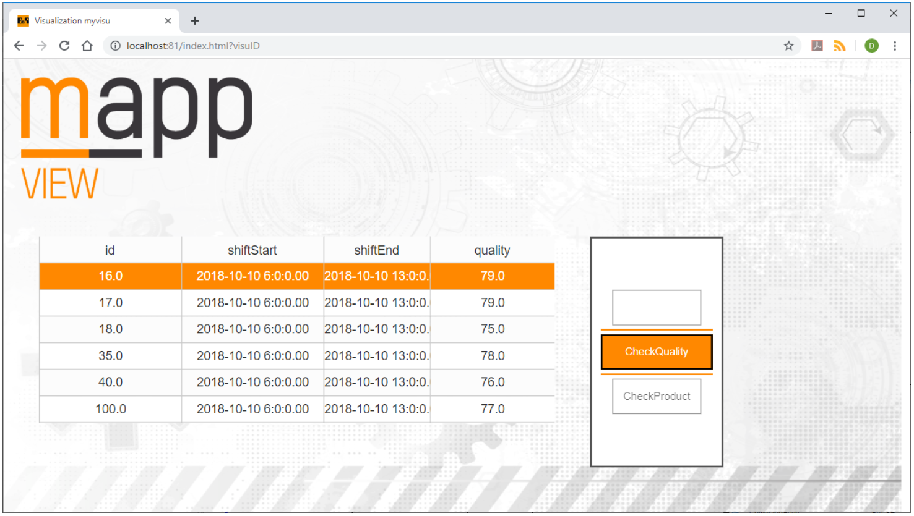
