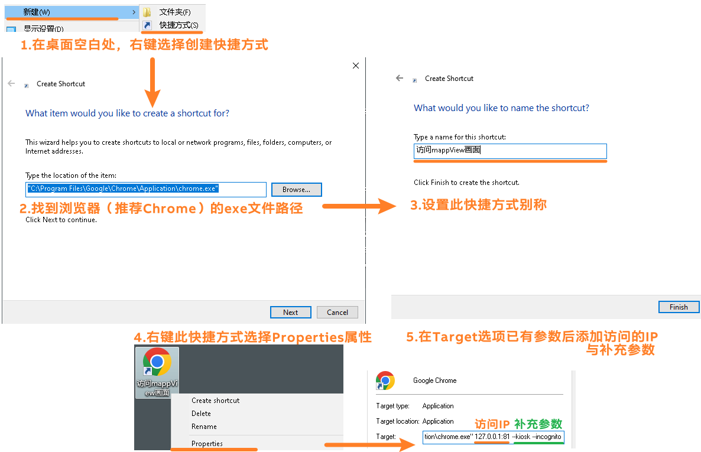

# 需求
- 使用 PPC 等硬件展示 mappView 画面，需要全屏显示，消除历史记录统计，支持手势滑动等操作。
- 希望能够直接双击一个图标自动按照期望方式访问 mappView，并且可以将此快捷方式添加至自启动中。

# Windows 系统上设置方式
## 补充参数
```
127.0.0.1:81 --kiosk --incognito --touch-events --allow-file-access-files
```

## 操作方式



