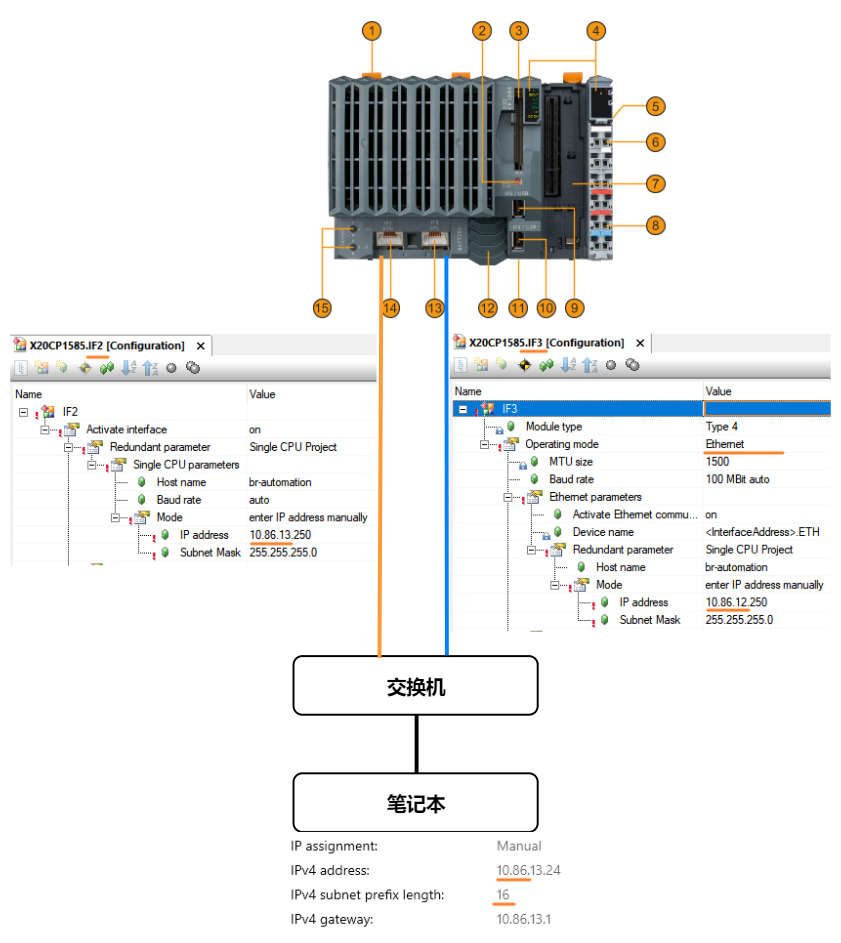
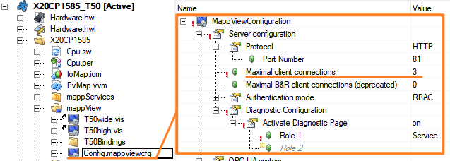
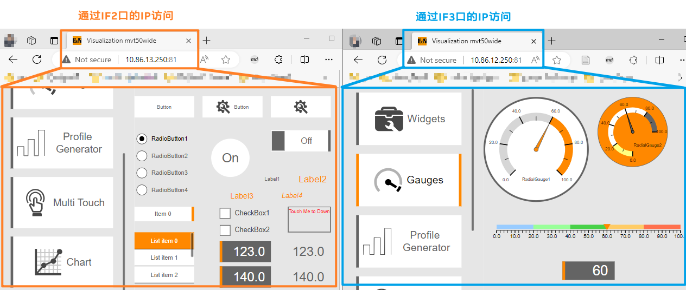

- [需求](#%E9%9C%80%E6%B1%82)
- [结论](#%E7%BB%93%E8%AE%BA)
- [拓扑结构](#%E6%8B%93%E6%89%91%E7%BB%93%E6%9E%84)
- [MappView 设置](#MappView%20%E8%AE%BE%E7%BD%AE)
- [效果](#%E6%95%88%E6%9E%9C)

# 需求

- PLC（例如 X 20 CP 1585）有一个 ETH 口，一个 PLK 口，可以将 PLK 口改成 ETH 口，通过合理设置，即可实现一台笔记本同时通过不同的 IP 访问同一个 mappView 画面
# 结论
- 对于贝加莱 PLC，内部网络是互通的，ETH 与 PLK 是通过不同的网段区分以实现独立通信，我们可以通过增加 Route 规则表来打通不同的网口，详情可参考 [031贝加莱PLC静态路由实现跨网段通信](/B08_技术_通信/031贝加莱PLC静态路由实现跨网段通信.md)
- MappView Server 在 PLC 内部是以 localhost 即 127.0.0.1 本地运行，外部 ETH 端口以任何的 IP 开放，均可访问到此 PLC 的 mappView 画面
- 通过 PLC 的两个网口同时访问同一个 PLC 的 mappView 画面是可行的

# 拓扑结构
- IF2 口设置 IP 地址为 C 类网段
- IF3 口将 Operating mode 设置为 Ethernet，并设置 IP 地址为 C 类网段，且 IP 与 IF2 口的不同。
- PC 侧的 IP 地址设置为 B 类网段
- 

# MappView 设置
- 由于可能存在 PC 同时开启两个浏览器页面访问同一个 mappView Server，因此需要在 `Config.mappviewcfg` 中，将 `Maximal client connections` 从默认值 1 调大。

# 效果
- 在同一台 PC，同时通过不同的 IP，访问同一台 PLC 的同一个 mappView 画面。
- 

