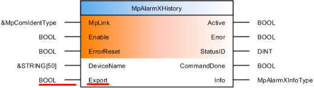
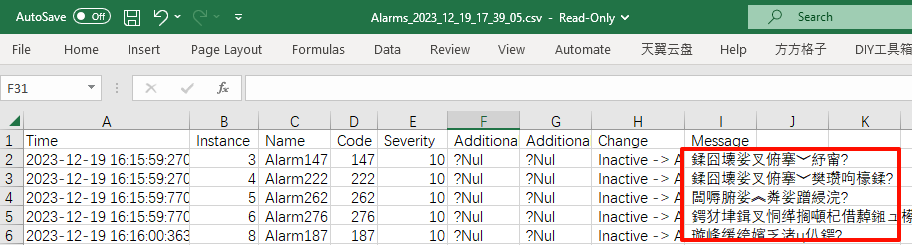
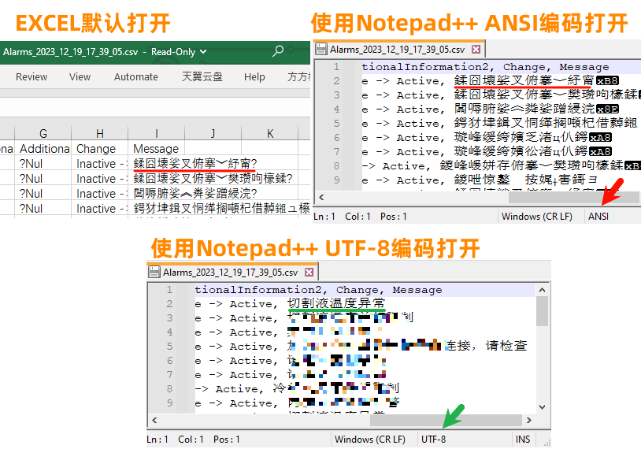
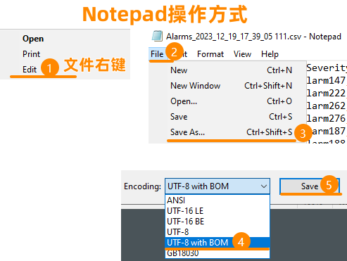
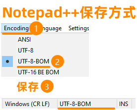
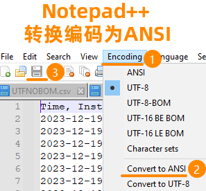
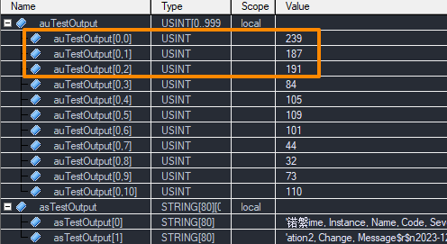

> Tags: #中文 #编码 #mappServices #mappAlarmX

- [1 现象](#1%20%E7%8E%B0%E8%B1%A1)
- [2 原因](#2%20%E5%8E%9F%E5%9B%A0)
- [3 解决方式一：文件以UTF-8 with BOM另存](#3%20%E8%A7%A3%E5%86%B3%E6%96%B9%E5%BC%8F%E4%B8%80%EF%BC%9A%E6%96%87%E4%BB%B6%E4%BB%A5UTF-8%20with%20BOM%E5%8F%A6%E5%AD%98)
- [4 解决方式二：文件以ANSI编码另存](#4%20%E8%A7%A3%E5%86%B3%E6%96%B9%E5%BC%8F%E4%BA%8C%EF%BC%9A%E6%96%87%E4%BB%B6%E4%BB%A5ANSI%E7%BC%96%E7%A0%81%E5%8F%A6%E5%AD%98)
- [5 解决方式三：文件在AR中操作添加BOM](#5%20%E8%A7%A3%E5%86%B3%E6%96%B9%E5%BC%8F%E4%B8%89%EF%BC%9A%E6%96%87%E4%BB%B6%E5%9C%A8AR%E4%B8%AD%E6%93%8D%E4%BD%9C%E6%B7%BB%E5%8A%A0BOM)
- [6 更新日志](#6%20%E6%9B%B4%E6%96%B0%E6%97%A5%E5%BF%97)

# B05.041-mappAlarmX导出的CSV文件中文乱码问题

# 1 现象

- 使用mappServices中的mappAlarmX功能，可自动管理导出报警信息。
- 其中MpAlarmXHistory函数，可以直接导出历史的报警信息文件，此文件以CSV文件存储在FileDevice指定的文件区域。
    - 
- 问题为导出的CSV文件，中文在Win 10上直接打开，显示是乱码的
    - 

# 2 原因

- 贝加莱mappAlarmX自动生成的文件编码为标准的UTF-8的CSV格式文件。
- 在Linux操作系统上，UTF-8编码文件打开能够显示正常的中文。
- Windows系统默认是以ANSI编码打开EXCEL文件，截止目前（Win10 22H2版本），均是如此，而UTF-8编码文件，微软系列软件是需要有BOM头才视作UTF-8处理的，因此若文件没有BOM头，是标准的UTF-8文件，则不能正常打开。
- 此
- 
- 故解决方式的思路有两种
    - 1.文件另存为，添加BOM (字节顺序标记)头
    - 2.将文件另存为ANSI编码格式文件
- 微软官方给出建议
    - [在 Excel 中正确打开 CSV UTF-8 文件 - Microsoft 支持](https://support.microsoft.com/zh-cn/office/%E5%9C%A8-excel-%E4%B8%AD%E6%AD%A3%E7%A1%AE%E6%89%93%E5%BC%80-csv-utf-8-%E6%96%87%E4%BB%B6-8a935af5-3416-4edd-ba7e-3dfd2bc4a032)

# 3 解决方式一：文件以UTF-8 with BOM另存

- 
- 

# 4 解决方式二：文件以ANSI编码另存

- 

# 5 解决方式三：文件在AR中操作添加BOM

- 添加三个字节数据，即USINT数组239,187,191
- 以形成BOM头保存
- 

# 6 更新日志

| 日期         | 修改人 | 修改内容 |
| :--------- | :-- | :--- |
| 2023-12-19 | YZY | 初次创建 |
