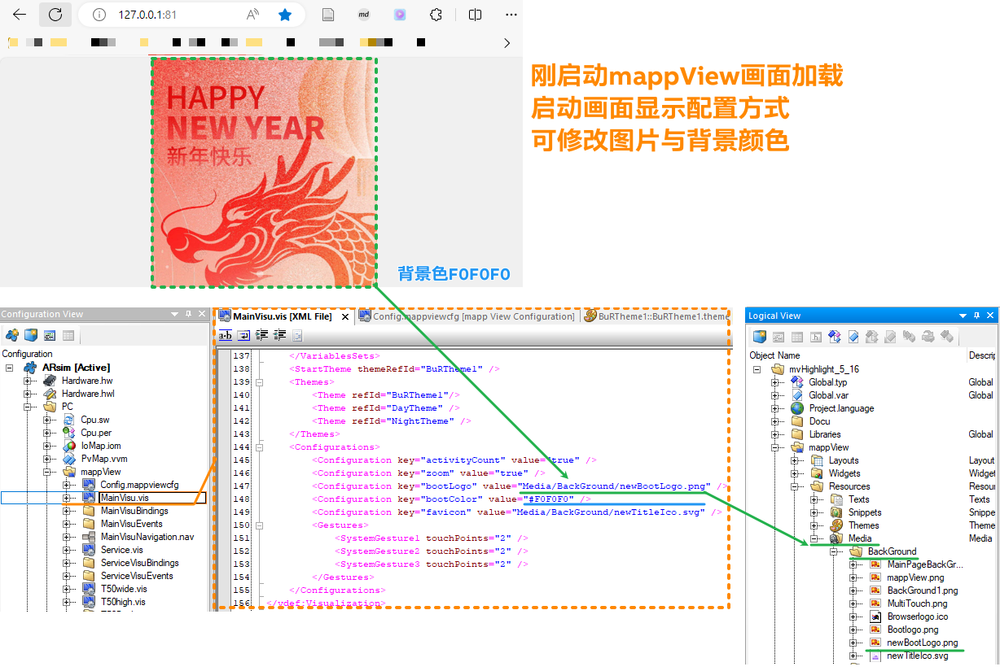

> Tags: #mappView #html

- [1 042mappView如何修改启动的Logo与背景，标题的图标与文字](#1%20042mappView%E5%A6%82%E4%BD%95%E4%BF%AE%E6%94%B9%E5%90%AF%E5%8A%A8%E7%9A%84Logo%E4%B8%8E%E8%83%8C%E6%99%AF%EF%BC%8C%E6%A0%87%E9%A2%98%E7%9A%84%E5%9B%BE%E6%A0%87%E4%B8%8E%E6%96%87%E5%AD%97)
- [2 启动页面图片与背景色修改](#2%20%E5%90%AF%E5%8A%A8%E9%A1%B5%E9%9D%A2%E5%9B%BE%E7%89%87%E4%B8%8E%E8%83%8C%E6%99%AF%E8%89%B2%E4%BF%AE%E6%94%B9)
	- [2.1 帮助信息所在位置](#2.1%20%E5%B8%AE%E5%8A%A9%E4%BF%A1%E6%81%AF%E6%89%80%E5%9C%A8%E4%BD%8D%E7%BD%AE)
- [3 浏览器Tab中标题的图标修改方式](#3%20%E6%B5%8F%E8%A7%88%E5%99%A8Tab%E4%B8%AD%E6%A0%87%E9%A2%98%E7%9A%84%E5%9B%BE%E6%A0%87%E4%BF%AE%E6%94%B9%E6%96%B9%E5%BC%8F)
	- [3.1 帮助信息所在位置](#3.1%20%E5%B8%AE%E5%8A%A9%E4%BF%A1%E6%81%AF%E6%89%80%E5%9C%A8%E4%BD%8D%E7%BD%AE)
- [4 浏览器Tab中标题的文字修改方式](#4%20%E6%B5%8F%E8%A7%88%E5%99%A8Tab%E4%B8%AD%E6%A0%87%E9%A2%98%E7%9A%84%E6%96%87%E5%AD%97%E4%BF%AE%E6%94%B9%E6%96%B9%E5%BC%8F)
	- [4.1 解决方式一：修改已运行PLC项目的底层文件](#4.1%20%E8%A7%A3%E5%86%B3%E6%96%B9%E5%BC%8F%E4%B8%80%EF%BC%9A%E4%BF%AE%E6%94%B9%E5%B7%B2%E8%BF%90%E8%A1%8CPLC%E9%A1%B9%E7%9B%AE%E7%9A%84%E5%BA%95%E5%B1%82%E6%96%87%E4%BB%B6)
	- [4.2 👍解决方式二：修改AS软件底层文件](#4.2%20%F0%9F%91%8D%E8%A7%A3%E5%86%B3%E6%96%B9%E5%BC%8F%E4%BA%8C%EF%BC%9A%E4%BF%AE%E6%94%B9AS%E8%BD%AF%E4%BB%B6%E5%BA%95%E5%B1%82%E6%96%87%E4%BB%B6)
	- [4.3 解决方式三，底层文件新增跳转用的HTML文件](#4.3%20%E8%A7%A3%E5%86%B3%E6%96%B9%E5%BC%8F%E4%B8%89%EF%BC%8C%E5%BA%95%E5%B1%82%E6%96%87%E4%BB%B6%E6%96%B0%E5%A2%9E%E8%B7%B3%E8%BD%AC%E7%94%A8%E7%9A%84HTML%E6%96%87%E4%BB%B6)
		- [4.3.1 对应HTML文件案例下载](#4.3.1%20%E5%AF%B9%E5%BA%94HTML%E6%96%87%E4%BB%B6%E6%A1%88%E4%BE%8B%E4%B8%8B%E8%BD%BD)
	- [4.4 补充：vis配置文件的id名不支持中文](#4.4%20%E8%A1%A5%E5%85%85%EF%BC%9Avis%E9%85%8D%E7%BD%AE%E6%96%87%E4%BB%B6%E7%9A%84id%E5%90%8D%E4%B8%8D%E6%94%AF%E6%8C%81%E4%B8%AD%E6%96%87)
- [5 更新日志](#5%20%E6%9B%B4%E6%96%B0%E6%97%A5%E5%BF%97)

# 1 B05.042-mappView如何修改启动的Logo与背景，标题的图标与文字

# 2 启动页面图片与背景色修改

- 如果mappView 启动图像未被修改，则在浏览器加载mappView画面时将再次显示B&R默认的Logo。
- 要修改mappView 启动图像，只需在mapp View visualization object（.vis）文件中进行修改，可定义背景图像和背景颜色。
- 

```
<Configurations> 
    <Configuration key="bootLogo" value="Media/company_bootlogo.bmp" /> 
    <Configuration key="bootColor" value="#FFFFFFFF" /> 
</Configurations>
```

- 在这种情况下，图像的像素不必与屏幕分辨率相匹配，如果图像小于屏幕分辨率，显示的图像就会变小，并用背景色填充屏幕的其余部分
- 如果没有添加 "bootColor "参数，背景将显示为默认的橙色。
- 支持图像格式：PNG、JPEG、SVG、BMP 或 GIF 格式。
    - 图像位于逻辑视图（Logical View）中的“mapp View Media”文件夹内。
    - 🔴使用 SVG 文件时，必须确保定义了 svg标记的高度和宽度属性。

## 2.1 帮助信息所在位置

- [B&R Online Help (br-automation.com)](https://help.br-automation.com/#/en/4/visualization%2Fmappview%2Fengineering%2Flv_organization%2Fconfigurationview%2Fcv_visualization.html)
- 

| Parameter | Values                                                                                                                                                                | Description                                                                                                                                                                                                                                                                                                                                                                                                                                                                                                                                      |
| --------- | --------------------------------------------------------------------------------------------------------------------------------------------------------------------- | ------------------------------------------------------------------------------------------------------------------------------------------------------------------------------------------------------------------------------------------------------------------------------------------------------------------------------------------------------------------------------------------------------------------------------------------------------------------------------------------------------------------------------------------------ |
| bootLogo  | Path to an image in the [mapp View Media package](https://help.br-automation.com/#/en/4/visualization/mappview/engineering/lv_organization/logicalview/lv_media.html) | This parameter specifies a customized image that is displayed when starting the HMI application.  <br>This image is shown in the middle of the screen in its original size.<br>The following image formats are supported:<br>    PNG (file extension .png)<br>    JPEG (file extension .jpg or .jpeg)<br>    SVG (file extension .svg)<br>    GIF (file extension .gif)<br>    Windows bitmap (file extension .bmp)<br>When using an SVG file, it is important to make sure that the height and width attributes of the `<svg>` tag are defined. |
| bootColor | [Color](https://help.br-automation.com/#/en/4/visualization/mappview/engineering/lv_themes/lv_styles_color.html)  <br>Default value: #FF8800                          | This parameter specifies a customized background color that is displayed when starting the HMI application.                                                                                                                                                                                                                                                                                                                                                                                                                                      |

# 3 浏览器Tab中标题的图标修改方式

- 
- 可通过修改Configuration View中的.vis文件中的favicon参数实现
- 参数配置自定义图标，用于在 Web 浏览器中识别 HMI 应用程序（用于书签、地址栏或选项卡，具体取决于浏览器）
- 支持以下类型图片
    - ICO
        - 16 × 16 or 32 × 32 and 16 to 16.7 million colors
    - PNG
        - 16 × 16 and 256 colors
    - GIF
        - 16 × 16 and 256 colors
    - SVG
        - 实测也支持此格式图片

## 3.1 帮助信息所在位置

- [B&R Online Help (br-automation.com)](https://help.br-automation.com/#/en/4/visualization%2Fmappview%2Fengineering%2Flv_organization%2Fconfigurationview%2Fcv_visualization.html)
- 

| Parameter | Values                                                                                                                                                                | Description                                                                                                                                                                                                                                                                                                                                                                                                                                                                                                |
| --------- | --------------------------------------------------------------------------------------------------------------------------------------------------------------------- | ---------------------------------------------------------------------------------------------------------------------------------------------------------------------------------------------------------------------------------------------------------------------------------------------------------------------------------------------------------------------------------------------------------------------------------------------------------------------------------------------------------- |
| favicon   | Path to an image in the [mapp View Media package](https://help.br-automation.com/#/en/4/visualization/mappview/engineering/lv_organization/logicalview/lv_media.html) | This parameter configures a customized icon for identifying the HMI application in the web browser (for the bookmark, address bar or tabs depending on the browser).  <br>  <br>The following image formats are supported:<br><br>- ICO (file extension .ico)<br>    <br>- PNG (file extension .png)<br>    <br>- GIF (file extension .gif)<br>    <br><br>Default sizes and color depths:<br><br>- ICO: 16 × 16 or 32 × 32 and 16 to 16.7 million colors<br>    <br>- GIF and PNG: 16 × 16 and 256 colors |

# 4 浏览器Tab中标题的文字修改方式

- mappView的标题名称是有固定的组成原则，Visualization + .vis文件中的id名
    - 🔴.vis文件中的id名不支持中文
    - 
- 在浏览器所见画面中对应的内容为 `<title>` 标签中的内容
    - 
- 在实际PLC运行时，底层的运行逻辑如下，故从AS项目中无法直接修改此文字内容形式
    - 

## 4.1 解决方式一：修改已运行PLC项目的底层文件

- 操作方式
    - 在已烧卡完成的PLC项目中，找到 `ADDONS\DATA\IAT_Data\wwwRoot\BRVisu\bootstrapper.min.js` 文件
    - 修改document.title后面的内容
- 实现效果
    - 
- 存在限制
    - 重新烧卡后此处内容会复原，需要重新操作

## 4.2 👍解决方式二：修改AS软件底层文件

> ✔️此方式为最推荐的方式，一步到位，仅需对使用编译的笔记本进行一次调整即可。

- 思路
    - 从编译文件的源头，即mappView对应版本的原始文件，将Title的内容修改
- 操作思路
    - 1. 确认当前使用的mappView版本
        - 
    - 2. 找到AS软件安装路径，例如AS4.12的mappView 5.22版本的需要修改的文件路径如下
        - 
    - 3. 修改 `bootstrapper.min.js` 文件，将 `document.title` 后面对应的内容进行修改
        - 需注意，原始内容为 `document.title="Visualization "+app.params.visuid`，可以根据需求自行调整
        - 此处修改后，所有使用此AS版本与mappView版本组合的项目，标题都是这个内容
        - 
- 使用效果
    - 与之前正常访问mappView画面方式一致，标题已改变
    - 
- 优势
    - ✔️内容修改直接影响到烧卡包里的内容，使用烧卡包，直接多次烧卡都正常表现
    - 使用被调整过的电脑，生成的项目都能自带此类效果
    - 无需手动去修改运行过程中PLC的CF卡中底层文件，操作更简单
- 存在限制
    - 编译项目的电脑底层的配置必须修改此处内容，若更换电脑进行编译，此处位置也需要调整
    - 若存在AS版本，mappView版本变更，`bootstrapper.min.js` 文件也需对应修改
    - 若同一个AS版本，mappView版本组合，需要维护多个完全不同的项目，`bootstrapper.min.js` 文件可能需要多次修改

## 4.3 解决方式三，底层文件新增跳转用的HTML文件

- 思路
    - 如同 **解决方式一：修改已运行PLC项目的底层文件** ，在正在运行的PLC底层文件中进行新增文件修改。
- 操作方式
    - 在运行的PLC底层文件中，将 `ADDONS\DATA\IAT_Data\wwwRoot` 文件夹中，新增一个jump.html 文件（若需修改ICO，则同级路径下放置引用的图标图片）
        - 仿真项目的路径为 `AS项目文件夹\Temp\Simulation\ARsim\PC\ADDONS\DATA\IAT_Data\wwwRoot` 下
    - 此jump.html文件通过 `<iframe>` 标签加载mappView原始网页内容，并通过HTML的 `<title>` 与 `<link>` 修改网页标题的内容
    - 
- 使用效果
    - 访问原本默认的IP地址，例如 `127.0.0.1:81` 访问到原本默认的标题与ICO
    - 访问 `127.0.0.1:81/jump.html` 则可直接访问到与原mappView画面一模一样的内容，并可自定义ICO与文件内容
    - 
- 使用优势
    - 两种标题方式都兼容，也可以用作和其他方案写的网页进行合并，方便扩展与使用
- 限制
    - 每次烧卡的时候，都需要进行人为的添加与修改（需要先烧卡，放PLC里运行，再在ADDONS下面文件夹里进行修改）
- 进阶使用方式
    - 为了能实现无需输入网址末尾的jump.html内容，保持与原先使用mappView习惯一致，可以按照以下方式修改
        - 将原本的的index.html改名为source.html
        - 将jump.html改名为index.html，并将其中的 `<iframe src="   "` 指向地址从原来的index.html改为source.html
    - 

### 4.3.1 对应HTML文件案例下载

- [📁点击下载案例文件](/B05_技术_mapp/FILES/042mappView如何修改启动的Logo与背景，标题的图标与文字/jump_html_demo.zip ':ignore')

## 4.4 补充：vis配置文件的id名不支持中文

- 若使用中文，则会导致PLC无法正常启动，在ARSim中可见如下报警信息。
- 

# 5 更新日志

| 日期         | 修改人        | 修改内容 |
| :--------- | :--------- | :--- |
| 2024-02-25 | YZY<br>QHC | 初次创建 |
