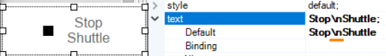
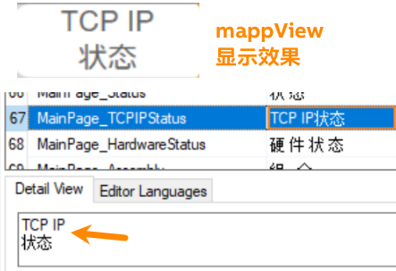

> Tags: #mappView #文字

# 043mappView画面中文字如何换行

# text内容，通过 `\n` 进行换行

# tmx中的内容，通过回车换行

# 更新日志

| 日期     | 修改人     | 修改内容     |
|:-----|:-----|:-----|
| 2024-03-14     | YuanZhiyi     | 初次创建     |
